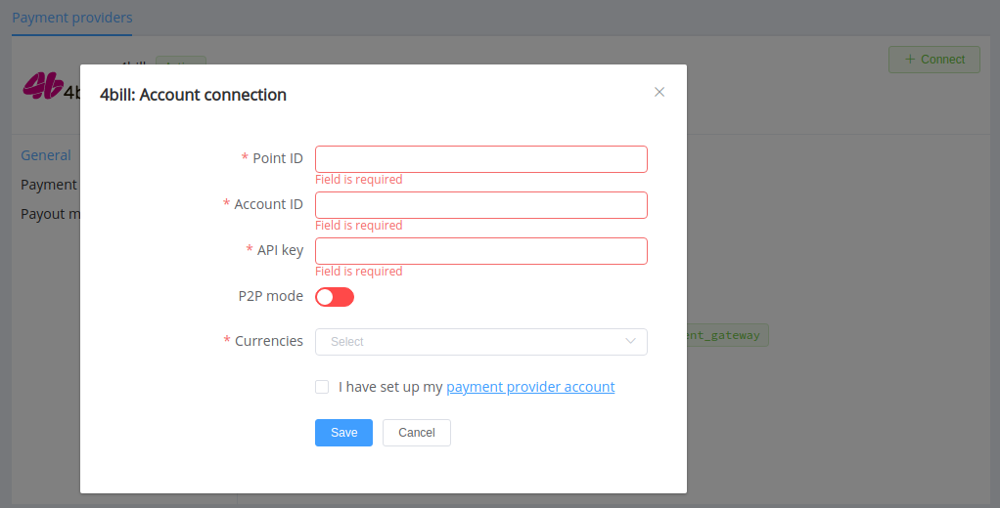
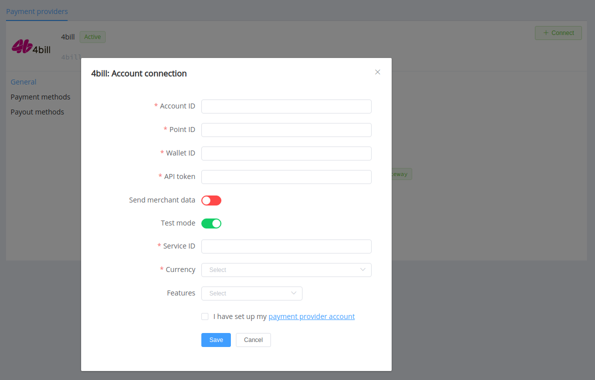

# 4bill

!!! quote ""
    Payments that drives business

**Website**: [4bill.io](https://4bill.io/)

**Login**: [login](https://cabinet.4bill.io/login)

Follow the guidance for setting up a connection with 4bill payment service provider.

## Set up Account

### Step 1: Create merchant account

To create an account send connection request at the [website](https://4bill.io/) or contact manager directly. Submit the required documents to verify your account and gain access.

#### Step 2: Get required credentials

Credentials that have to be issued:

* account_id
* wallet_id
* point_id
* service_id (you need a separate service code for each requested feature)
* api_token

## Connect Provider Account

### Step 1. Connect account at the {{custom.company_name}} Dashboard

Press **Connect** at [*4bill Provider Overview*]({{custom.dashboard_base_url}}connect-directory/payment-providers/4bill/general) page in *'New connection'* and choose **Provider account** option to open Connection form.

Enter credentials:

* account_id --> Account ID
* point_id --> Point ID (if you have more than one, you should connect each payment point separately)
* api_token --> API key

!!! success
    You have connected **4bill** account!

## Connect H2H Merchant Account

### Step 1. Connect H2H account at the {{custom.company_name}} Dashboard

Press **Connect** at [*4bill Provider Overview*]({{custom.dashboard_base_url}}connect-directory/payment-providers/4bill/general) page in *'New connection'* and choose **H2H Merchant account** option to open Connection form.

Enter credentials:

* account_id --> Account ID
* point_id --> Point ID (if you have more than one, you should connect each payment point separately)
* api_token --> API token
* wallet_id --> Wallet ID (each wallet holds a balance in the related currency)
* service_id --> Service ID

Choose 'Send merchant data' option if you need to send Commerce MCC and Merchant URL to 4bill.

Choose Test Mode for test connection.

Choose Currency and Features. You can set these parameters according to available currencies and features for your 4bill wallets and services, but it is necessary to check details of the connection with your {{custom.company_name}} account manager.

!!! success
    You have connected **4bill** H2H merchant account!

!!! question "Still looking for help connecting your 4bill account?"
    [Please contact our support team!](mailto:{{custom.support_email}})
