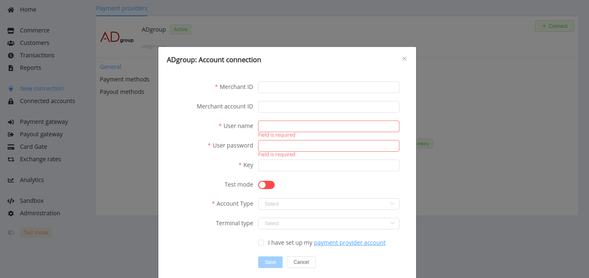
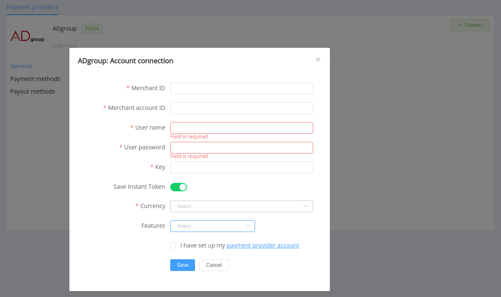

# ADgroup

> Payment Processor for Merchants and host2host provider for other processors all in one

**Website**: [adgroup.finance](https://adgroup.finance/en/)

Follow the guidance for setting up a connection with ADgroup payment service provider.

## Set Up Account

### Step 1: Contact ADgroup support manager

Send a request on the [adgroup.finance](https://adgroup.finance/en/). Submit the required documents to verify your account and gain account and access.

### Step 2: Check your contact email for credentials

## Connect Provider Account

### Step 1. Connect account at dashboard.paycore.io

Press **Connect** at [*ADgroup Provider Overview*](https://dashboard.paycore.io/connect-directory/payment-providers/adgroup/general) page in *'New connection'* and choose **Provider account** option to open Connection form.

Enter credentials to access the API:

* Merchant Id --> Merchant ID
* Merchant Account Id --> Merchant Account ID
* Merchant Account User Name -->> User Name
* Merchant Account Password --> User Password
* Merchant Account Key --> Key

Also, choose *Test Mode* for test connection with ADgroup.

!!! success
    You have connected **ADgroup** account!

## Connect H2H Merchant Account

### Step 1. Connect H2H account at dashboard.paycore.io

Press **Connect** at [*ADgroup Provider Overview*](https://dashboard.paycore.io/connect-directory/payment-providers/adgroup/general) page in *'New connection'* and choose **H2H Merchant account** option to open Connection form.

Enter credentials to access the API:

* Merchant Id --> Merchant ID
* Merchant Account Id --> Merchant Account ID
* Merchant Account User Name -->> User Name
* Merchant Account Password --> User Password
* Merchant Account Key --> Key

Choose Currency and Features. You can set these parameters according to available currencies and features for your ADgroup account, but it is necessary to check details of the connection with your PayCore.io account manager.

Also, choose *Save Instant Token* option if you plan to use the ADgroup account for instant payments.

!!! success
    You have connected **ADgroup** H2H merchant account!

!!! question "Still looking for help connecting your ADgroup account?"
    [Please contact our support team!](mailto:support@paycore.io)
