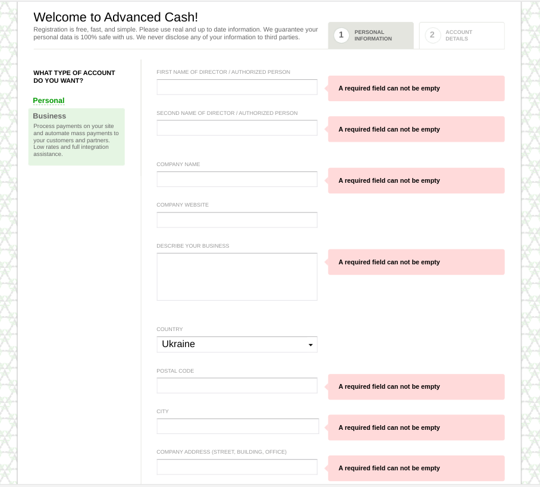
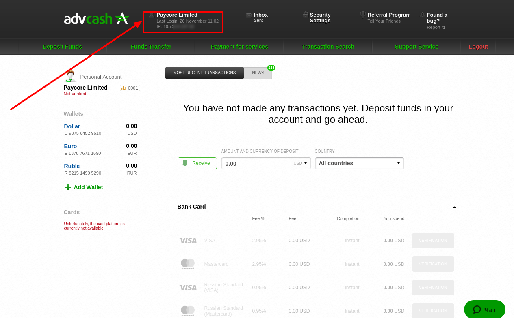
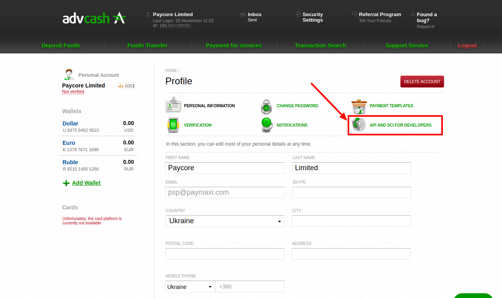
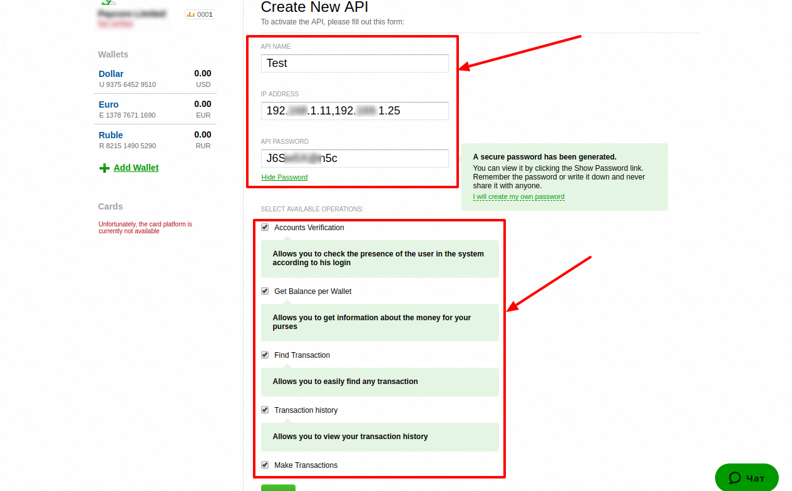
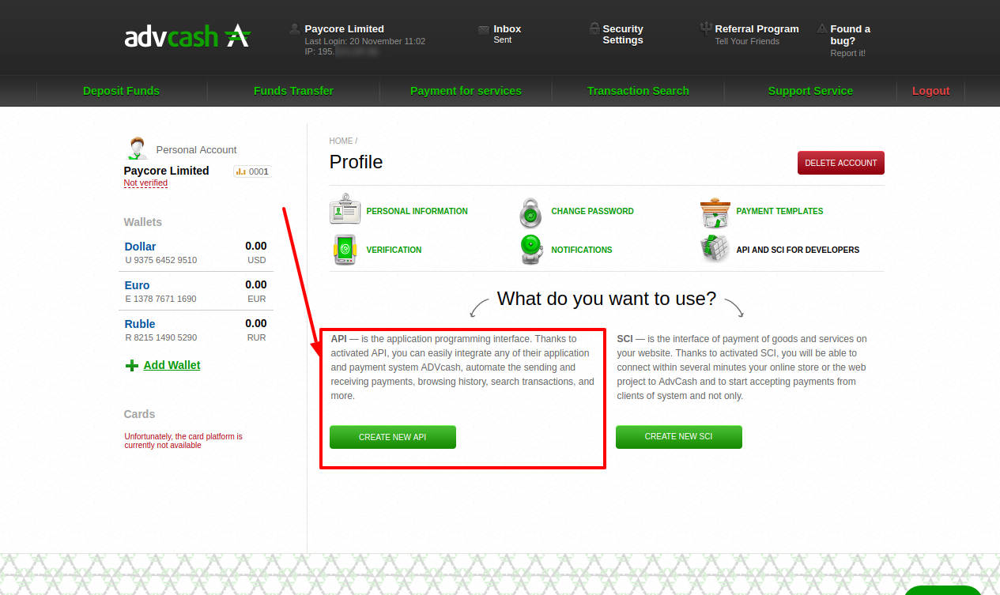
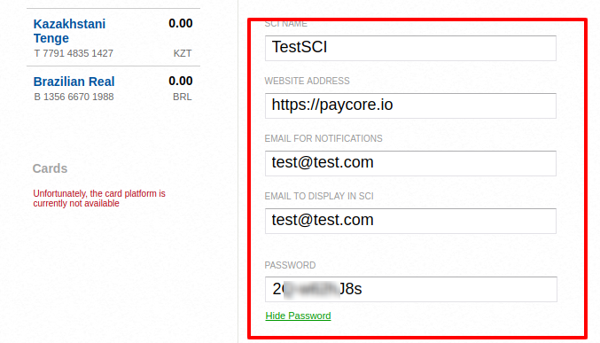

# Advcash

> Money + online safe and simple

**Website**: [advcash.com](https://advcash.com/en/)

**Account**: [log in](https://wallet.advcash.com/login)

Follow the guidance for setting up a connection with AdvCash payment provider.

## Set Up Account

### Step 1: Register or login into your account at wallet.advcash.com

### Step 2: Open profile settings

### Step 3: Go to "API AND SCI FOR DEVELOPERS" section

## Set Up API

!!! info
    [Skip this section](#set-up-sci) if you have already configured API.

### Step 1: Create New API

### Step 2: Set up the properties

* API Name
* IP Addresses (comma-separated list): add all necessary IP addresses including [{{custom.company_name}} white-list IP addresses](/integration/ips/)
* API Password

* Tick all checkboxes:
      * Accounts Verification
      * Get Balance per Wallet
      * Find Transaction
      * Transaction history
      * Make Transactions

### Step 3: Confirm changes

!!! warning
    To confirm the changes, follow the link with instructions that AdvCash send to your primary email.

!!! success
    You have set up and activated API.

## Set Up SCI

!!! info
    [Skip this section](#connect-account) if you have already configured SCI.

!!! warning
    To activate SCI, first, you should verify account.

    

### Step 1: Create New SCI

### Step 2: Set up basic properties

* Tick the option *Use a digital signature in the request to SCI*

!!! tip
    All other properties (*COMMISSION PAYS*, *Accept underpayment*, *Accept overpayment*) are your discretion.

  

### Step 3: Set up advanced properties

* SCI name
* Your Website address (such as`{{custom.website_url}}`)
* Email for notifications
* Email to display in SCI
* Password

!!! tip
    All other links (*Successful transaction page*, *Failed transaction page*, *Status page*) should remain unfilled; they are set through API.

!!! success
    You have set up and activated the SCI.

## Connect Account

### Step 1: Copy required credentials from wallet.advcash.com

* Account Email (the primary email linked with your [Profile](https://wallet.advcash.com/pages/profile))
* API Name
* API Password
* SCI Name
* SCI Password

### Step 2: Connect account at the {{custom.company_name}} Dashboard

Press **Connect** at [*AdvCash Provider Overview*]({{custom.dashboard_base_url}}connect-directory/payment-providers/advcash/general) page in *'New connection'* to open Connection form. Enter copied credentials from [Step 1](#step-1-copy-required-credentials-from-walletadvcashcom).

!!! success
    You have connected **AdvCash** account!

!!! question "Still looking for help connecting your AdvCash account?"
    <!--email_off-->[Please contact our support team!](mailto:{{custom.support_email}})<!--/email_off-->
