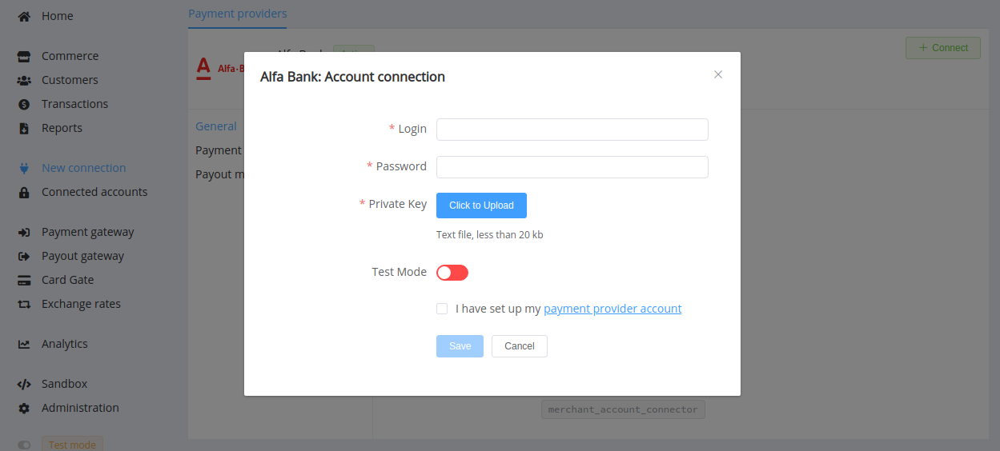

# Alfa Bank

**Website**: [alfabank.com](https://alfabank.com/)

!!! quote ""
    Bank for every day

Follow the guidance for setting up a connection with Alfa Bank as a payment service provider.

## Set Up Account

### Step 1: Contact Alfa Bank support manager

Send a request on the [website](https://alfabank.com/) or call the hotline. Submit the required documents to verify your account and gain access.

### Step 2: Get credentials

Credentials that have to be issued:

* Login suffixed with `-api`
* Password

Find out which API link you require to send requests if you plan to use the host-to-host connection.

!!! important
    Be sure to check with the manager if you require to provide a white list of IPs, and if so, specify IP addresses from the [Corefy list](/integration/ips/).

### Step 3 (for provider account connection): Generate the private/public key pair

Generate the public and private key pair for the digital sign. Save the private and send the public key in Base64 format to your Alfa Bank account manager.

## Connect Provider Account

### Step 1. Connect account at the {{custom.company_name}} Dashboard

Press **Connect** at [*Alfa Bank Provider Overview*]({{custom.dashboard_base_url}}connect-directory/payment-providers/alfabank/general) page in *'New connection'* and choose **Provider account** option to open Connection form.

Enter credentials:

* Login
* Password

Upload generated private key file.

Select Test or Live mode according to the type of account to connect with Alfa Bank.

!!! success
    You have connected **Alfa Bank** account!

## Connect H2H Merchant Account

### Step 1. Connect H2H account at the {{custom.company_name}} Dashboard

Press **Connect** at [*Alfa Bank Provider Overview*]({{custom.dashboard_base_url}}connect-directory/payment-providers/alfabank/general) page in *'New connection'* and choose **H2H Merchant account** option to open Connection form.

Enter credentials:

* Login
* Password

Choose your Host URL from the drop-down list.

Also, choose the *Save Instant Token* option if you plan to use the Alfa Bank account for instant payments and the *Send Customer Data* option if your account has permission to bind client cards.

Choose Currencies and Features. You can set these parameters according to available currencies and features for your Alfa Bank account, but it's necessary to verify details of the connection with your {{custom.company_name}} account manager.

!!! success
    You have connected **Alfa Bank** H2H merchant account!

!!! question "Still looking for help connecting your Alfa Bank account?"
    <!--email_off-->[Please contact our support team!](mailto:{{custom.support_email}})<!--/email_off-->
