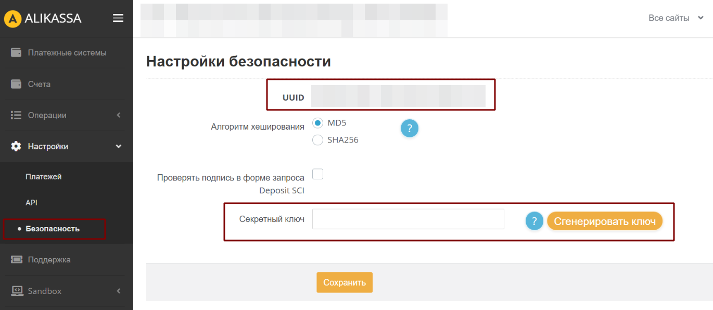
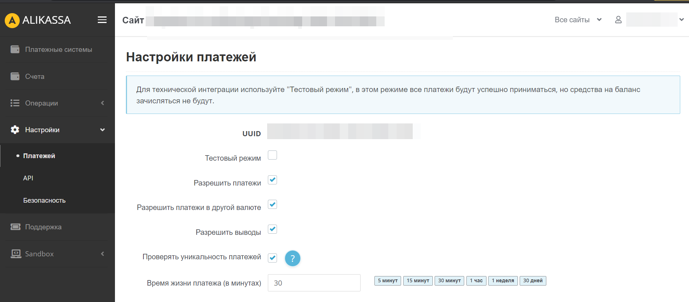
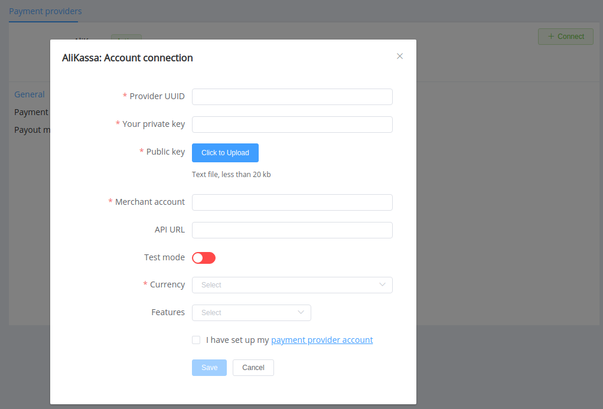

# AliKassa

**Website**: [AliKassa.com](https://alikassa.com/)

Follow the guidance for setting up a connection with the AliKassa payment service provider.

## Set up account

### Step 1: Sign up for the AliKassa account

Send a request on the [website](WEBSITE), verify your account and gain access.

### Step 2: Get credentials

In the account (*'Settings'* --> '*Security*'), find:

* UUID
* Private (Secret) Key

!!! tip ""
    Be sure to check available options at *'Settings'* --> '*Payments*' and choose those you intend to use.

    

And if AliKassa provides you with the H2H connection, you will also obtain:

* *Merchant Account*
* *Public key* (file)
* API URL for connection

### Step 3: Set Callback URL in the account API settings

Add `https://psp-ext.paycore.io/alikassa/callback` as the notification URL if you want to receive Callbacks through the {{custom.company_name}} platform.

!!! important
    Be sure to check with the manager if you require to provide a white list of IPs, and if so, specify IP addresses from the [{{custom.company_name}} list](/integration/ips/).

## Connect Provider account

### Step 1. Connect account at the {{custom.company_name}} Dashboard

Press **Connect** at [*AliKassa Provider Overview*]({{custom.dashboard_base_url}}connect-dirhttps://payment.alikassa.com/ectory/payment-providers/alikassa/general) page in *'New connection'* and choose **Provider account** option to open Connection form.

Enter credentials:

* UUID --> Provider UUID
* Private Key

!!! success
    You have connected **AliKassa** provider account.

## Connect H2H Merchant Account

### Step 1. Connect H2H account at the {{custom.company_name}} Dashboard

Press **Connect** at [*AliKassa Provider Overview*]({{custom.dashboard_base_url}}connect-directory/payment-providers/alikassa/general) page in *'New connection'* and choose **H2H Merchant account** option to open Connection form.

Enter credentials:

* UUID --> Provider UUID
* Private Key
* Merchant Account
* API URL (without `api` prefix, for example: `https://payment.alikassa.com/`)

Upload the file with the Public key.
https://payment.alikassa.com/
Choose Test Mode to test connection with AliKassa if you're sure you also checked Test mode in your account on the AliKassa platform.

Choose Currencies and Features. You can set these parameters according to available currencies and features for your AliKassa account, but it is necessary to check details of the connection with your {{custom.company_name}} account manager.

!!! success
    You have connected **AliKassa** H2H merchant account!

!!! question "Still looking for help connecting your AliKassa account?"
    <!--email_off-->[Please contact our support team!](mailto:{{custom.support_email}})<!--/email_off-->
