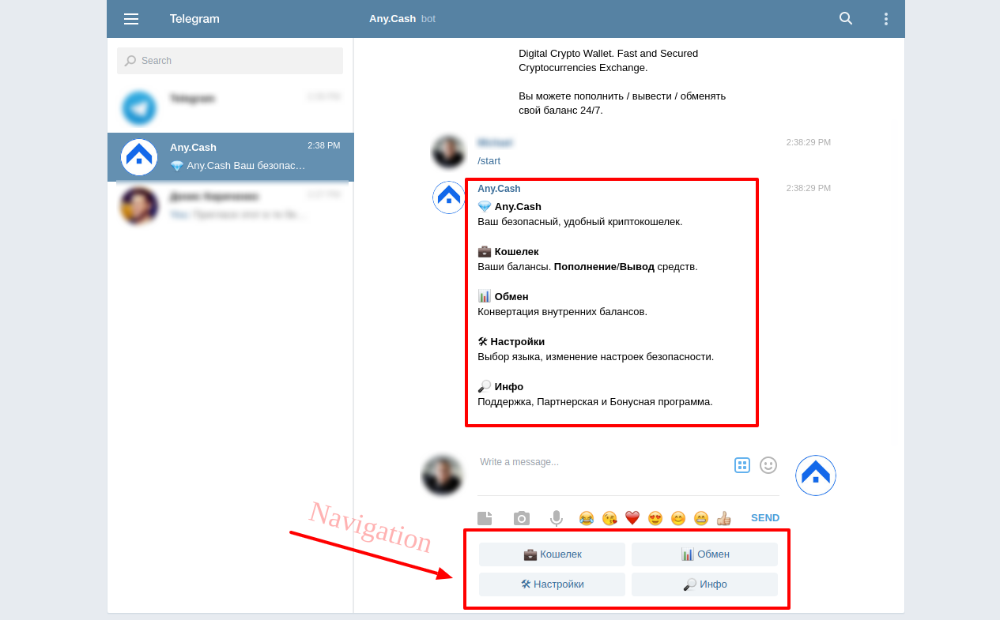
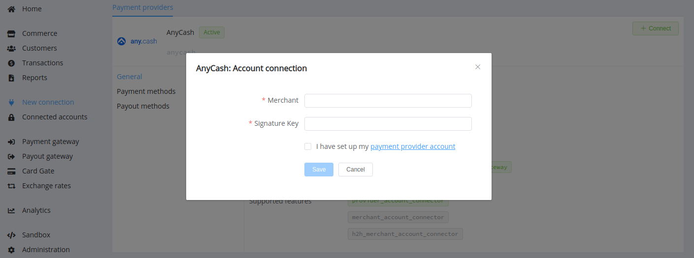

# AnyCash

!!! quote ""
    Convenient and secure digital wallet on Telegram

**Website**: [any.cash](https://any.cash/en)

## Set Up account

### Step 1: Create AnyCash wallet

!!! note ""
    Since this digital wallet for sending funds with Telegram, you should have your trusted account in this messenger.

Press the *'Create Wallet'* button or find `@AnyCashBot` directly on Telegram. Run `/start`

    

### Step 2: Contact AnyCash Manager and get required credentials

Credentials that have to be issued:

* Merchant ID
* Signature key

!!! important
    Be sure to check with the manager if you require to provide a white list of IPs, and if so, specify IP addresses from the [Corefy list](/integration/ips/).

## Connect Account

### Step 1. Connect account at the {{custom.company_name}} Dashboard

Press **Connect** at [*Any.Cash Provider Overview*]({{custom.dashboard_base_url}}connect-directory/payment-providers/anycash/general) page in *'New connection'* and choose **Provider account** option to open Connection form.

Enter credentials:

* Merchant ID --> Merchant
* Signature key

!!! success
    You have connected **Any.Cash** account!

!!! question "Still looking for help connecting your Any.Cash account?"
    [Please contact our support team!](mailto:{{custom.support_email}})