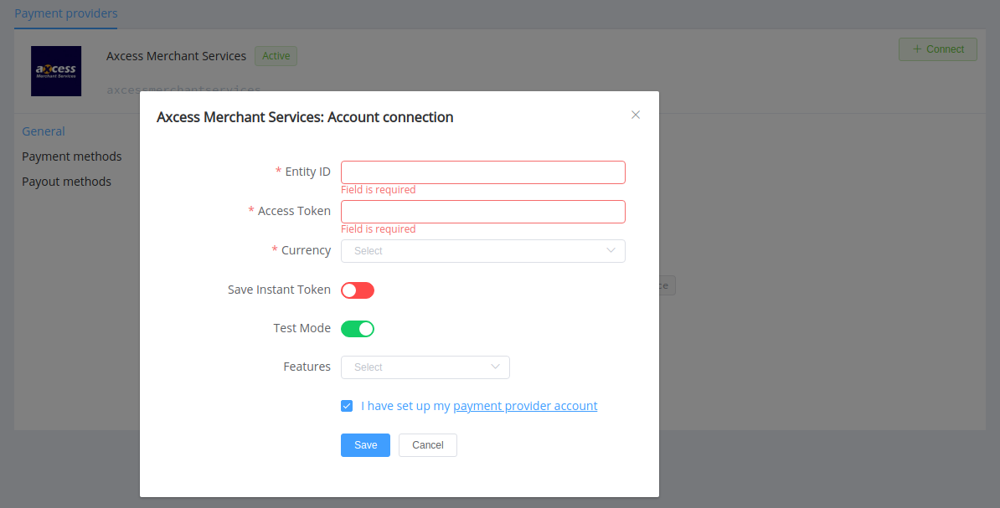

# Axcess Merchant Services Connector

> SLOGAN

**Website**: [Axcess Merchant Services](https://www.axcessms.com/)
**Login**: [Axcess Merchant Services](WEBSITE)

Follow the guidance for setting up a connection with Axcess Merchant Services payment provider.

## Set Up Account

### Step 1: Contact Axcess Merchant Services support manager

Send a request on the [website](https://www.axcessms.com/) or call the hotline. Submit the required documents to verify your account and gain access.

### Step 2: Get credentials

Credentials that have to be issued:

* entityId
* Authorization Bearer \<access-token\>

You can gain them from your account administrator (or take from the backend UI if you have specific administration rights).

<!--
## Connect Provider Account

### Step 1. Connect account at dashboard.paycore.io

Press **Connect** at [*Axcess Merchant Services Provider Overview*](https://dashboard.paycore.io/connect-directory/payment-providers/axcessmerchantservices/general) page in *'New connection'* and choose **Provider account** option to open Connection form.

Enter credentials:

[//]: # (Also, choose Test Mode for test connection with Axcess Merchant Services, and P2P mode for connection in  peer-to-peer payment network.)

!!! success
    You have connected **Axcess Merchant Services** account!
-->

## Connect H2H Merchant Account

### Step 1. Connect H2H account at dashboard.paycore.io

Press **Connect** at [*Axcess Merchant Services Provider Overview*](https://dashboard.paycore.io/connect-directory/payment-providers/axcessmerchantservices/general) page in *'New connection'* and choose **H2H Merchant account** option to open Connection form.

Enter credentials:

* entityId --> Entity ID
* Authorization Bearer \<access-token\> --> Access Token

Choose Save Instant Token option if you plan to use the Axcess account for instant payments.

Choose Test Mode for test connection with Axcess Merchant Services.

Choose Currency and Features. You can set these parameters according to available currencies and features for your Axcess Merchant Services account, but it is necessary to check details of the connection with your PayCore.io account manager.

!!! success
    You have connected **Axcess Merchant Services** H2H merchant account!

!!! question "Still looking for help connecting your Axcess Merchant Services account?"
    [Please contact our support team!](mailto:support@paycore.io)
