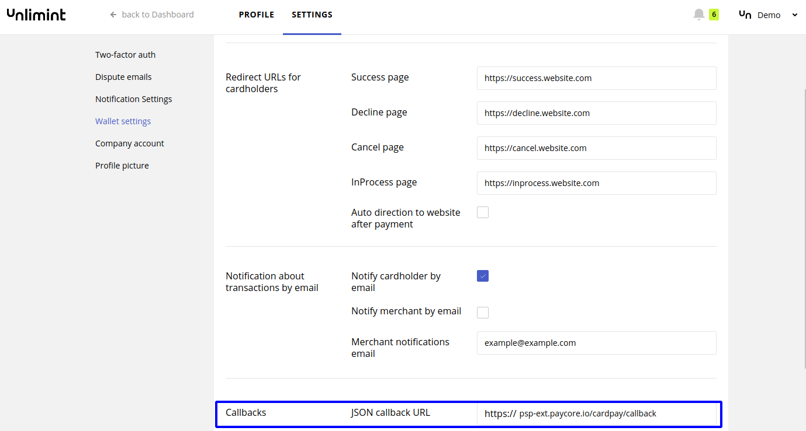
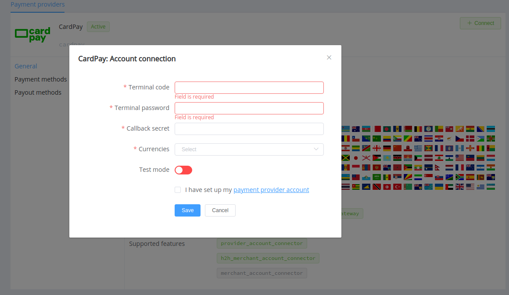
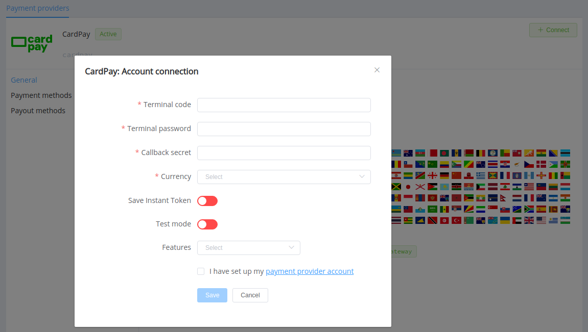

# Unlimint (CardPay)

!!! quote ""
    Is your business ready for tomorrow?

**Website**: [Unlimint.com](https://www.unlimint.com/)

**Login**: [cardpay.com](https://cardpay.com/ma/)

Follow the guidance for setting up a connection with Unlimint as a payment service provider.

## Set Up Account

### Step 1: Contact Unlimint support manager

Send a request on the [website](WEBSITE). Submit the required documents to verify your account. Provide them with contact details of your integration specialist and gain access to the sandbox.

The test API integration parameters will be available in the Sandbox Merchant Account firstly. Please check the integration status along with your Unlimint and {{custom.company_name}} account managers.

### Step 2: Get live credentials

Then, the Unlimint support team will prepare a live account and send you login credentials (login and link) and instructions for the first entering to the live administrative interface (Merchant Account). Set a personal permanent passwords to the account.

Go to the *Settings* --> *Wallet settings* --> *Show credentials function* and copy live credentials:

* Wallet ID
* Terminal password
* Callback secret

### Step 3: Set up your account

Set up all necessary parameters. Make sure to specify `https://psp-ext.paycore.io/cardpay/callback` as the Callback URL.

!!! important
    Be sure to check with the manager if you require to provide a white list of IPs, and if so, specify IP addresses from the [Corefy list](/integration/ips/).

## Connect Provider Account

### Step 1. Connect account at the {{custom.company_name}} Dashboard

Press **Connect** at [*CardPay (Unlimint) Provider Overview*]({{custom.dashboard_base_url}}connect-directory/payment-providers/cardpay/general) page in *'New connection'* and choose **Provider account** option to open Connection form.

Enter credentials:

* Terminal code <-- Wallet ID
* Terminal password
* Callback secret

Choose currencies according to available currencies for your Unlimint account. Also, select Test or Live mode according to the type of account to connect.

!!! success
    You have connected **Unlimint** account!

## Connect H2H Merchant Account

### Step 1. Connect H2H account at the {{custom.company_name}} Dashboard

Press **Connect** at [*Unlimint Provider Overview*]({{custom.dashboard_base_url}}connect-directory/payment-providers/Unlimint/general) page in *'New connection'* and choose **H2H Merchant account** option to open Connection form.

Enter credentials:

* Terminal code <-- Wallet ID
* Terminal password
* Callback secret

Select Test or Live mode according to the type of account to connect with Unlimint.

Choose Currencies and Features. You can set these parameters according to available currencies and features for your Unlimint account, but it's necessary to verify details of the connection with your {{custom.company_name}} account manager.

Also, toggle the 'Save Instant token' option if you plan to use instant payments.

!!! success
    You have connected **Unlimint** H2H merchant account!

!!! question "Still looking for help connecting your Unlimint account?"
    <!--email_off-->[Please contact our support team!](mailto:{{custom.support_email}})<!--/email_off-->
