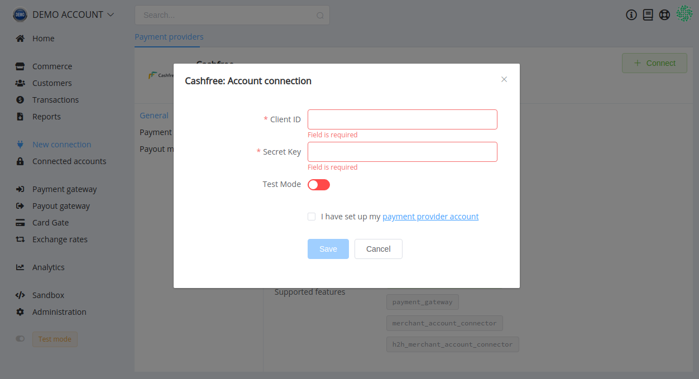

# Cashfree Connector

> The fastest and easiest way to collect and disburse payments for growing businesses

**Website**: [cashfree.com](https://www.cashfree.com/)

Follow the guidance for setting up a connection with Cashfree payment service provider.

## Set Up Account

### Step 1: Sign Up at cashfree.com

Create your merchant profile on the [website](https://merchant.cashfree.com/merchant/sign-up). Submit the required documents to verify your account and gain access.

### Step 2: Get credentials

Credentials that have to be issued:

* Client ID
* Secret key

## Connect Provider Account

### Step 1. Connect account at the {{custom.company_name}} Dashboard

Press **Connect** at [*Cashfree Provider Overview*]({{custom.dashboard_base_url}}connect-directory/payment-providers/cashfree/general) page in *'New connection'* and choose **Provider account** option to open Connection form.

Enter credentials:

* Client ID
* Secret key

Also, choose Test Mode for test connection with Cashfree.

!!! success
    You have connected **Cashfree** account!

!!! question "Still looking for help connecting your Cashfree account?"
    [Please contact our support team!](mailto:{{custom.support_email}})
