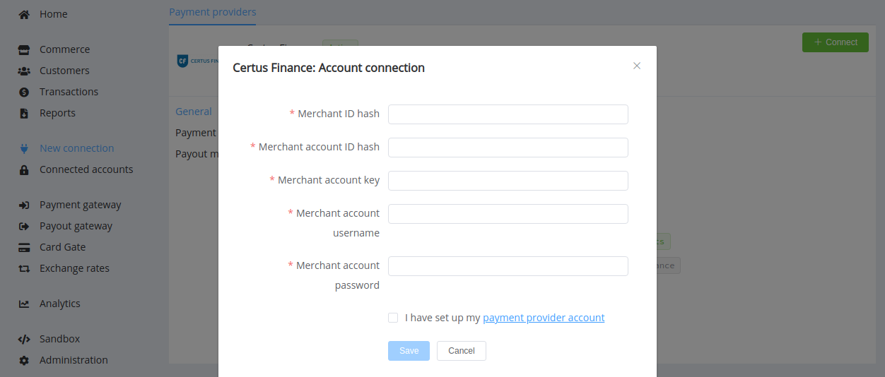

# Certus Finance

!!! quote ""
    Real processing for all business categories

**Website**: [certus.finance](https://certus.finance/)

**Login**: [mbo.certus.finance](https://mbo.certus.finance/Portal/#!login)

Follow the guidance for setting up a connection with Certus Finance payment service provider.

## Set Up Account

### Step 1: Contact Certus Finance support manager

Send a request on the [website](https://certus.finance/). Submit the required documents to verify your account and gain access.

### Step 2: Get credentials

Credentials that have to be issued:

* Merchant ID hash
* Merchant account ID hash
* Merchant account key
* Merchant account username
* Merchant account password

## Connect Provider Account

### Step 1. Connect account at the {{custom.company_name}} Dashboard

Press **Connect** at [*Certus Finance Provider Overview*]({{custom.dashboard_base_url}}connect-directory/payment-providers/certusfinance/general) page in *'New connection'* to open Connection form.

Enter the credentials obtained for your account:

* Merchant ID hash
* Merchant account ID hash
* Merchant account key
* Merchant account username
* Merchant account password

!!! success "That's all!"
    You have connected **Certus Finance** account!

!!! question "Still looking for help connecting your Certus Finance account?"
    [Please contact our support team!](mailto:{{custom.support_email}})
