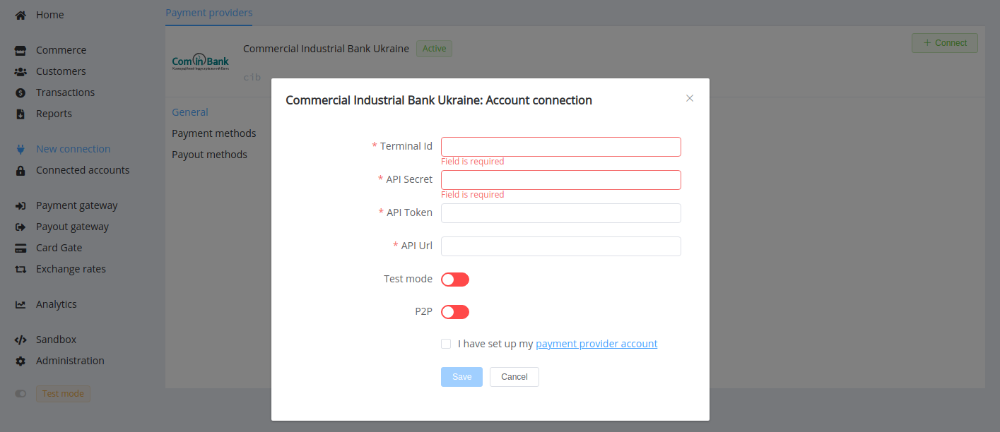
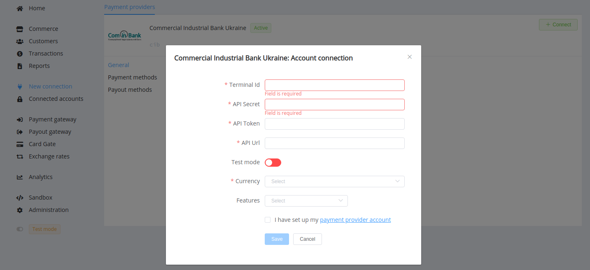

# ComIn Bank (the Commercial Industrial Bank of Ukraine)

**Website**: [cib.com.ua](https://cib.com.ua/uk)

**Login**: [PAY.CIB](https://pay.cib.com.ua:7002/ifobsClient/LoginShow.action)

Follow the guidance for setting up a connection with ComIn Bank as a payment service provider.

## Set Up Account

### Step 1: Contact ComIn Bank support manager

Contact your bank manager, submit all required documents to verify your account and gain access.

### Step 2: Get credentials

Credentials that have to be issued:

* Terminal ID
* API Secret
* API Token
* API URL

!!! important
    Be sure to check with the bank manager if you require to provide a white list of IPs, and if so, specify IP addresses from the [Corefy list](/integration/ips/).

## Connect Provider Account

### Step 1. Connect account at the {{custom.company_name}} Dashboard

Press **Connect** at [*ComIn Bank Connector Overview*]({{custom.dashboard_base_url}}connect-directory/payment-providers/cib/general) page in *'New connection'* and choose **Provider account** option to open Connection form.

Enter credentials:

* Terminal ID
* API Secret
* API Token
* API URL

Also, select Test or Live mode according to the type of account to connect with ComIn Bank, and P2P mode for connection in  the peer-to-peer network.

!!! success
    You have connected the **ComIn Bank** account!

## Connect H2H Merchant Account

### Step 1. Connect H2H account at the {{custom.company_name}} Dashboard

Press **Connect** at [*ComIn Bank Connector Overview*]({{custom.dashboard_base_url}}connect-directory/payment-providers/cib/general) page in *'New connection'* and choose **H2H Merchant account** option to open Connection form.

Enter credentials:

Select Test or Live mode according to the type of account to connect with ComIn Bank.

Choose Currency and Features. You can set these parameters according to available currencies and features for your ComIn Bank account, but it is necessary to check details of the connection with your {{custom.company_name}} account manager.

!!! success
    You have connected the **ComIn Bank** H2H merchant account!

!!! question "Still looking for help connecting your ComIn Bank account?"
    <!--email_off-->[Please contact our support team!](mailto:{{custom.support_email}})<!--/email_off-->
