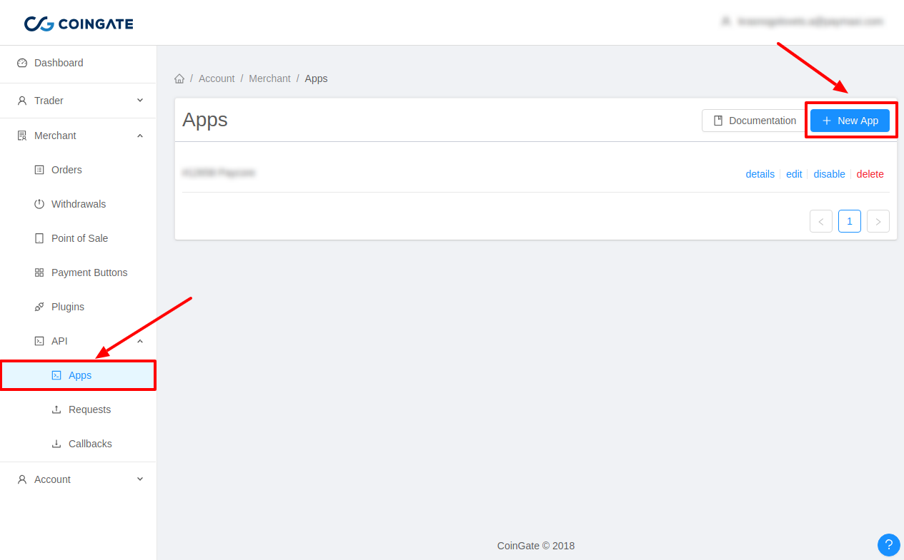
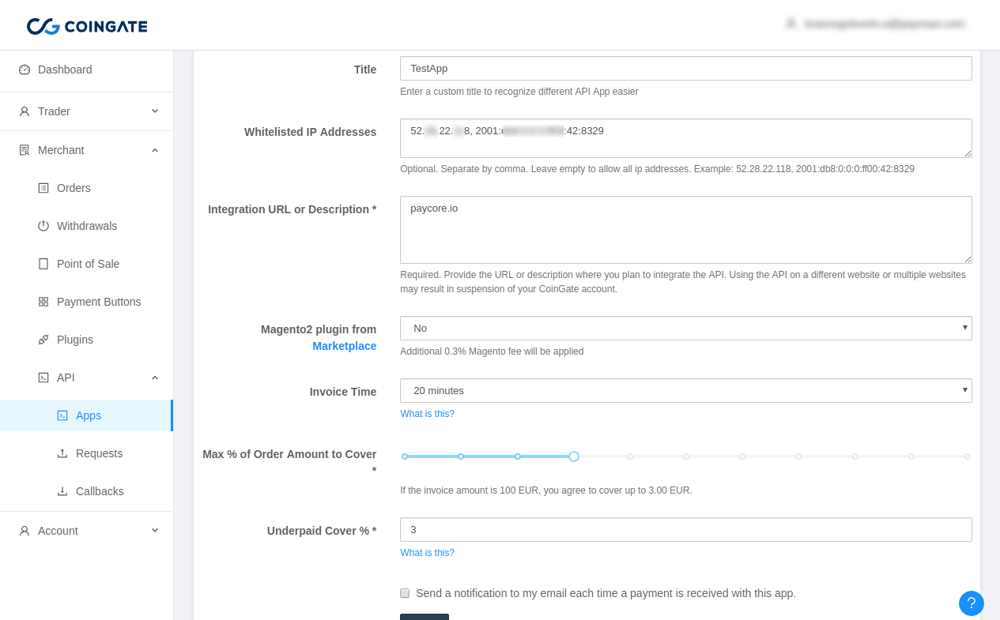
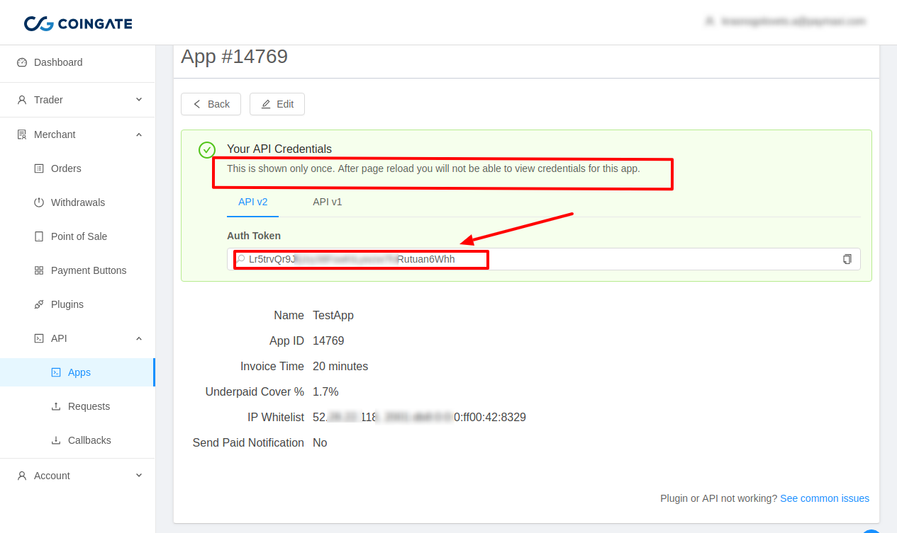
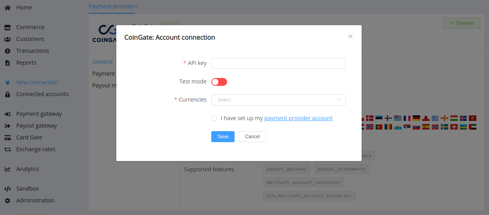

# CoinGate

!!! quote ""
    Your Gateway to All Things Cryptocurrency

**Website**: [coingate.com](https://coingate.com/)

**Login**: [dashboard.coingate.com](https://dashboard.coingate.com/login)

Follow the guidance for setting up a connection with CoinGate payment service provider.

## Set Up Account

### Step 1: Register at CoinGate dashboard

Create an account at the [CoinGate dashboard](https://dashboard.coingate.com/register). Submit the required documents to verify your account and gain full access.

### Step 2: Create API credentials

Login to your CoinGate account, go to the *'API'* --> *'Apps'* section, and click on *'+ New App'*".

Fill out the form:

* enter a title
* whitelist all necessary IP addresses including [{{custom.company_name}} whitelist IP addresses](/integration/ips/)
* set your integration URL as `{{custom.website_url}}`
* choose an invoice expiration time and acceptable underpayment threshold if desired

Press '*Submit*'. Immediately after creation, copy the displayed Auth Token to your API integration code or configuration (it's only shown once for security purposes).

!!! note "Please note"
    To use Test Mode, you should create an account on the [CoinGate sandbox environment](https://sandbox.coingate.com/) and get API credentials there.

## Connect Provider Account

### Step 1. Connect account at the {{custom.company_name}} Dashboard

Press **Connect** at [*CoinGate Provider Overview*]({{custom.dashboard_base_url}}connect-directory/payment-providers/coingate/general) page in *'New connection'* to open Connection form.

Enter:

* *Auth Token* --> *API Key*

Choose Test Mode for test connection. Choose currencies to use.

!!! success "That's all!"
    You have connected **CoinGate** account!

!!! question "Still looking for help connecting your CoinGate account?"
    [Please contact our support team!](mailto:{{custom.support_email}})
