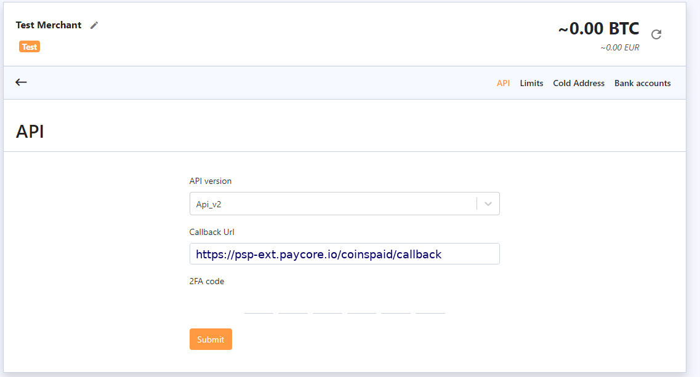
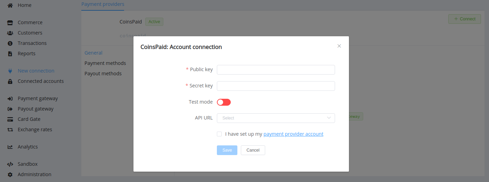

# CoinsPaid

!!! quote ""
    Secure crypto payment solutions for businesses and individuals.

**Website**: [cryptoprocessing.com](https://cryptoprocessing.com/)

**Login**: [login](https://app.cryptoprocessing.com/login)

Follow the guidance for setting up a connection with CoinsPaid payment service provider.

## Set Up Account

### Step 1: Contact CoinsPaid support

Send a request on the [website](https://cryptoprocessing.com/request-a-quote/) or contact support via email. Submit the required documents to verify your account, gain access, and browse to your merchant account.

### Step 2: Get credentials

You should set up and activate your API key (or create a new one).

You will receive your API secret – an access code for the API key that you’ve activated.  You’ll need to copy and save the key secret in a safe place because it is only displayed once and you won’t be able to see it again.

Then you can set up Callback URL: `https://psp-ext.paycore.io/coinspaid/callback`. You need to complete this step to receive callbacks from CoinsPaid.

Make sure that all necessary currencies are enabled on your merchant account, for that you need to access the “Currencies Info" tab. There you can enable the currencies that you want to use (either crypto or fiat) by pressing the “Add New Currency” button and picking the desirable currencies from the list.

## Connect Provider Account

### Step 1. Connect account at the {{custom.company_name}} Dashboard

Press **Connect** at [*CoinsPaid Provider Overview*]({{custom.dashboard_base_url}}connect-directory/payment-providers/coinspaid/general) page in *'New connection'* and choose **Provider account** option to open Connection form.

Enter credentials:

* activated API Key --> Public Key
* API Secret --> Secret Key

Also, choose Test Mode if you want to test connection with CoinsPaid. Choose 

!!! success
    You have connected **CoinsPaid** account!

!!! question "Looking for help connecting your CoinsPaid account?"
    [Please contact our support team](mailto:{{custom.support_email}})!
