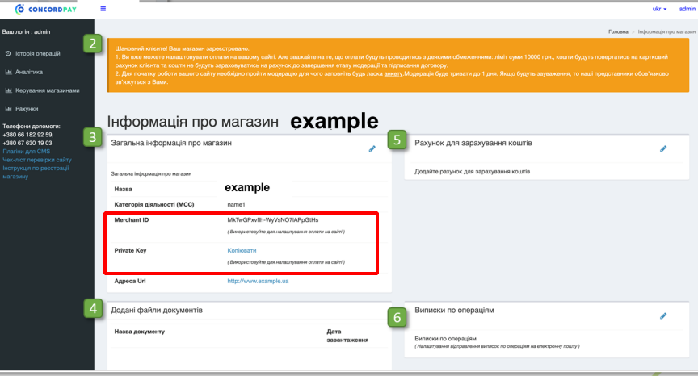
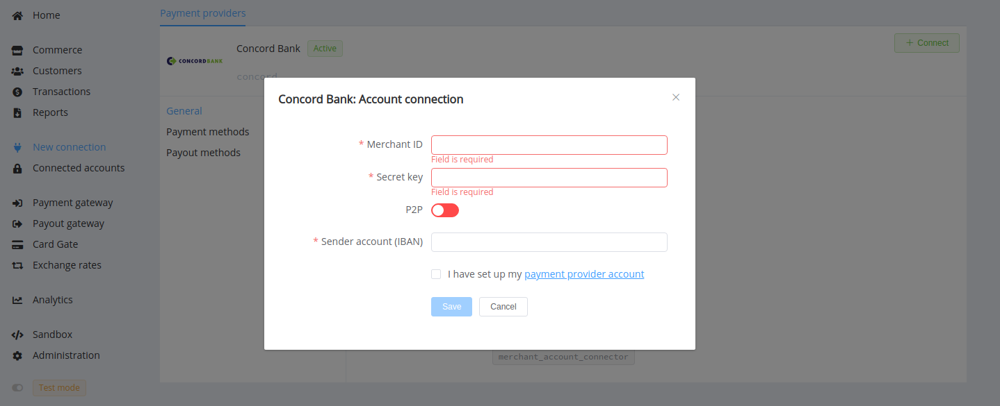
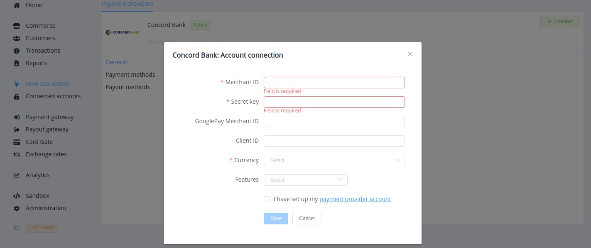

# Concord Bank

!!! quote ""
    Concord Pay internet acquiring

**Website**: [concord.ua](https://concord.ua/en)

**Login**: [pay.concord.ua](https://pay.concord.ua/cabinet/default/login)

Follow the guidance for setting up a connection with Concord bank as a payment service provider.

## Set Up Account

### Step 1: Register at Concord Pay

Send a request on the [website](https://pay.concord.ua/cabinet/default/signup). Submit the required information and documents to verify your account and gain access.

### Step 2: Get credentials

Set up your account at [pay.concord.ua](https://pay.concord.ua/cabinet/default/login). Add your shop. In the General information about the shop, find:

* Merchant ID
* Private Key

!!! important
    Be sure to check with the bank manager if you require to provide a white list of IPs, and if so, specify IP addresses from the [Corefy list](/integration/ips/).

## Connect Provider Account

### Step 1. Connect account at the {{custom.company_name}} Dashboard

Press **Connect** at [*Concord Bank Provider Overview*]({{custom.dashboard_base_url}}connect-directory/payment-providers/concord/general) page in *'New connection'* and choose **Provider account** option to open Connection form.

Enter credentials:

* Merchant ID
* Private Key

Specify the Sender bank account (IBAN).

Also, choose P2P mode for connection in peer-to-peer payment network.

!!! success
    You have connected **Concord** account!

## Connect H2H Merchant Account

### Step 1. Connect H2H account at the {{custom.company_name}} Dashboard

Press **Connect** at [*Concord Provider Overview*]({{custom.dashboard_base_url}}connect-directory/payment-providers/concord/general) page in *'New connection'* and choose **H2H Merchant account** option to open Connection form.

Enter credentials:

* Merchant ID
* Private Key --> Secret Key

Specify your GooglePay Merchant ID for an account with the Google Pay connection and your Masterpass Client ID for an account with the Masterpass connection.

Choose Currency and Features. You can set these parameters according to available currencies and features for your Concord account, but it is necessary to check details of the connection with your {{custom.company_name}} account manager.

!!! success
    You have connected **Concord** H2H merchant account!

!!! question "Still looking for help connecting your Concord Bank account?"
    <!--email_off-->[Please contact our support team!](mailto:{{custom.support_email}})<!--/email_off-->
