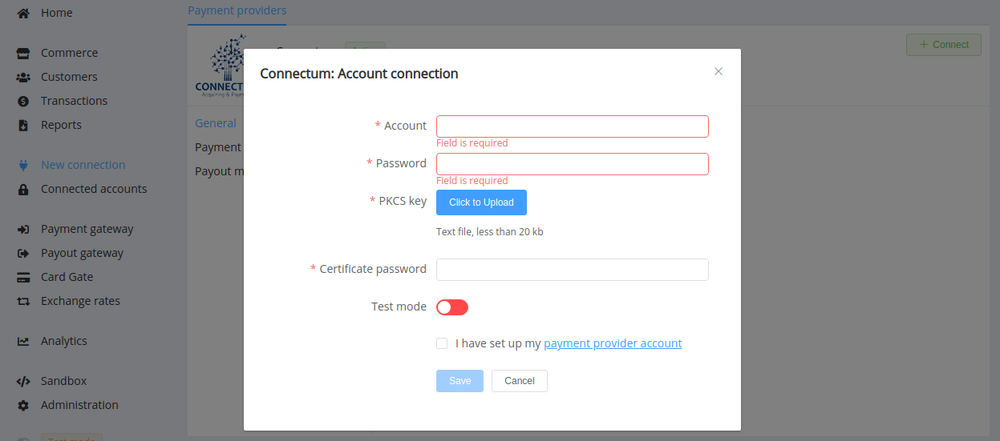
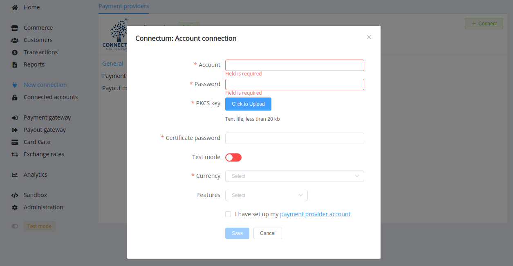

# Connectum

!!! quote ""
    Global payment processing for each client.

**Website**: [connectum.eu](https://connectum.eu/)

**Login**: [ib.connectum.eu](https://ib.connectum.eu/site/home)

Follow the guidance for setting up a connection with Connectum as the payment service provider.

## Set Up Account

### Step 1: Contact Connectum support manager

Send a request on the [website](https://connectum.eu/account-opening/) or call the hotline. Submit the required documents to verify your account and gain access.

### Step 2: Get credentials

Credentials that have to be obtained from your Connectum account manager:

* your account username
* password
* archive file with your PKCS key --> unpack it and save the key
* certificate password

!!! important
    Be sure to check with the manager if you require to provide a white list of IPs, and if so, specify IP addresses from the [Corefy list](/integration/ips/).

!!! note "Please keep in mind"
    Connectum renews access certificates annually, so stay in touch with your account manager to timely know about updates. Once your certificate has been updated, you will need to reconnect your accounts.

## Connect Provider Account

### Step 1. Connect account at the {{custom.company_name}} Dashboard

Press **Connect** at [*Connectum Provider Overview*]({{custom.dashboard_base_url}}connect-directory/payment-providers/connectum/general) page in *'New connection'* and choose **Provider account** option to open Connection form.

Enter credentials:

* your account username
* password
* certificate password

Upload file with PKCS key.

Also, choose Test Mode for test connection with Connectum.

!!! success "Just right!"
    You have connected **Connectum** account!

## Connect H2H Merchant Account

### Step 1. Connect H2H account at the {{custom.company_name}} Dashboard

Press **Connect** at [*Connectum Provider Overview*]({{custom.dashboard_base_url}}connect-directory/payment-providers/Connectum/general) page in *'New connection'* and choose **H2H Merchant account** option to open Connection form.

Enter credentials:

* your account username
* password
* certificate password

Upload file with PKCS key. Choose Test Mode for test connection with Connectum.

Choose Currencies and Features. You can set these parameters according to available currencies and features for your Connectum account, but it is necessary to check details of the connection with your {{custom.company_name}} account manager.

!!! success
    You have connected **Connectum** H2H merchant account!

!!! question "Still looking for help connecting your Connectum account?"
    <!--email_off-->[Please contact our support team!](mailto:{{custom.support_email}})<!--/email_off-->
