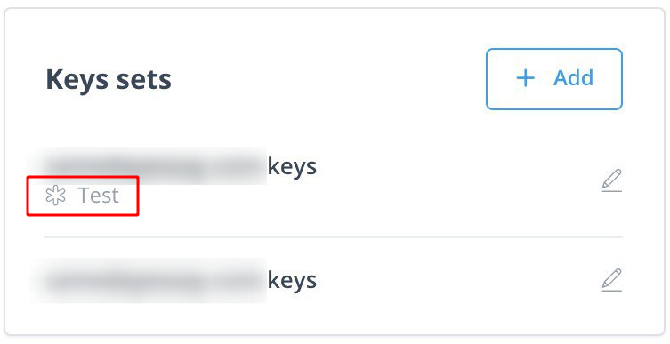
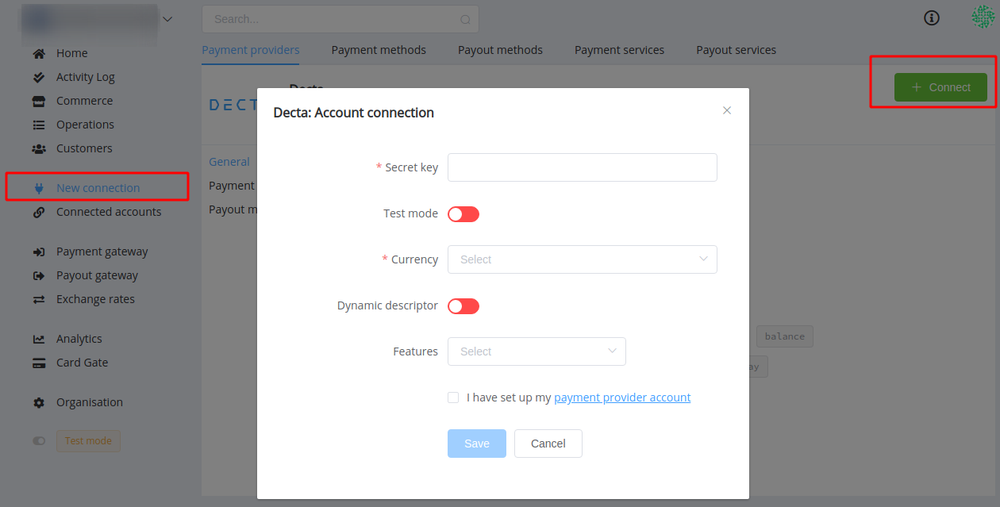

# Decta Connector

Follow the instructions for setting up a connection with Decta payment provider.

## Set up account

### Step 1: Contact Decta support manager

Submit the required documents to verify your account and gain access.

### Step 2:  Generate key(s)

Go to the 'e-Commerce & API' section, choose a terminal and generate keys for the account connection. Pay attention that you'll need different sets for the live and test connection.

To generate a test key set, turn on the toggle near the 'Title' input.

The test key set will be marked by 'Test' label under the title in the common list (the screenshot shows the correct toggle position to generate test keys).

## Connect account

### Step 1: Copy the secret key from the key set at gate.decta.com

### Step 2: Connect account at the {{custom.company_name}} Dashboard

Press Connect at **Decta Provider Overview** page in *'New connection'* section to open Connection form.

Enter the key and set up the required parameters:

* Test mode &mdash; if you connect the test key;
* Currency.

!!! note
    These parameters are set according to your Merchant account type and its available currencies.

As necessary, choose additional options:  

* turn on the generation of dynamic descriptor &mdash; you can edit its content later, in the *'Commerce account'* settings;
* add all necessary features.

!!! success
    You have connected **Decta** account!

!!! question "Still looking for help connecting your Decta account?"
    <!--email_off-->[Please contact our support team!](mailto:{{custom.support_email}})<!--/email_off-->