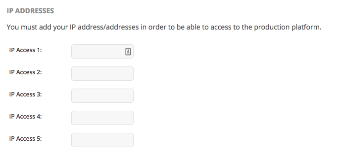
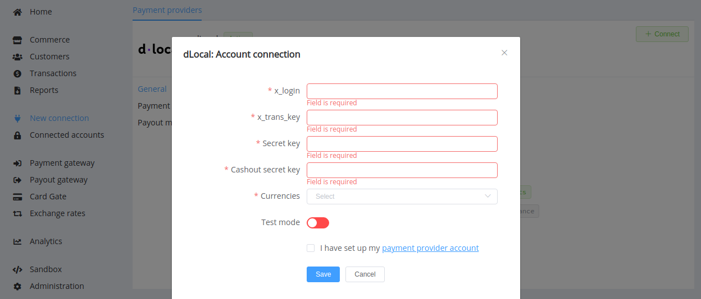

# dLocal

!!! quote ""    
    Local payments in emerging markets made easy

**Website**: [dlocal.com](https://dlocal.com/)

**Login**: [merchant.dlocal.com](https://merchant.dlocal.com/login)

Follow the guidance for setting up a connection with dLocal payment service provider.

## Set Up Account

### Step 1: Contact dLocal support manager

Send a request on the [website](https://dlocal.com/lets-talk/). Submit the required documents to verify your account and gain access.

### Step 2: Set up your account

Log into the Merchant application. Go to the *'Integration'* --> *Integration Settings*.

!!! note

    Please note that dlocal has Test and Live integration panel. Be sure that you operate in the right mode.

    

Whitelist all your necessary IP addresses including [{{custom.company_name}} whitelist IPs](/integration/ips/).

Since {{custom.company_name}} and dLocal have implemented integration only for payouts yet, you shouldn't configure *Return URL*, *Confirm URL*, and *Refund URL*: it is correct to leave them empty.

### Step 3: Get credentials

Credentials that have to be issued:

* *Test (Live) Credentials*:

    * x_login
    * x_trans_key
    * Secret Key

* *Cashout credentials*:

    * Secret key

!!! attention "Be aware"

    Once you have finished connection testing, make sure dLocal has activated your account and you have got the production key.
    
    When you go live, switch from Test to Live mode, update the API credentials by replacing the test key with the production key and necessarily updating the whitelisted IPs.

## Connect Provider Account

### Step 1. Connect account at the {{custom.company_name}} Dashboard

Press **Connect** at [*dLocal Provider Overview*]({{custom.dashboard_base_url}}connect-directory/payment-providers/dLocal/general) page in *'New connection'* to open Connection form.

Enter credentials:

* x_login
* x_trans_key
* Secret Key
* Cashout secret key

Choose Currencies according to available currencies for your dLocal account.

Make sure enable test mode if you specify test credentials (or vice versa).

!!! success
    You have connected **dLocal** provider account!

!!! question "Still looking for help connecting your dLocal account?"
    [Please contact our support team!](mailto:{{custom.support_email}})
