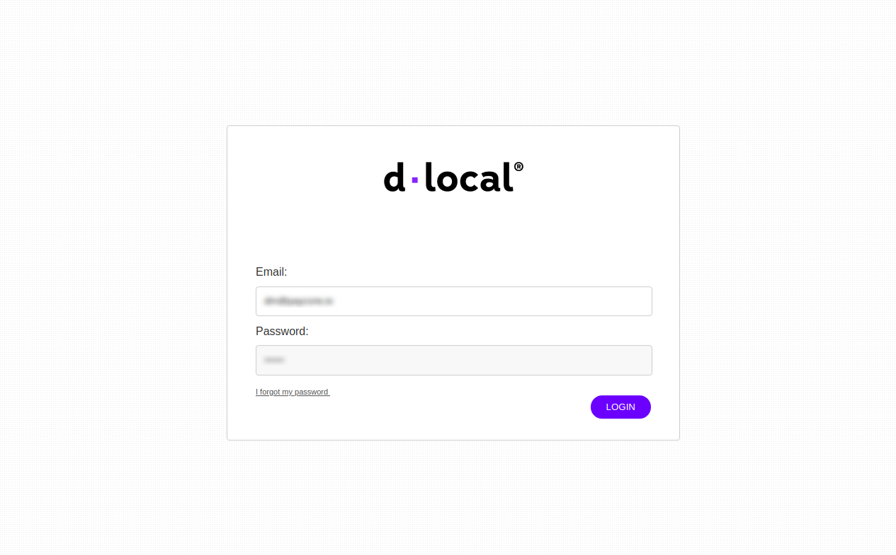
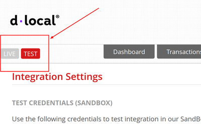

# dLocal Connector

## Introduction

Here You can find  instructions for setting up **dLocal**  account.

## Setup account

#### Step 1: Contact with dLocal Support Manager

!!! note
    You can not create dLocal merchant account yourself! 
 
    Ask Support manager how to get login details!

#### Step 2: Log in to the dashboard
!!! info "Screenshot"
    
#### Step 3: Go to the Integration:Credentials&Settings section

!!! info "Screenshot"
    

#### Step 4: Get required credentials

!!! info
    Note that  there are  **`TEST`** and **`LIVE`** mode.
    Ensure that you turn on the rught one.
    
    !!! info "Screenshot"
        

- **Test (Live) Credentials**:

    -  x_login

    -  x_trans_key

    -  Secret Key

- **Cashout credentials:**

    -  Cashout secret key

!!! info "Screenshot"
    

#### Step 5: Set up required parameters

- Add all necessary IP adressess to the White list, including  [PayСore.io white-list IP addresses](/ips/#white-list-ip-addresses)
    
!!! info "Screenshot"
    

!!! success
    You have configured account!

## Connect account

#### Step 1: Copy required credentials

#### Step 2: Enter credentials

-  x_login

-  x_trans_key

-  Secret Key

-  Cashout secret key

!!! tip
    Press **`Connect`** at dLocal **`Provider Overview page`** in **`New connection`** section to open Connection form!

#### Step 3: Set up additional parameters

-  Currencies
    
    !!! tip
        You can add any currency, available for your dLocal merchant account.

    !!! Note 
        If You add **unavailable** currency - it will occure an **`ERROR`**!

-  Test mode

    !!! tip
        Set **TRUE** - if You connect **`TEST`** account!

        Set **FALSE** - if You connect **`LIVE`** account!

!!! info "Screenshot"
    

!!! success
    You have connected **dLocal**!