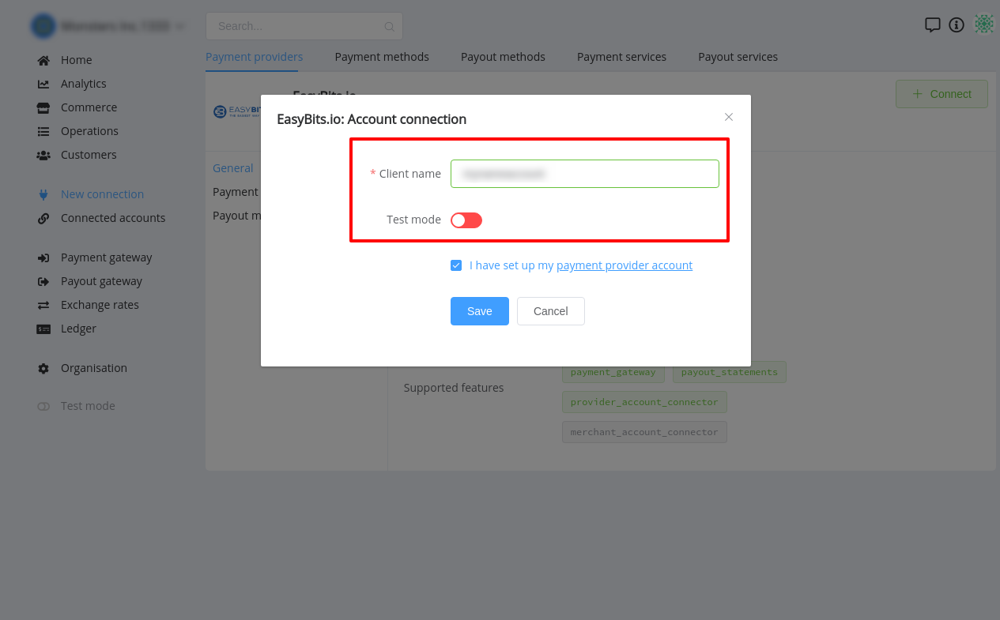

# EasyBits.io Connector

## Introduction

Here You can find  instructions for setting up **EasyBits.io**  account.

## Setup account

#### Step 1 Contact with EasyBits.io Support Manager

#### Step 2: Get required credentials

- Client name

!!! success
    You have configured account!

## Connect account

#### Step 1: Copy required credentials

#### Step 2: Enter credentials

- Client name

!!! tip
    Press **`Connect`** at EasyBits.io **`Provider Overview page`** in **`New connection`** section to open Connection form!

#### Step 3: Set up additional parameters 

-  Test mode

!!! note
    This parameter is set according to your Merchant account type!

!!! success
    You have connected **EasyBits.io**!