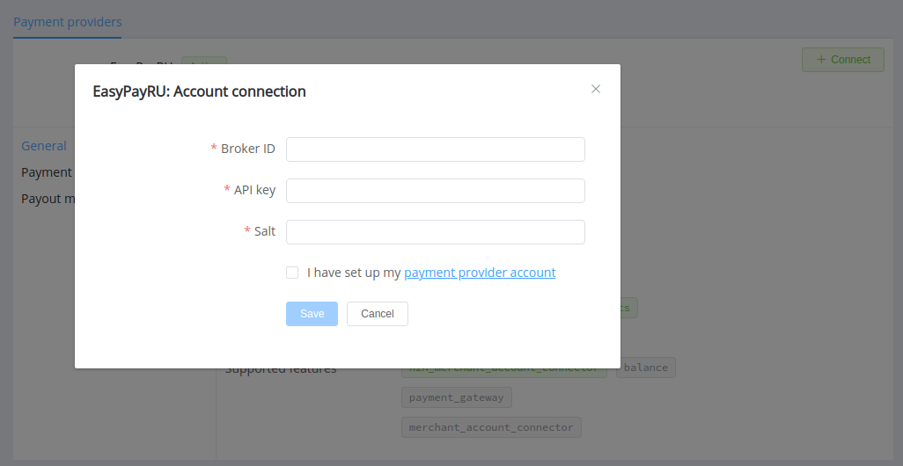
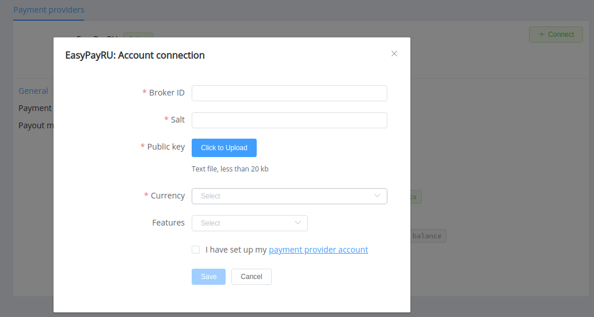

# EasyPayRU

Follow the guidance for setting up a connection with EasyPayRU payment service provider.

## Set Up Account

### Step 1: Contact EasyPay support manager

Submit the required documents to verify your account and gain access.

### Step 2: Get credentials

Credentials that have to be issued:

* Broker ID
* Salt (hash modifier)
* API key (for payouts)
* Public key (for host-to-host payment connection)

!!! important
    Be sure to check with the manager if you require to provide a white list of IPs, and if so, specify IP addresses from the [Corefy list](/integration/ips/).

## Connect Provider Account

### Step 1. Connect account at the {{custom.company_name}} Dashboard

Press **Connect** at [*EasyPayRU Provider Overview*]({{custom.dashboard_base_url}}connect-directory/payment-providers/easypayru/general) page in *'New connection'* and choose **Provider account** option to open Connection form.

Enter credentials:

* Broker ID
* API key
* Salt (hash modifier)

!!! success
    You have connected **EasyPayRU** account!

## Connect H2H Merchant Account

### Step 1. Connect H2H account at the {{custom.company_name}} Dashboard

Press **Connect** at [*EasyPayRU Provider Overview*]({{custom.dashboard_base_url}}connect-directory/payment-providers/easypayru/general) page in *'New connection'* and choose **H2H Merchant account** option to open Connection form.

Enter credentials:

* Broker ID
* Salt (hash modifier)

Upload EasyPayRU Public key in the .txt format.

Choose Currencies and Features. You can set these parameters according to available currencies and features for your EasyPayRU account, but it's necessary to check details of the connection with your {{custom.company_name}} account manager.

!!! success
    You have connected **EasyPayRU** H2H merchant account!

!!! question "Still looking for help connecting your EasyPayRU account?"
    <!--email_off-->[Please contact our support team!](mailto:{{custom.support_email}})<!--/email_off-->
