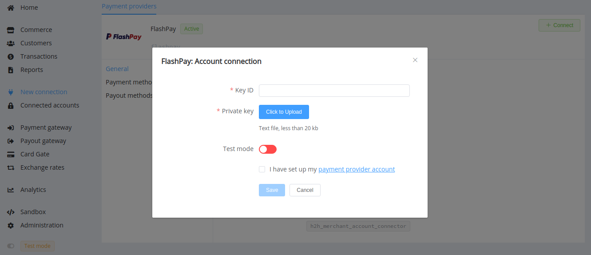

# FlashPay

Info: [fbank.com.ua](https://www.fbank.com.ua/index.php?p=168)

Follow the guidance for setting up a connection with FlashPay payment service provider.

## Set Up Account

### Step 1: Contact FlashPay support

Pass all necessary procedures for the conclusion of the contract with the FlashPay payment system.

### Step 2: Generate the private/public key pair for authentication

!!! example ""

    ``` bash
    # the Private key
    openssl genrsa -out priv.key 2048
    # the Public key
    openssl rsa -in priv.key -out open.key -pubout
    ```

Send the public key (`open.key`) to your FlashPay support manager.

### Step 3: Get credentials

Linking the received public key and your account data, FlashPay assigns the **Key ID** and passes it on to you.

## Connect Provider Account

### Step 1. Connect account at the {{custom.company_name}} Dashboard

Press **Connect** at [*FlashPay Provider Overview*]({{custom.dashboard_base_url}}connect-directory/payment-providers/flashpay/general) page in *'New connection'* to open Connection form.



Enter you Key ID and upload your private key (`priv.key`).

Also, choose Test Mode for test connection with FlashPay.

!!! success
    You have connected **FlashPay** account!

!!! question "Still looking for help connecting your FlashPay account?"
    <!--email_off-->[Please contact our support team!](mailto:{{custom.support_email}})<!--/email_off-->
