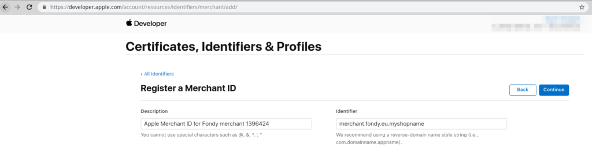
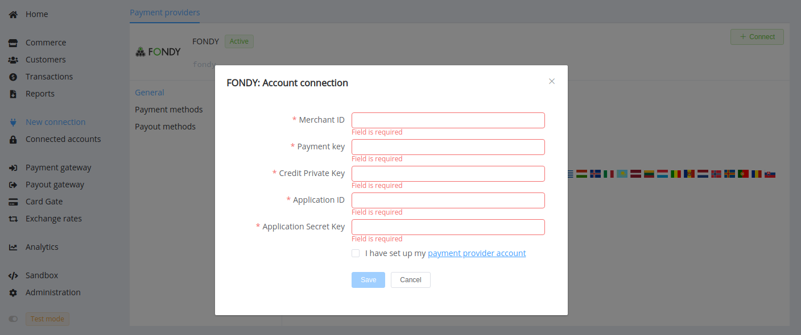
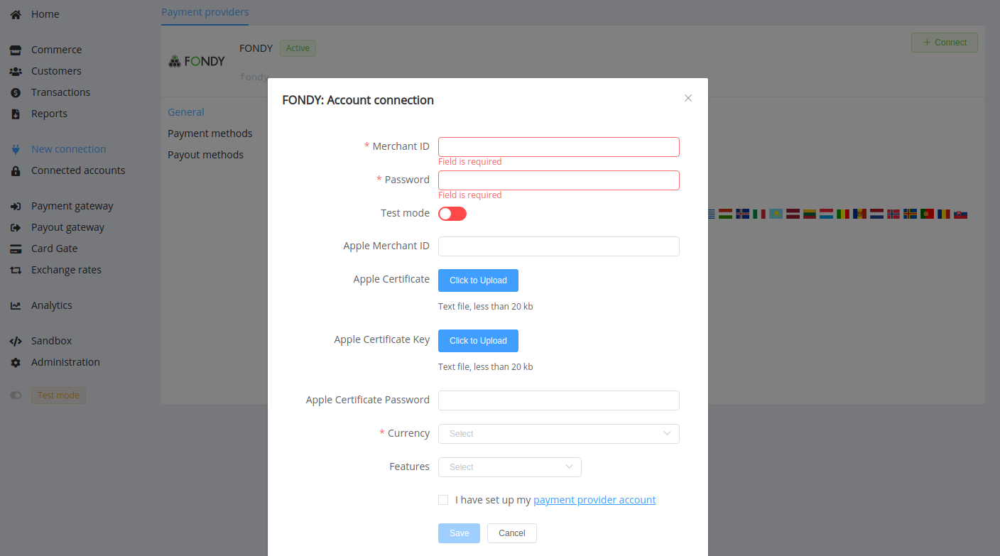

# Fondy

!!! quote ""
    Fondy is simplifying global payments for small and medium-sized businesses looking for an easy and affordable way to accept online payments in a variety of ways including cards, online banking and digital wallets such as Apple and Google Pay.

**Website**: [fondy.io](https://fondy.io/en/)

**Login**: [portal.fondy.eu](https://portal.fondy.eu/mportal/#/account/login)

Follow the guidance for setting up a connection with Fondy payment service provider.

## Set Up Account

### Step 1: Sign up

Register at the [Fondy portal](https://portal.fondy.eu/mportal/#/account/registration).

### Step 2: Create new merchant

At the *'Merchant list'* section, press the *'+ Add Merchant'* button and set up your merchant account.


### Step 3: Set up Financial settings

Fill the required data at *'Merchant settings'* --> *'Financial settings'*. Submit the required documents to verify your account and gain access.


### Step 4: Get Merchant and Application credentials

You can find Merchant credentials in *'Merchant settings'* --> *'Technical settings'*:

- Merchant ID
- Payment Key
- Credit Private Key


And you should contact Fondy technical support to obtain:

- Application ID
- Application Secret Key


#### Optional: Get ApplePay registration

If you need to connect ApplePay with Fondy, get your Apple Merchant ID [completing the requirements](https://developer.apple.com/documentation/passkit/apple_pay/setting_up_apple_pay_requirements) at Apple Developer site. Fill in related Description and Identifier.



Then, generate the Apple Pay certificate  by yourself, or apply to Fondy or {{custom.company_name}} support team for doing it for you.

1. Generate keys and CSR (Certificate Signing Requests)

    ??? example "The example sequence of console commands (for MacOs)"

        ``` bash
        openssl genrsa -out merchant.key 2048
        openssl ecparam -out apple_pay.key -name prime256v1 -genkey
        # Apple Pay Merchant Identity Certificate Request
        openssl req -new -key merchant.key -out merchant.csr
        # Apple Pay Payment Processing Certificate Request
        openssl req -new -sha256 -key apple_pay.key -nodes -out apple_pay.csr
        ```

2. Use the obtained CSR files to generate certificates to complete registration at [developer.apple.com](https://developer.apple.com/account/resources/identifiers/merchant/add).

3. Get your CRT certificates and convert to .pem and .p12 format.

    ??? example "The example sequence of console commands (for MacOs)"

        ``` bash
        # DER to PEM
        openssl x509 -inform DER -outform PEM -text -in merchant.cer -out merchant.pem
        openssl x509 -inform DER -outform PEM -text -in apple_pay.cer -out apple_pay.pem

        # PEM to P12
        openssl pkcs12 -export -out apple_pay.p12 -inkey apple_pay.key -in apple_pay.pem
        openssl pkcs12 -export -out merchant.p12 -inkey merchant.key -in merchant.pem
        ```

!!! note

    You should verify the domain from which you intend to call Apple Pay API. Provide your {{custom.company_name}} HPP URL to your Apple Pay developer account manager, obtain a domain association file, and share it with your {{custom.company_name}} account manager.

    Meanwhile, you should preliminarily determine the verification details with your {{custom.company_name}} account manager if you plan to use a white-label domain.

## Connect Provider Account

### Step 1. Connect account at the {{custom.company_name}} Dashboard

Press **Connect** at [*Fondy Provider Overview*]({{custom.dashboard_base_url}}connect-directory/payment-providers/fondy/general) page in *'New connection'* and choose **Provider account** option to open Connection form.



Enter credentials:

- Merchant ID
- Payment Key
- Credit Private Key
- Application ID
- Application Secret Key

!!! success
    You have connected **Fondy** provider account!

## Connect H2H Merchant Account

### Step 1. Connect H2H account at the {{custom.company_name}} Dashboard

Press **Connect** at [*Fondy Provider Overview*]({{custom.dashboard_base_url}}connect-directory/payment-providers/fondy/general) page in *'New connection'* and choose **H2H Merchant account** option to open Connection form.



Enter credentials:

- Merchant ID
- Payment Key --> Password

Select Test or Live mode according to the type of account to connect with Fondy.

If you need to connect ApplePay with Fondy, receive the Merchant ID and generate certificates [in advance](#optional-get-applepay-registration). Enter the related credentials:

- Apple Merchant ID
- Apple Certificate password (if you set it)

Upload the certificate files:

- `merchant.key` --> Apple Certificate
- `apple_pay.key` --> Apple Certificate Key

Choose Currency and Features. You can set these parameters according to available currencies and features for your Fondy account, but it is necessary to check details of the connection with your {{custom.company_name}} account manager.

!!! success
    You have connected **Fondy** H2H merchant account!

!!! question "Still looking for help connecting your Fondy account?"
    <!--email_off-->[Please contact our support team!](mailto:{{custom.support_email}})<!--/email_off-->
