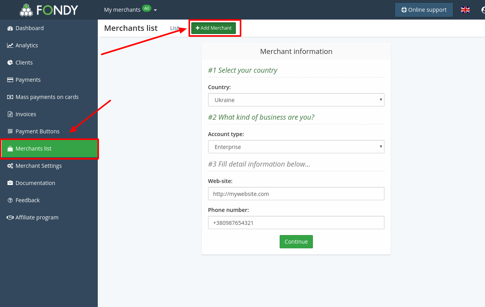
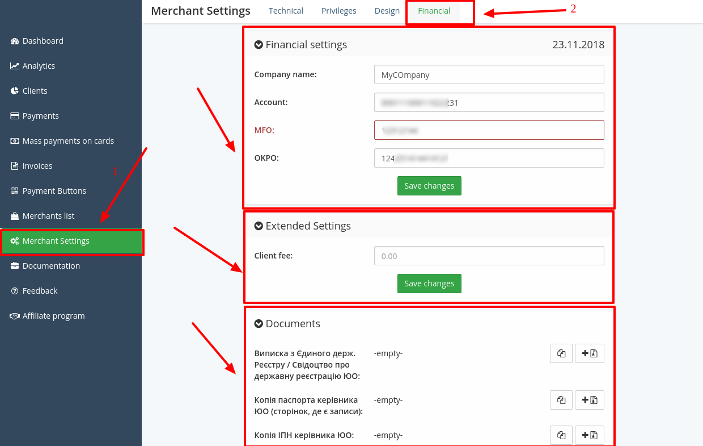

# Fondy Connector

## Introduction

Here You can find  instructions for setting up [**Fondy** account](https://portal.fondy.eu/)!

## Setup account

#### Step 1: Create Merchant

-  Go to the Merchant list section
-  Press "Add Merchant"
-  Set up creation parameters

#### Step 2: Setup Financial settings

-  Go to the Merchant Settings
-  Open Financial Settings
-  Fill the required data
-  Verify documents

#### Step 3: Get Merchant and Aplication credentials

- **Merchant**: Go to the Technical Settings and find the following fields
    -  Merchant ID
    -  Payment Key
    -  Credit Private Key

- **Application**
-  ID
-  Secret key

!!! info 
    Application credentials (**_ID_**, **_Secret key_**) You can get only from **Fondy Technical Support**

!!! success
    You have configured Merchant!
    
## Connect account

#### Step 1: Copy required credentials
- Merchant data:

    -  Merchant ID
    -  Payment Key
    -  Credit Private Key

- Application data:
    
    -  ID
    -  Secret Key

#### Step 2: Enter credentials
   
-  Merchant ID
-  Payment Key
-  Credit Private Key
-  Application ID
-  Application Secret Key

!!! tip
    Press **`Connect`** at Fondy **`Provider Overview page`** in **`New connection`** section to open Connection form!

!!! success
    You have connected **Fondy**!