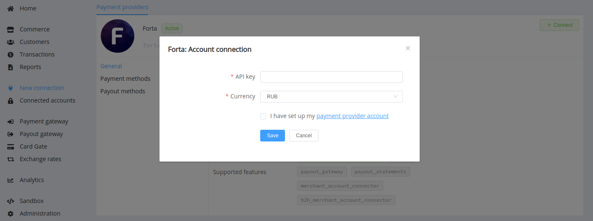

# Forta

Follow the guidance for setting up a connection with Forta payment service provider.

## Set up account

### Step 1: Contact Forta support manager

Send a request on the [website](WEBSITE) or call the hotline. Submit the required documents to verify your account and gain access.

### Step 2: Get credentials

To connect Forta account, you just need to obtain the API key and API URL.

!!! important
    Be sure to check with the manager if you require to provide a white list of IPs, and if so, specify IP addresses from the [Corefy list](/integration/ips/).

## Connect Provider account

### Step 1. Connect Provider account at the {{custom.company_Forta}} Dashboard

Press **Connect** at [*Forta Provider Overview*]({{custom.dashboard_base_url}}connect-directory/payment-providers/forta/general) page in *'New connection'* and choose **Provider account** option to open Connection form.

Enter credentials:

* API key
* API URL

Choose currencies according to available currencies for your Forta account and check details of the connection with your {{custom.company_name}} account manager.

!!! success
    You have connected **Forta** provider account!

!!! question "Still looking for help connecting your Forta account?"
    <!--email_off-->[Please contact our support team!](mailto:{{custom.support_email}})<!--/email_off-->
