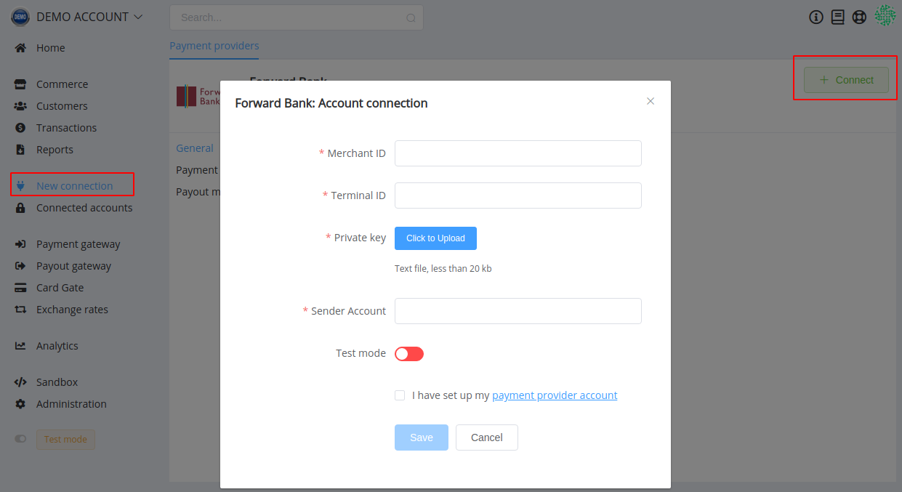
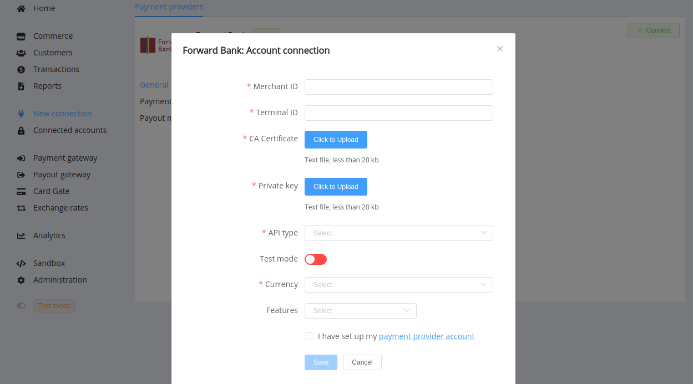

# Forward Bank

**Website**: [forward-bank.com](https://www.forward-bank.com/)

**Online Banking**: [sign in](https://ifobs.forward-bank.com:7002/ifobsClient/LoginShow.action?localeName=en)

Follow the guidance for setting up a connection with Forward Bank payment provider

## Set Up Account

### Step 1: Contact Forward Bank support manager

Send a request on the [website](https://www.forward-bank.com/faq/ask/) or call the hotline. Submit the required documents to verify your account and gain access.

### Step 2: Get credentials

Credentials that have to be issued:

* Merchant ID
* Terminal ID
* CA Certificate (if you need [H2H Merchant Account connection](#connect-h2h-merchant-account))

### Step 3: Generate Private Key

You should create your public key certificate in PEM and CRT formats.

!!! info
    .pem — (Privacy-enhanced Electronic Mail) Base64 encoded DER certificate, enclosed between '-----BEGIN CERTIFICATE-----' and '-----END CERTIFICATE-----'

    .crt — usually in binary DER form, but Base64-encoded certificates are standard too

Create or update with your actual data *config.dat* file in OpenSSL directory.

??? example "File Example"
    ```
    [ req ]
    prompt	= no
    distinguished_name	= req_distinguished_name

    [ req_distinguished_name ]

    #Country
    CN=UA
    #Region
    ST=Kiev
    #City
    L=Kiev
    #Organization name
    O=ORGANIZATION
    #Department
    OU=ECOMMERCE
    #Certificate name (your name)
    CN=YOUR_NAME
    #Email
    emailAddress=your_name@organization.com
    ```

Run the command in a terminal (pay attention that you should replace *'your_merchant_id'* in filenames by the actual Merchant ID number):

```bash
openssl req -x509 -nodes -days 365 -newkey rsa:4096 -sha1 -keyout 'your_merchant_id'.pem -config config.dat -out xs_'your_merchant_id'_cert.crt

openssl rsa -in 'your_merchant_id'.pem -pubout > 'your_merchant_id'.pub
```

Save the obtained PEM file. And also, send the obtained CRT file to the processing centre of Forward Bank for checking messages' authenticity on the gateway.

## Connect Provider Account

### Step 1. Connect account at the {{custom.company_name}} Dashboard

Press **Connect** at [*Forward Bank Provider Overview*]({{custom.dashboard_base_url}}connect-directory/payment-providers/forwardbank/general) page in *'New connection'* and choose **Provider account** option to open Connection form.



Enter credentials:

* Merchant ID
* Terminal ID
* upload your PEM key file to the Private Key
* Sender Account (the unique code of the legal entity in the National State Registry of Ukrainian Enterprises and Organizations (*ЄДРПОУ*))

Also, choose Test Mode for test connection with Forward Bank.

!!! success
    You have connected **Forward Bank** account!

## Connect H2H Merchant Account

### Step 1. Connect H2H account at the {{custom.company_name}} Dashboard

Press **Connect** at [*Forward Bank Provider Overview*]({{custom.dashboard_base_url}}connect-directory/payment-providers/forwardbank/general) page in *'New connection'* and choose **H2H Merchant account** option to open Connection form.



Enter credentials:

* Merchant ID
* Terminal ID
* CA Certificate
* upload your PEM key file to the Private Key

Choose Test Mode for test connection with Forward Bank.

Choose Currency and Features. You can set these parameters according to available currencies and features for your Forward Bank account, but it is necessary to check details of the connection with your {{custom.company_name}} account manager.

!!! success
    You have connected **Forward Bank** H2H merchant account!

!!! question "Still looking for help connecting your Forward Bank account?"
    [Please contact our support team!](mailto:{{custom.support_email}})
