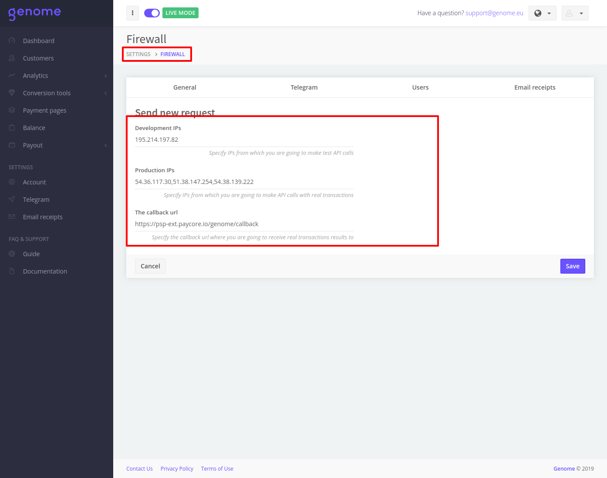
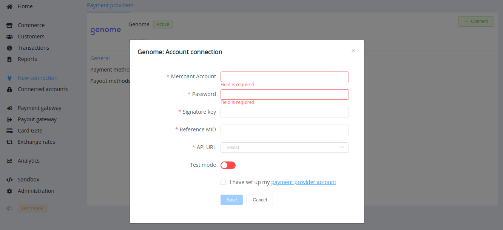
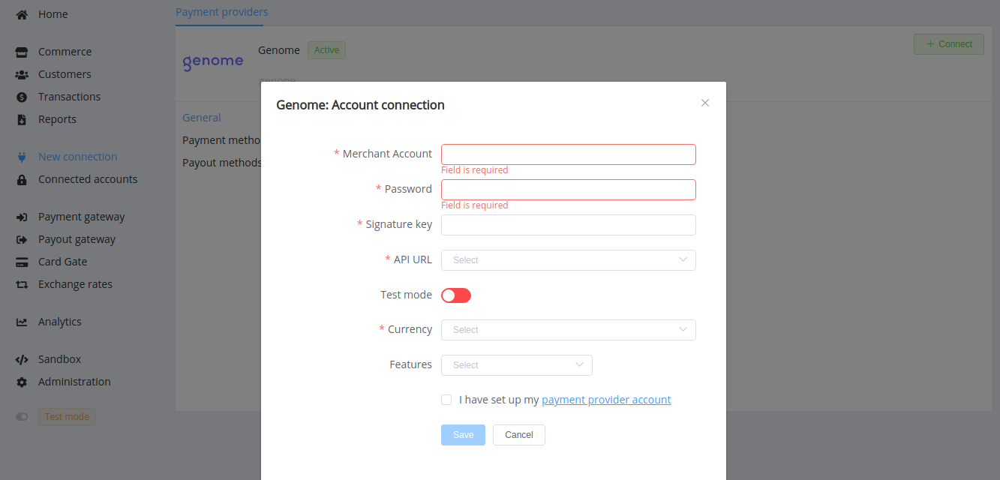

# Genome

!!! quote ""
    The operating system for your financial life

**Website**: [Genome](https://genome.eu/)

**Login**: [Genome](https://merchant.genome.eu/#/signin)

Follow the guidance for setting up a connection with Genome payment service provider.

## Set Up Account

### Step 1: Contact Genome

Send a request on the [website](https://my.genome.eu/signup) or call the hotline. Verify your identity and start merchant registration process. Submit all required documents to gain access.

### Step 2: Get credentials

Genome integration team provides you sufficient credentials:

- Merchant Account Name
- Merchant Account Password
- Signature Key (`your_privat_signature`)
- MID reference in Genome system
- and which of the API addresses you should use to integrate

### Step 3: Set up your account

Fill up your main account data. In 'Account settings' --> 'Firewall', click on the button "Send new request" and input all your necessary IP addresses including [{{custom.company_name}} whitelist IPs](/integration/ips/). Set `https://psp-ext.paycore.io/genome/callback` as Callback URL.

Send to whitelist callback url. Click on the Account settings (upper-right corner) and select Firewall section. Input production callback url value and send a request for whitelisting.

## Connect Provider Account

### Step 1. Connect account at the {{custom.company_name}} Dashboard

Press **Connect** at [*Genome Provider Overview*]({{custom.dashboard_base_url}}connect-directory/payment-providers/genome/general) page in *'New connection'* and choose **Provider account** option to open Connection form.

Enter credentials:

- Merchant Account Name
- Merchant Account Password
- Signature Key (`your_privat_signature`)
- Reference MID

Choose API URL. Also, choose Test Mode for test connection with Genome.

!!! success
    You have connected **Genome** account!

## Connect H2H Merchant Account

### Step 1. Connect H2H account at the {{custom.company_name}} Dashboard

Press **Connect** at [*Genome Provider Overview*]({{custom.dashboard_base_url}}connect-directory/payment-providers/genome/general) page in *'New connection'* and choose **H2H Merchant account** option to open Connection form.

Enter credentials:

- Merchant Account Name
- Merchant Account Password
- Signature Key (`your_privat_signature`)
- Reference MID

Choose API URL.

Choose Test Mode for test connection with Genome.

Choose Currency and Features. You can set these parameters according to available currencies and features for your Genome account, but it is necessary to check details of the connection with your {{custom.company_name}} account manager.

!!! success
    You have connected **Genome** H2H merchant account!

!!! question "Still looking for help connecting your Genome account?"
    [Please contact our support team!](mailto:{{custom.support_email}})
