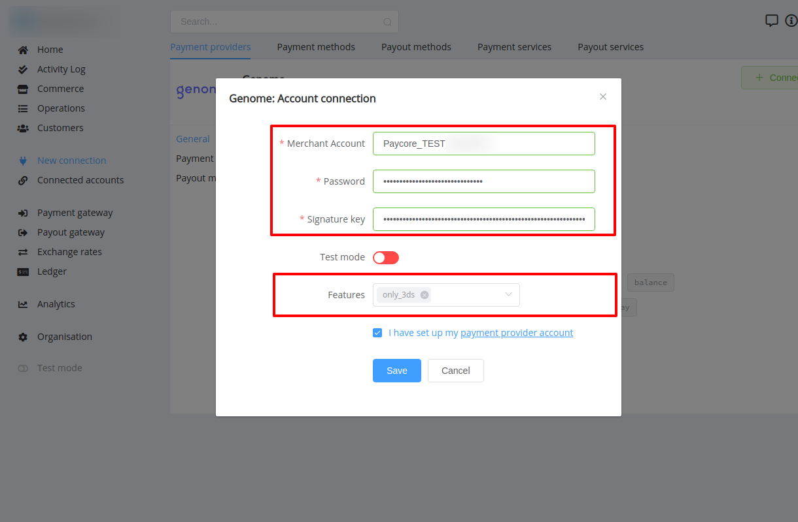

# Genome Connector

## Introduction

Here You can find  instructions for setting up **Genome**  account.

## Host2Host Payments

### Setup account

#### Step 1 Contact with Genome Support Manager

#### Step 2: Get required credentials

- Merchant Account Name
- Merchant Account Password
- Signature Key

!!! success
    You have configured account!

## Connect account

#### Step 1: Copy required credentials

#### Step 2: Enter credentials

- Merchant Account Name
- Merchant Account Password
- Signature Key

!!! tip
    Press **`Connect`** at Genome **`Provider Overview page`** in **`New connection`** section to open Connection form!

#### Step 3: Set up additional parameters 

- Test mode
- Features (one option)

!!! note
    These parameters are set according to your Merchant account type!

!!! success
    You have connected **Genome**!