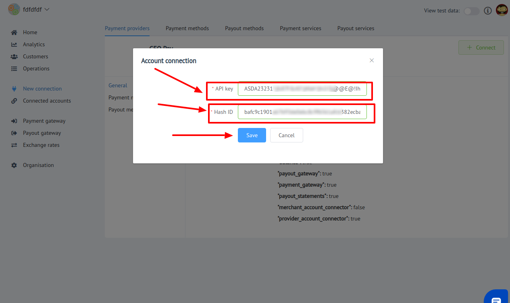

# GeoPay Connector

## Introduction

Here You can find  instructions for setting up [**GeoPay**  account](https://geo-pay.net/account/#!/)!

## Setup account

#### Step 1: Create provider account

#### Step 2: Go to the **Profile** info

#### Step 3: Get User ID (Hash ID)

#### Step 4: Contact with GeoPay manager

This Payment Provoider gives account credentials personaly to their merchants!

#### Step 5: Get API Key

-  API Key

!!! success
    You are ready to connect!
    
## Connect account

#### Step 1: Copy credentials

#### Step 2: Enter credentials

-  User ID (Hash ID)
-  API Key

!!! tip
    Press **`Connect`** at GeoPay **`Provider Overview page`** in **`New connection`** section to open Connection form!

!!! success
    You have connected **GeoPay**!