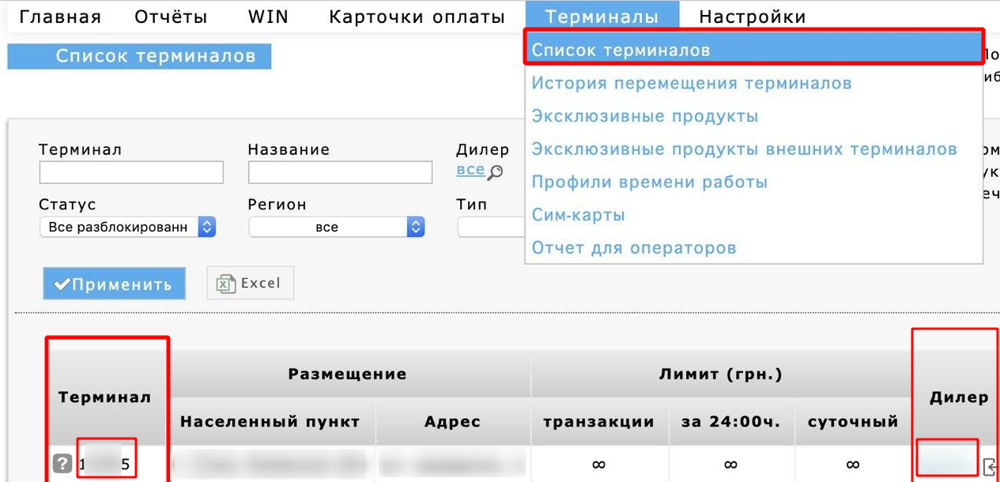
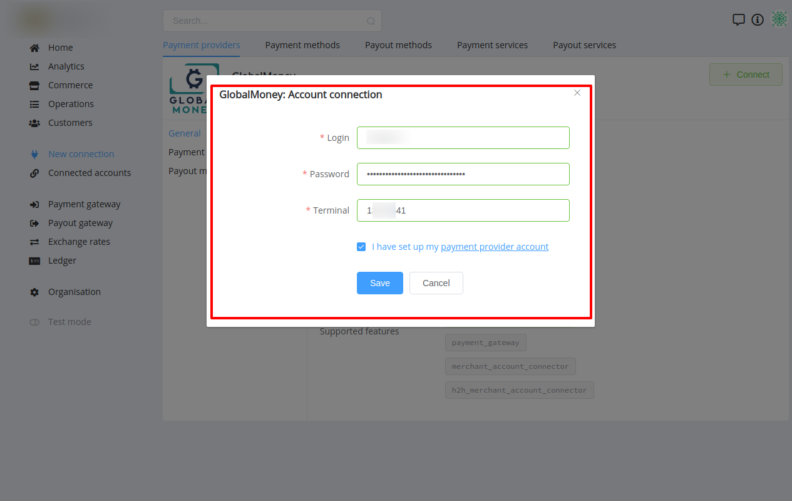

# GlobalMoney Connector

## Introduction

Here You can find  instructions for setting up **GlobalMoney**  account.

## Setup account

#### Step 1 Contact with GlobalMoney support manager

Contact with GlobalMoney Support Manager to get help with creating. 

#### Step 2: Get required credentials

- **Login**
    - Go to the "Terminals" list and find **Dealer** column

    

- **Password**
    - Ask GlobalMoney Support Manager for this parameter

- **Terminal**
    - Go to the "Terminals" list and find **Terminal** column

!!! success
    You have configured account!

## Connect account

#### Step 1: Copy required credentials

#### Step 2: Enter credentials

- Login
- Password
- Terminal

!!! tip
    Press **`Connect`** at GlobalMoney **`Provider Overview page`** in **`New connection`** section to open Connection form!

!!! success
    You have connected **GlobalMoney**!