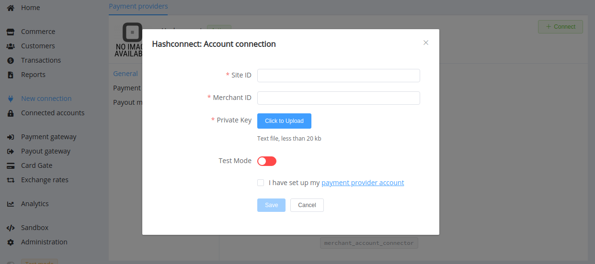
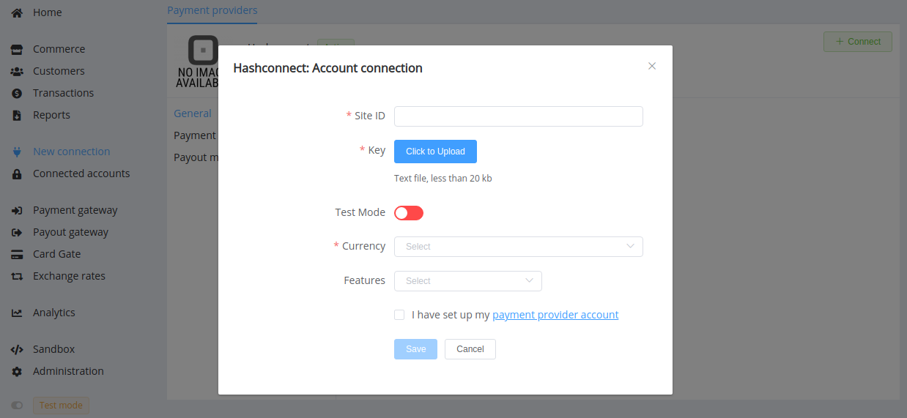

# Hashconnect

!!! quote ""
    Hashconnect Internet Acquiring

**Website**: [Hashconnect](http://hashconnect.eu/)

Follow the guidance for setting up a connection with Hashconnect payment service provider.

## Set Up Account

### Step 1: Contact Hashconnect support manager

Send a request on the [website](http://hashconnect.eu/). Submit the required documents to verify your account and gain access.

### Step 2: Get credentials

Login to the Hashconnect merchant dashboard and get credentials:

* Site ID (`siteId`)
* Merchant ID

!!! important
    Be sure to check with the manager if you require to provide a white list of IPs, and if so, specify IP addresses from the [Corefy list](/integration/ips/).

### Step 3: Generate private-public key pair

Run the command in a terminal:

!!! example
    
    ``` bash
    openssl genrsa -out private_key.pem 2048
    openssl rsa -in private_key.pem -pubout -outform PEM -out public_key.pem
    ```

Save the obtained `private_key.pem` file. And also, send the obtained `public_key.pem` to the processing centre of Hashconnect for checking messages' authenticity on the gateway.

## Connect Provider Account

### Step 1. Connect account at the {{custom.company_name}} Dashboard

Press **Connect** at [*Hashconnect Provider Overview*]({{custom.dashboard_base_url}}connect-directory/payment-providers/hashconnect/general) page in *'New connection'* and choose **Provider account** option to open Connection form.



Enter credentials:

* Site ID (`siteId`)
* Merchant ID

Upload your private_key.pem key file as the Private Key.

Also, select Test or Live mode according to the type of account to connect with Hashconnect.

!!! success
    You have connected **Hashconnect** account!

## Connect H2H Merchant Account

### Step 1. Connect H2H account at the {{custom.company_name}} Dashboard

Press **Connect** at [*Hashconnect Provider Overview*]({{custom.dashboard_base_url}}connect-directory/payment-providers/hashconnect/general) page in *'New connection'* and choose **H2H Merchant account** option to open Connection form.



Enter Site ID (`siteId`) and upload your private_key.pem key file as the Private Key.

Also, select Test or Live mode according to the type of account to connect with Hashconnect.

Choose Currencies and Features. You can set these parameters according to available currencies and features for your Hashconnect account, but it's necessary to verify details of the connection with your {{custom.company_name}} account manager.

!!! success
    You have connected **Hashconnect** H2H merchant account!

!!! question "Still looking for help connecting your Hashconnect account?"
    <!--email_off-->[Please contact our support team!](mailto:{{custom.support_email}})<!--/email_off-->
