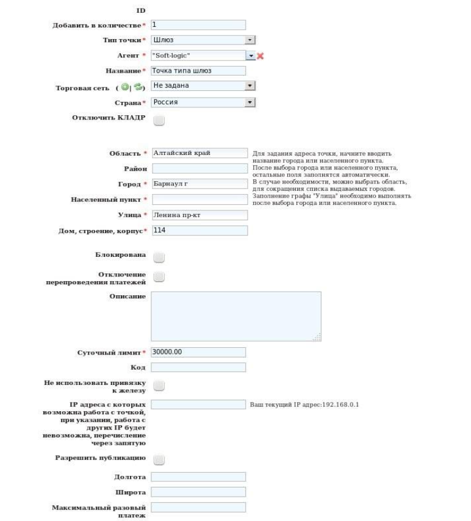
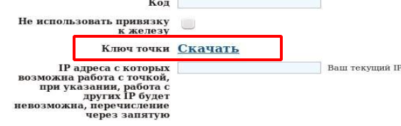
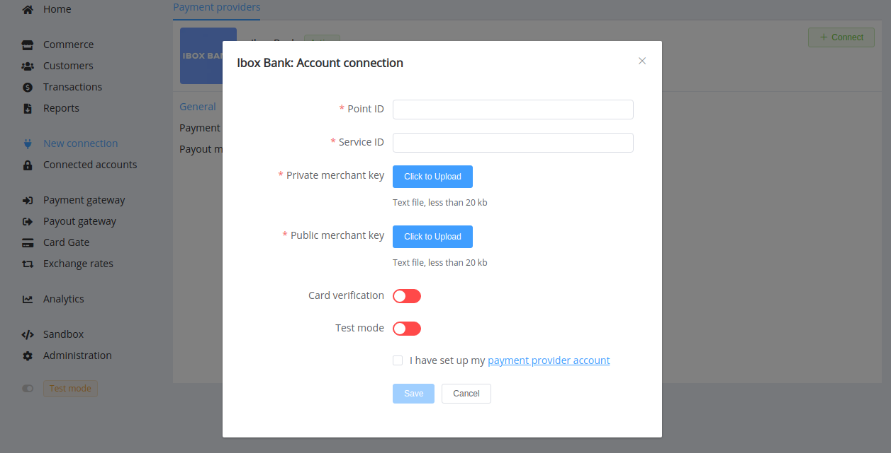
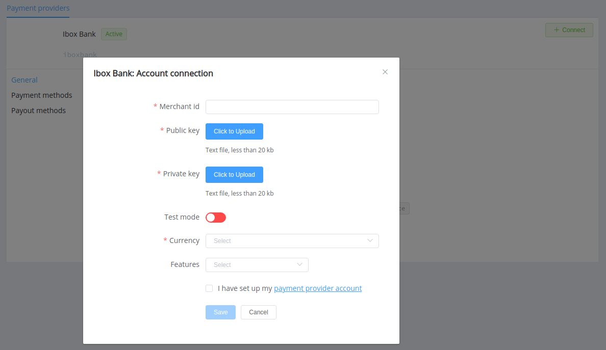

# Ibox Bank

**Website**: [iboxbank.online](https://iboxbank.online/ua/)

**Login**: [clb.iboxbank.online](https://clb.iboxbank.online:7002/ifobsClient/LoginShow.action?localeName=en)

Follow the guidance for setting up a connection with Ibox Bank as a payment service provider.

## Set Up Account

### Step 1: Contact Ibox Bank support manager

Send a request on the [website](https://iboxbank.online/ua/open-account) or call the [hotline](tel:0800500178). Submit the required documents to verify your account and gain access to the system processing centre.

### Step 2: Get credentials

Credentials that have to be issued from your Ibox Bank account manager:

* Merchant ID
* Point ID
* Service ID
* Public IboxBank Key

Upon registration with the system you will be able to create the necessary quantity of payment points and generate Private keys for each points.

???+ hint
    
    

After key generation, you can download it in the point's settings:

## Connect Provider Account

### Step 1. Connect account at dashboard.paycore.io

Press **Connect** at [*Ibox Bank Provider Overview*](https://dashboard.paycore.io/connect-directory/payment-providers/iboxbank/general) page in *'New connection'* and choose **Provider account** option to open Connection form.

Enter credentials:

* Point ID
* Service ID

!!! attention "Please be aware"
    You should connect each point and each available service separately.

Upload files with related Public IboxBank key and Private payment point key.

Also, choose Test Mode for test connection with Ibox Bank.

!!! success
    You have connected **Ibox Bank** account!

## Connect H2H Merchant Account

### Step 1. Connect H2H account at dashboard.paycore.io

Press **Connect** at [*Ibox Bank Provider Overview*](https://dashboard.paycore.io/connect-directory/payment-providers/iboxbank/general) page in *'New connection'* and choose **H2H Merchant account** option to open Connection form.

Enter your Merchant ID and upload files with related Public IboxBank key and Private payment point key.

Choose Test Mode for test connection with Ibox Bank.

Choose Currency and Features. You can set these parameters according to available currencies and features for your Ibox Bank account, but it is necessary to check details of the connection with your PayCore.io account manager.

!!! success
    You have connected **Ibox Bank** H2H merchant account!

!!! question "Still looking for help connecting your Ibox Bank account?"
    [Please contact our support team!](mailto:support@paycore.io)
