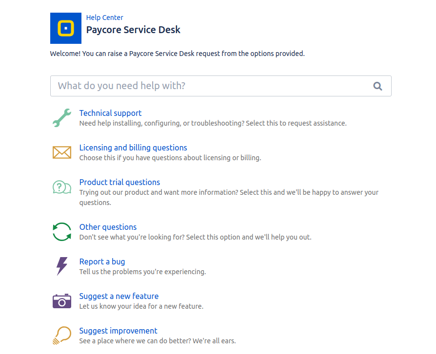

# Payment providers connectors

This section is intended for mastering with the general connecting process.

The section contains  all connecting instructions (for each provider) which will help you to:

-  Create a Provider (Merchant) account
-  Set Up the profile
-  Set or get the required credentials
-  Connect account in [**PayСore.io Dashboard**](https://dashboard.paycore.io/)

The general algorithm for the connection procedure consists of the following steps:

1. Setting up an account (on the side of the payment provider).
 
 !!! Note
    This step implies that you are already registered in the provider's system!

2. Connecting account (in Dashboard)

## Setting up account

- Depending on the provider, the set of steps can be different, in case of: the methods of storage, transmission and uniqueness of data are individual for each of them.
- The purpose of this step is to obtain the Credentials necessary for integration in Dashboard

!!! warning
    Parameters (credentials) format should correspond to the requirements of connection form .

## Connecting account

- This step is unified for all providers. All that you need is to:
    -  Enter credentials
    -  Confirm the connection

## Payment Providers 

!!! info "Definition"
    **Payment Provider** - is an institution that offers online services for accepting electronic payments by a variety of payment methods including credit card, bank-based payments such as direct debit, bank transfer, and real-time bank transfer based on online banking. Typically, they use a software as a service model and form a single payment gateway for their clients (merchants) to multiple payment methods.

Payment Provider  can be in **2 statuses**:

1. **Ready**: means, that this Payment provider has been already implemented to PayСore.io 
2. **Not Ready**: means, that this Payment provider has  not been implemented to PayСore.io yet.
    
- To connect the certain provider:

    1. Go to the **`Provider Overview page`** by clicking on it's logo
    2. Click **`Connect`** button
    3. Enter the credentials 
    
    !!! tip
        You can find detailed instructions for each provider at [Integration    Manuals](/connectors/).

- To ask PayCore.io to implement **NEW** Payment provider, use **`Request a connection`** button!

    

    

## Payment methods

!!! info "Definition"
    **Payment method** - the way that a customer chooses to pay to the merchant. Typical payment methods used in a modern business context include cash, checks, credit or debit cards, money orders, bank transfers and online payment services such as PayPal.
    
    [*Read more...*](http://www.businessdictionary.com/definition/payment-method.html)

## Payout methods

!!! info "Definition"
    **Payout method** - is the way a merchant pay to the customers through.

## Payment services

!!! info "Definition"
    **Payment service** - is a virtual entity, that means "payment method in view of certain currency"

## Payout services 

!!! info "Definition"
    **Payout service** - is a virtual entity, that means "payout method in view of certain currency"

!!! info "Note"
    If You have any questions, suggestions or comments, please, contact us  through [**PayСore.io Service Desk**](https://jira.paymaxi.com/servicedesk/customer/portal/4)
    
    