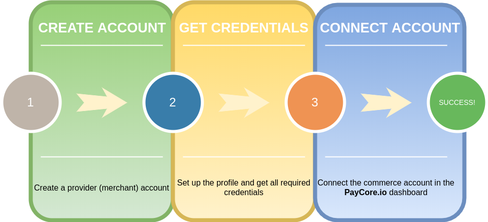

# Payment providers

This section explains how to connect your payment providers' accounts and the {{custom.company_name}} platform. It describes setup processes and helps you to put in place new services that can relay requests to the payment or payout gateways.

Click on the name of the desired connector and follow the link to the step-by-step guide.

!!! info "Payment Service Provider (PSP)"
    **Payment Service Provider (PSP)** is a third party that helps [merchants](/getting-started/glossary/#merchant) accept and facilitate payments.

    PSPs partner with [acquiring banks](/getting-started/glossary/#acquiring-bank) to offer merchants the capability to accept payments. They often offer services in addition to processing transactions. These services include [Payment Card Industry Data Security Standard (PCI)](/getting-started/glossary/#payment-card-industry-data-security-standard-pci) compliance, fraud protection, and the ability to process different currencies and translate different languages.

## List of Ready-Made Connections

<!-- 18/01/2021: 100 connectors + Test + manual
|                                                  Logo                                                  | Name                             | Supported Features                              |
|:------------------------------------------------------------------------------------------------------:|:---------------------------------|:------------------------------------------------|
|             | [123x](123x/)                    | Payments                                        |
|          | [PayMega](paymega/)              | H2H connection, Payments and Payouts            |
|       | [Twelve.live](twelvelive/)       | H2H connection, Payments and Payouts                 |
 -->

| Logo | Name | Supported Connections | Supported Currencies[^1] |
|:--:|:---|:----|:----|
|  | [4bill](4bill/) | H2H&nbsp;connection,&nbsp;Payments, Payouts, Account balances | AUD, CAD, EUR, GBP, UAH, USD |
|  | [Accentpay](accentpay/) | H2H connection, Payments, Payouts, Account balances | EUR, PLN, RUB, UAH, USD |
|   | [ADgroup](adgroup/)  | H2H connection, Payments, Payouts, Account balances   | EUR, RUB, USD |
|  | [AdvCash](advcash/) | Payments, Payouts, Account balances | [according to the provider account settings] |
|   | [Alfa Bank](alfabank/) | H2H connection, Payouts, Account balances  | UAH |
|  | [AliKassa](alikassa/) | H2H connection, Payouts, Account balances | EUR, RUB, UAH, USD |
|  | [any.cash](anycash/) | Payments, Payouts, Account balances | [according to the provider account settings] |
|  | [Any.Money](anymoney/) | Payments, Payouts, Account balances | [according to the provider account settings] |
|  | [Axcess Merchant Services](axcessmerchantservices/) | H2H connection  | EUR, RUB, UAH, USD |
|  | [Bank Onego](bankonego/) | H2H connection, Payouts, Account balances  | RUB |
|   | [BillLine](billline/) | Payments, Payouts, Account balances  | [according to the provider account settings] |
|  | [Card Payments](cardgate/) | Card Payments & Payouts | AMD, AUD, AZN, BGN, BYN, CAD, CHF, CNY, CZK, DKK, EUR, GBP, GEL, GIP, HKD, INR, JPY, KZT, MDL, MXN, NGN, NOK, NZD, PHP, PLN, RUB, SEK, SGD, TJS, TMT, TRY, TZS, UAH, USD, UZS, VND |
|  | [cardpay](cardpay/)  | H2H connection, Payments, Payouts, Account balances | AUD, CAD, CZK, EUR, GBP, INR, MXN, PLN, RUB, UAH, USD |
|  | [Cashfree](cashfree/) | Payouts, Account balances | [according to the provider account settings] |
|  | [Cauri](cauri/) | H2H connection | CAD, CZK, EUR, GBP, INR, MXN, PLN, RUB, UAH, USD |
|   | [Certus Finance](certusfinance/) | Payouts  | [according to the provider account settings] |
|  | [ComIn Bank](cib/)  | H2H connection, Payouts, Account balances | UAH |
|  | [CoinGate](coingate/) | Payments | BCH, BTC, ETH, EUR, LTC, USD |
|  | [CoinsPaid](coinspaid/) | Payments, Payouts, Account Balances | [according to the provider account settings] | |
|  | [Concord Bank](concord/)  | H2H connection, Payouts, Account balances | UAH |
|   | [Connectum](connectum/) | H2H connection, Payouts, Account Balances | AUD, CAD, EUR, GBP, UAH, USD |
|   | [CrossPay](crosspay/) | Payouts, Account Balances | [according to the provider account settings] |
|  | [Cypix](cypix/) | H2H connection, Payouts, Account balances | EUR, RUB, UAH, USD |
|   | [Decta](decta/)  | H2H connection | EUR, PLN, USD |
|  | [dLocal](dlocal/) | Payouts | ARS, BOB, BRL, CLP, COP, INR, MXN, PEN, PYG |
|  | [dotpay](dotpay/)  | Payouts, Account balances | [according to the provider account settings] |
|  | [EasyBits.io](easybits/) | Payments, Payouts, Account balances | [according to the provider account settings] |
|  | [Ecobanq](ecobanq/) | Payments, Payouts, Account balances | [according to the provider account settings] |
|  | [ECommPay](ecommpay/) | Payouts, Account balances | [according to the provider account settings] |
|   | [ecoPayz](ecopayz/) | Payments, Payouts,  Account balances | AUD, BRL, CAD, EUR, GBP, INR, MDL, NGN, PLN, RUB, UAH, USD, UZS |
|  | [ePay](epay/) | H2H connection, Payouts, Account balances  | UAH |
|  | [exactly](exactly/) | H2H connection, Payouts, Account Balances   | EUR, USD |
|   | [External Provider](externalprovider/) |  Payouts, Account Balances | [according to the provider account settings] |
|  | [FlashPay](flashpay/) | Payouts, Account balances | [according to the provider account settings] |
|  | [Fondy](fondy/) | H2H connection, Payouts, Account balances | AUD, CAD, CZK, EUR, GBP, PLN, RUB, UAH, USD |
|  | [Forta](forta/) | Payouts | RUB |
|  | [Forward Bank](forwardbank/) | H2H connection, Payouts, Account balances | UAH |
|   | [Genome](genome/) | H2H connection, Payouts, Account balances | AUD, CAD, EUR, GBP, UAH, USD |
|   | [GEO pay](geopaynet/) | Payments, Payouts, Account balances | [according to the provider account settings] |
|  | [Global Money](globalmoney/) | Payouts, Account balances  | [according to the provider account settings] |
|   | [Hashconnect](hashconnect/) | H2H connection, Payouts, Account balances  | RUB |
|   | [Ibox Bank](iboxbank/) | H2H connection, Payouts  | UAH |
|  | [ING Bank Poland](ingbankpl/) | Payments   | [according to the provider account settings] |
|  | [Interkassa](interkassa/) | Payments, Payouts, Account balances | [according to the provider account settings] |
|  | [IPayTotal](ipaytotal/) | H2H Connection  | EUR, INR, MXN, PLN, USD |
|   | [Kassa](/connectors/kassa/) | H2H Connection, Payouts, Account Balances  | BYN, EUR, KZT, RUB, UAH, USD |
|  | [Klarna](klarna/) | Payments | [according to the provider account settings] |
|  | [Kuna](kuna/) | Payments, Payouts, Account balances  | [according to the provider account settings] |
|  | [Kuna Pay](kunapay/) | H2H Connection, Payments, Payouts, Account balances  | EUR, RUB, UAH, USD |
|  | [LeoGaming](leogaming/) | Payouts, Account balances | [according to the provider account settings] |
|   | [LiqPay](liqpay/)  | H2H connection, Payments, Payouts, Account balances   | EUR, RUB, UAH, USD |
|   | [Manual](manual/) | manual connector for Swift and bank transfer methods | [according to the transfer parameters] |
|   | [Maxpay](maxpay/) | H2H Connection, Payments, Payouts, Account balances | EUR, RUB, UAH, USD |
|   | [mercuryo](mercuryo/)  | Payments | [according to the provider account settings] |
|    | [Mine.Exchange](mineexchange/) |  Payments, Payouts, Account balances | [according to the provider account settings] |
|  | [MuchBetter](muchbetter/) | Payments, Payouts, Account balances | [according to the provider account settings] |
|  | [Neteller](neteller/) | Payouts, Account balances | [according to the provider account settings] |
|   | [Odysseq](odysseq/) | Payments, Payouts, Account balances | [according to the provider account settings] |
|   | [OffsetPay](offsetpay/)  | H2H connection | EUR, RUB, USD |
|  | [Parimatch](parimatch/) | Payouts, Account balances |  [according to the provider account settings] |
|  | [Paybox](paybox/) | H2H connection, Payouts, Account balances  | KZT |
|  | [Paydoo](paydoo/)  | H2H connection | EUR |
|  | [Payeer](payeer/) | Payments, Payouts, Account balances  | BCH, BTC, DASH, ETH, EUR, LTC, RUB, USD |
|  | [Paylink](paylink/)  | H2H connection, Payouts, Account balances | UAH |
|   | [Pay-logic](paylogic/)  | Payouts, Account balances | [according to the provider account settings] |
|   | [Paymega.io](paymegaio/)  | H2H connection, Payments, Payouts, Account balances  | EUR, RUB, UAH, USD |
|  | [Payment Center](paymentcenter/) | H2H connection, Payouts, Account balances | EUR, RUB, USD |
|  | [Paymentwall](paymentwall/) | H2H connection  | USD |
|  | [PayPal](paypal/) | Payments, Payouts, Account balances | [according to the provider account settings] |
|  | [Paysafe](paysafe/)  | Payments, Payouts, Account balances |  AZN, BRL, EUR, INR, NGN, PKR, USD, UZS |
|  | [paysafecard](paysafecard/) | Payments, Payouts, Account balances | [according to the provider account settings] |
|  | [PaySage.io](paysage/) | H2H connection, Payouts, Account balances | RUB, EUR |
|   | [PaySec](paysec/) | Payments, Payouts, Account balances | AUD, BTC, CNY, INR, KRW, MYR, THB, VND |
|  | [PaySoft Inc.](paysoft/) | Payouts, Account balances | [according to the provider account settings] |
|  | [Perfect Money](perfectmoney/) | Payments, Payouts, Account balances | [according to the provider account settings] |
|  | [Piastrix](piastrix/) | H2H connection, Payments, Payouts, Account balances | EUR, RUB, UAH, USD |
|   | [Pivdenny Bank](pivdennybank/) | H2H connection, Payouts, Account balances | UAH |
|  | [Platio](platio/) | H2H connection, Payouts, Account balances | RUB |
|   | [Portmone.com](portmone/) | H2H connection | UAH |
|  | [Procard](procard/)  | H2H connection | UAH |
|  | [PUMB (FUIB)](pumb/)  | H2H connection | UAH |
|  | [Raiffeisen Bank](raiffeisenbank/) | H2H connection, Account balances | UAH |
|  | [Rapyd.net](rapyd/) | Payouts, Account balances  | [according to the provider account settings] |
|   | [RBK Money](rbkmoney/) | H2H connection, Payouts, Account balances   | EUR, RUB, USD |
|  | [Royal Pay](royalpay/) | H2H connection, Payouts, Account balances | RUB |
|   | [Russian Standard Bank](russianstandardbank/) | H2H connection | RUB |
|  | [SafeCharge](safecharge/) | H2H connection, Payouts | AUD, CAD, EUR, GBP, USD |
|  | [SatchelPay](satchelpay/)  | Payouts, Account balances | [according to the provider account settings] |
|   | [Selcom](selcom/) | Payments, Payouts, Account balances | [according to the provider account settings] |
|  | [Skrill](skrill/) | Payments, Payouts, Account balances | AUD, BGN, CHF, CZK, DKK, EUR, GBP, HRK, HUF, MYR, NOK, PLN, RON, SEK, THB, USD |
|   | [Square](square/) | Payments | [according to the provider account settings] |
|  | [Stripe](stripe/)  | H2H connection | AUD, CAD, EUR, GBP, USD |
|  | [TKB Pay](tkbpay/) | H2H connection, Payouts, Account balances | RUB |
|  | [tome](tome/) | H2H connection, Payouts, Account balances | BYN, EUR, KZT, RUB, UAH, USD |
|  | [TransferHub](transferhub/) | H2H connection, Payments, Payouts, Account balances | EUR, RUB, UAH, USD |
|  | [Tranzzo](tranzzo/) | Payments | [according to the provider account settings] |
|  | [TrustPay](trustpay/)  | H2H connection | RUB |
|  | [UAPay](uapay/)  | H2H connection, Payouts, Account balances | UAH |
|  | [UKRGASBANK](ukrgasbank/)  | Payouts, Account balances | [according to the provider account settings] |
|  | [VCreditos](vcreditos/) | Payments, Payouts, Account balances | [according to the provider account settings]  |
|  | [WinPay](winpay/) | H2H connection, Payments, Payouts, Account balances | EUR, USD, RUB |
|     | [Wirecapital](wirecapital/) | H2H connection, Payments  | AZN, EUR, INR, KGS, MDL, PLN, RUB, TJS, UAH, USD, UZS |
|      | [wirecard](wirecard/) | H2H connection, Payouts, Account balances | AZN, BYN, EUR, KGS, KZT, MDL, RUB, TJS, TMT, UAH, USD, UZS |
|  | [WlandPay](wlandpay/) | H2H connection | AED, AUD, CAD, CHF, DKK, EUR, GBP, HKD, ILS, INR, KRW, MYR, NOK, NZD, PHP, RUB, SEK, SGD, THB, TRY, TWD, USD, ZAR |
|  | [WPayments](wpayments/) | H2H connection, Payouts, Account balances | EUR, RUB |
|  | [xpate](xpate/) | H2H connection, Payouts, Account balances  | EUR, RUB, USD |
|   | [XPAY](xpayua/)  | Payments, Payouts, Account balances  | [according to the provider account settings] |
|   | [Zotapay](zotapay/)   | Payments, Payouts, Account balances | EUR, GHS, IDR, KES, MYR, NGN, THB, TZS, USD, VND, ZAR |

You can also send a request about a new connection by clicking the appropriate button on the [dashboard]({{custom.dashboard_base_url}}connect-directory/payment-providers) or <!--email_off-->[emailing our support team](mailto:{{custom.support_email}}).<!--/email_off-->

## How to Connect to the Payment Provider

Usually, the connection algorithm includes the following steps:

1. Create an account on the side of the payment provider
2. Set up your provider or merchant account and get credentials for the further connection
3. Connect the account in the [{{custom.company_name}} Dashboard]({{custom.dashboard_base_url}})

!!! attention "Please note"
    - Sub-steps can be different, since methods of data storage, delivery and organisation are unique for each provider.

    - The credential parameters format must be appropriate to the connection form's requirements.

!!! question "Contact us"
    If you have any questions, feature suggestions or ideas, feel free to contact our support team via <!--email_off-->[email](mailto:{{custom.support_email}})<!--/email_off--> or [Jira service desk]({{custom.support_url}}).

[^1]: You can find the complete list of currencies {{custom.company_name}} support [here](/products/currency-rates/supported-currencies/).

--8<-- "includes/abbr.md"
