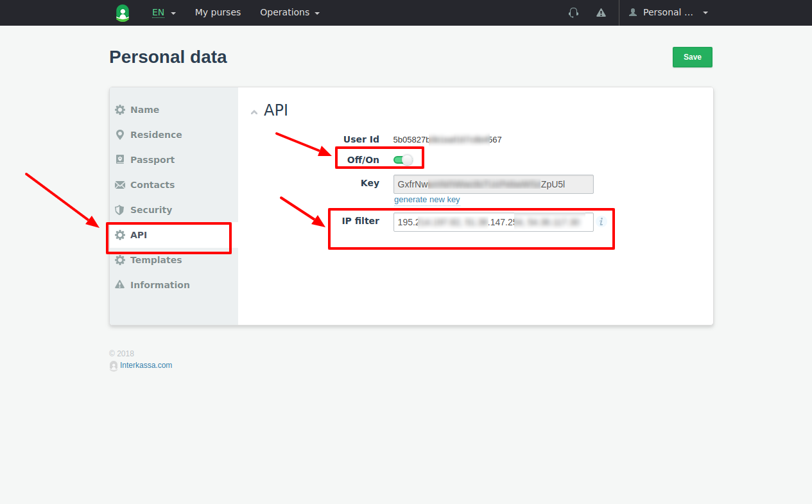
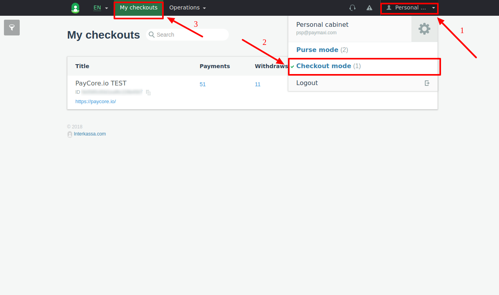
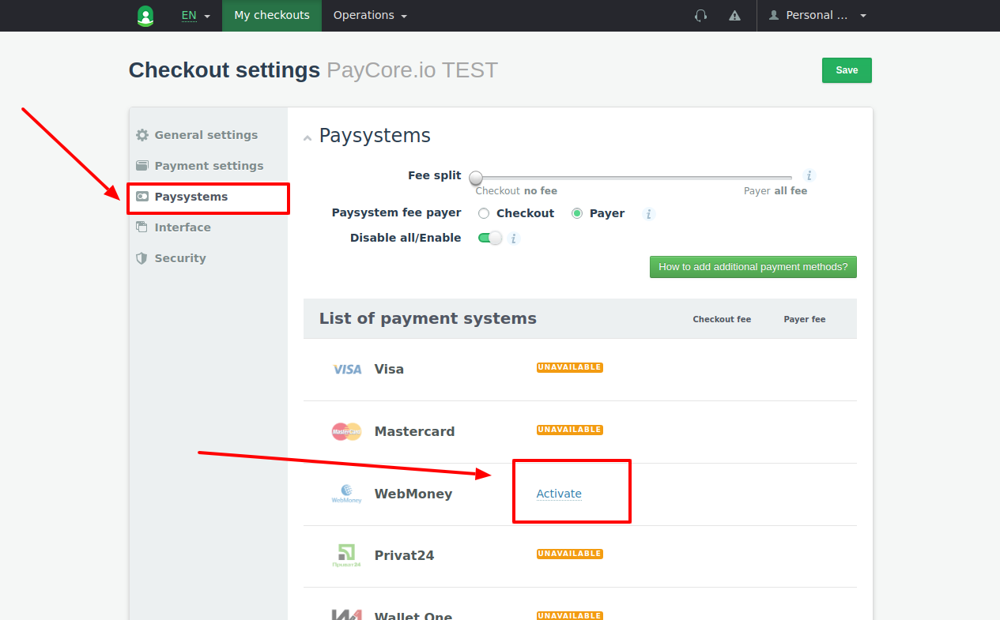
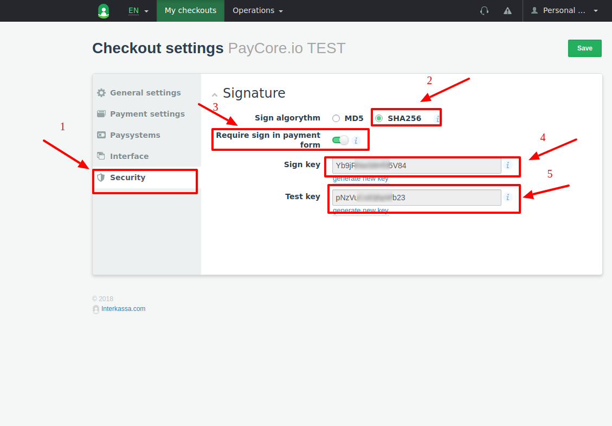
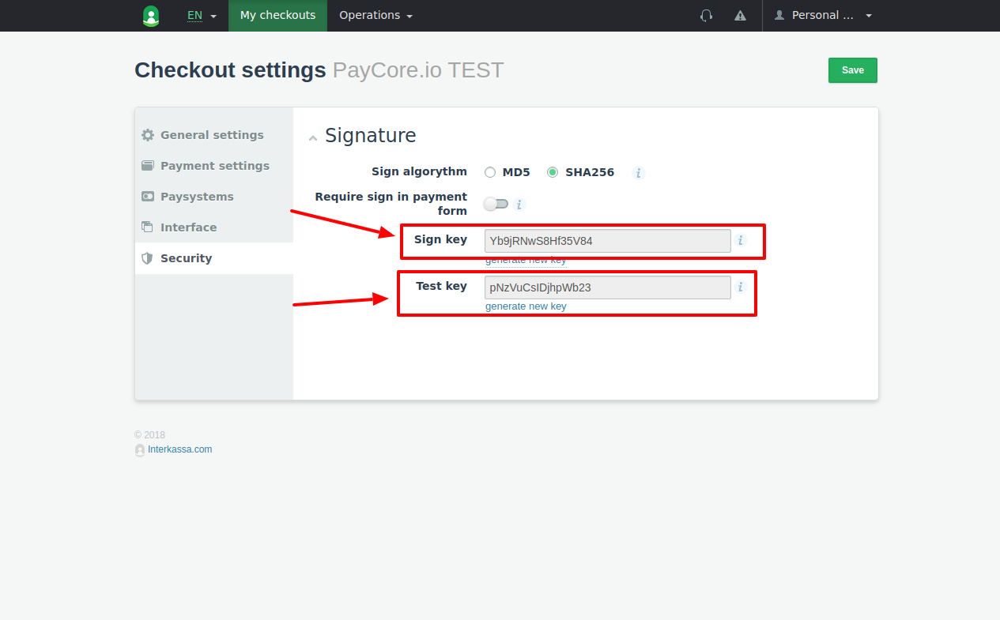
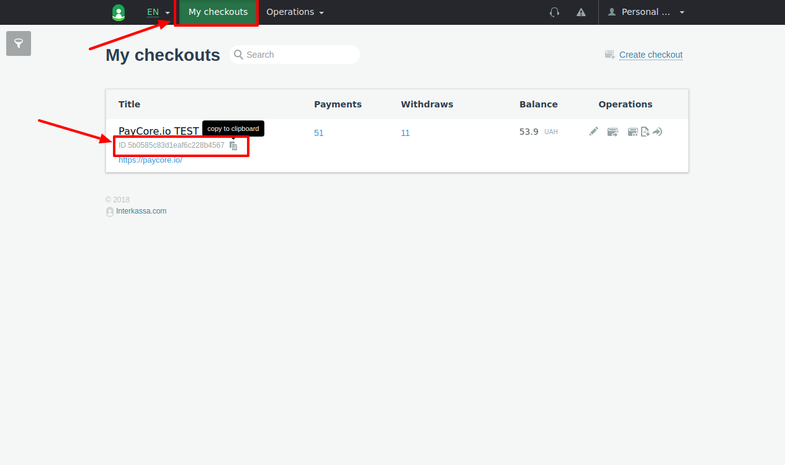
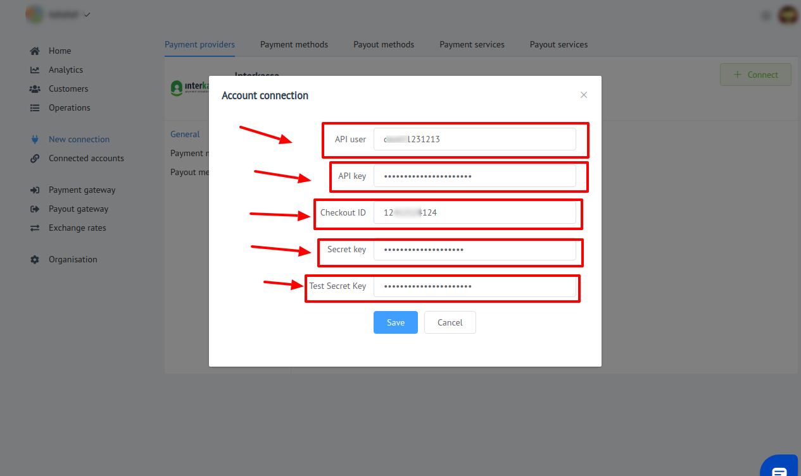

# Interkassa Connector

## Introduction

Here You can find  instructions for setting up [**Interkassa** account](https://www.interkassa.com)!


## Setup account

#### Step 1: Configure API 
- Open "Personal Data Settings"


- Go to the API section
- Set up parameters:
    -  Add all necessary IP adressess to the White list, including  [PayСore.io white-list IP addresses](/ips/#white-list-ip-addresses)
    -  "Turn ON" API




 - Get required account parameters:   
   
    -  User ID
    -  API key 

    !!! note
        You may generate **`New API key`**!
    
    !!! warning
        **Be careful!** Before generating **`New API key`** ensure that **`Existing API key`** is **NOT** used somewhere else.

- Save changes
#### Step 2: Create Checkout

-  Ensure You are at **Checkout mode**
    
    

-  Create new checkout
    
    

-  Set up  Site URL as ```https://paycore.io```
      
    

#### Step 3: Configure Checkout

- Open **_Checkout Settings_**

    

- Go to **_Payment Settings_** and set **Check the uniqueness of payments** to **`Enabled`**
   
    

- Go to **_Paysystems_** and activate **at least 1** paysystem

    

- Go to  **_Interface_** and ensure that  **`allow override in request`** under **`Interaction URL`** option is **`ENABLED`**

- Go to **_Security_** and set up parameters:
    -  Sign algorithm only **`SHA256`**
    -  Require sign in payment form  **`Enabled`**

    

- Get required checkout parameters
    
    -  Checkout ID
    -  Sign key
    -  Test key
    
        
        
        

!!! success
    You have configured your account!
    
## Connect account

#### Step 1: Copy required credentials

-  User ID
-  API Key
-  Checkout ID
-  Sign key
-  Test key

#### Step 2: Enter credentials

-  User ID
-  API Key
-  Checkout ID
-  Sign key
-  Test key

!!! tip
    Press **`Connect`** at Interkassa **`Provider Overview page`** in **`New connection`** section to open Connection form!





!!! success
    You have connected **Interkassa**!