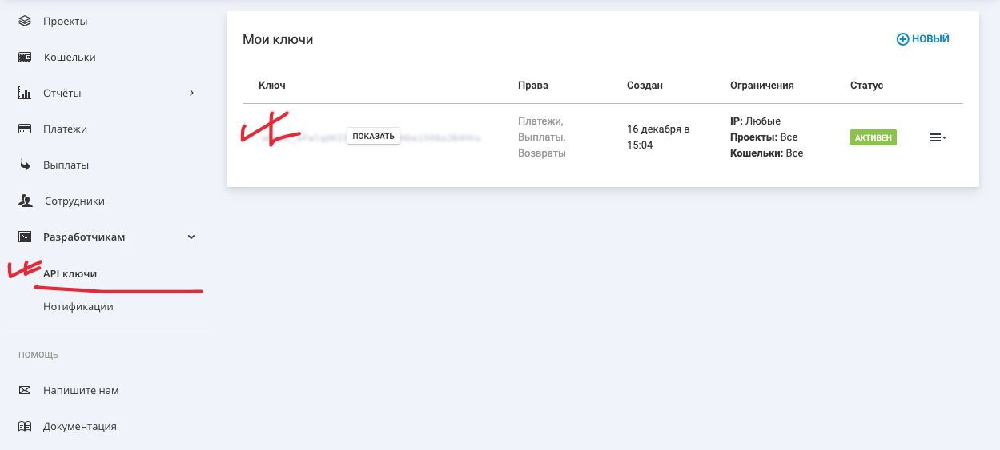
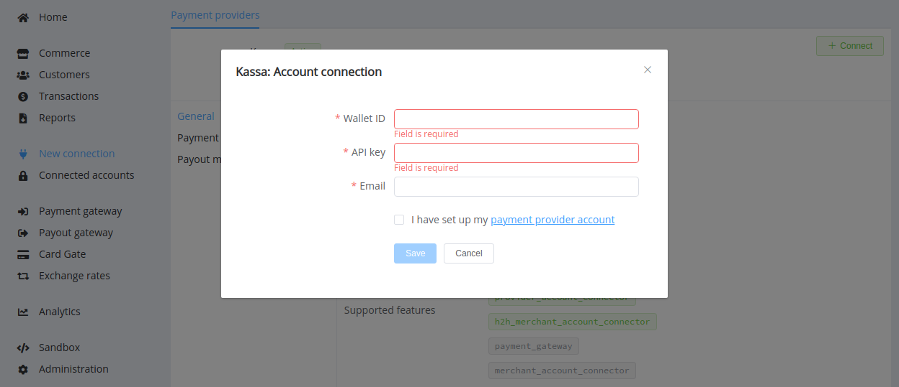
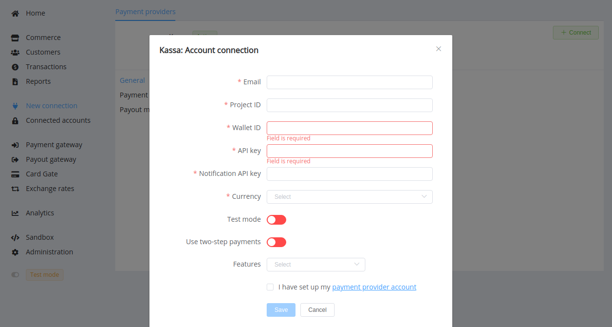

# Kassa

!!! quote ""
    New standard for accepting payments

**Website**: [Kassa](https://kassa.com/)

**Login**: [Kassa](https://kassa.com/signin)

Follow the guidance for setting up a connection with Kassa payment service provider.

## Set Up Account

### Step 1: Contact Kassa support manager

Send a request on the [website](https://kassa.com/signup), via [email](mailto:support@kassa.com), or [call the hotline](tel:88005008525). Submit the required documents to verify your account and gain access.

### Step 2: Get credentials

Log in to your account, create or find the right project and wallet. Copy related:

* Wallet ID
* Project ID

Go to the '*API Keys*' section and copy related:

* API key

For the Host-to-host (H2H) connection, you also need to copy:

* Notification API key

And add the {{custom.company_name}} Callback URL to the '*Notifications*' settings.

## Connect Provider Account

### Step 1. Connect account at the {{custom.company_name}} Dashboard

Press **Connect** at [*Kassa Provider Overview*]({{custom.dashboard_base_url}}connect-directory/payment-providers/kassa/general) page in *'New connection'* and choose **Provider account** option to open Connection form.

Enter credentials:

* Wallet ID
* API key
* Email

!!! success
    You have connected **Kassa** account!

## Connect H2H Merchant Account

### Step 1. Connect H2H account at the {{custom.company_name}} Dashboard

Press **Connect** at [*Kassa Provider Overview*]({{custom.dashboard_base_url}}connect-directory/payment-providers/kassa/general) page in *'New connection'* and choose **H2H Merchant account** option to open Connection form.

Enter credentials:

* Email
* Project ID
* Wallet ID
* API Key
* Notification API Key

Choose Test Mode for test connection with Kassa. Switch the toggle '*Use two-step payments*' if this option is available for your Kassa account (clear that with the Kassa support).

Choose Currencies and Features. You can set these parameters according to available currencies and features for your Kassa account, but it is necessary to check all details of the connection with your {{custom.company_name}} account manager.

!!! success
    You have connected **Kassa** H2H merchant account!

!!! question "Still looking for help connecting your Kassa account?"
    [Please contact our support team!](mailto:{{custom.support_email}})
