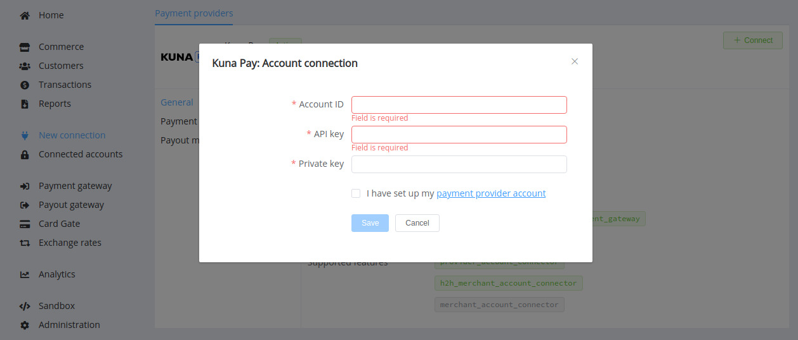
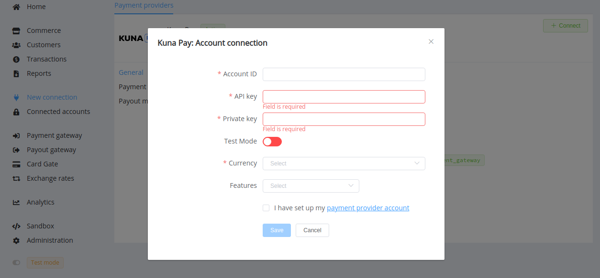

# Kuna Pay

> KUNA Pay is a crypto and fiat payments platform processing

**Website**: [pay.kuna.io](https://pay.kuna.io/en)

Follow the guidance for setting up a connection with Kuna Pay payment provider.

## Set Up Account

### Step 1: Leave the application to integrate

Send a request on the [website](https://pay.kuna.io/en) and contact Kuna Pay support manager.

### Step 2: Get credentials

Credentials that have to be issued:

- Account ID
- API key
- Private key &mdash; for Callback X-Signature

## Connect Provider Account

### Step 1. Connect account at the {{custom.company_name}} Dashboard

Press **Connect** at [*Kuna Pay Provider Overview*]({{custom.dashboard_base_url}}connect-directory/payment-providers/paymegaio/general) page in *'New connection'* and choose **Provider account** option to open Connection form.

Enter credentials:

- Account ID
- API key
- Private key

!!! success
    You have connected **Kuna Pay** account!

## Connect H2H Merchant Account

### Step 1. Connect H2H account at the {{custom.company_name}} Dashboard

Press **Connect** at [*Kuna Pay Provider Overview*]({{custom.dashboard_base_url}}connect-directory/payment-providers/paymegaio/general) page in *'New connection'* and choose **H2H Merchant account** option to open Connection form.

Enter credentials:

- Account ID
- API Key
- Private key

Choose Test Mode for test connection with Kuna Pay.

Choose Currency and Features. You can set these parameters according to available currencies and features for your Kuna Pay account, but it is necessary to check details of the connection with your {{custom.company_name}} account manager..

!!! success
    You have connected **Kuna Pay** H2H merchant account!

!!! question "Still looking for help connecting your Kuna Pay account?"
    <!--email_off-->[Please contact our support team!](mailto:{{custom.support_email}})<!--/email_off-->
