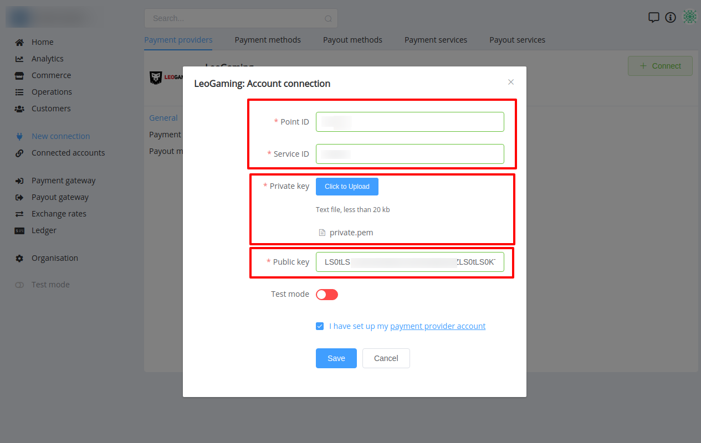

# LeoGaming Connector

## Introduction

Here You can find  instructions for setting up **LeoGaming**  account.

## Setup account

#### Step 1 Create Agent and Point

Contact with LeoGaming Support Manager to get help with creating. 

#### Step 2: Configure Point

1. Open "Points" section.

2. Go to the Point settings

3. (Optional)  Add all necessary IP adressess to the White list, including  [PayСore.io white-list IP addresses](/integration/ips/)

4. Generate keys

5. Download Keys

6. Save the configuration.

#### Step 3: Get required credentials

- **Point ID**
    - Go to the "Points" list and find ID column

    

- **Service ID**
    - Ask Leogaming Support Manager for this ID

- **Private Key**
    - Get Private key from Keys archive from **Step 2**

- **Public Key**
    - Get Private key from Keys archive from **Step 2**
    - Encode in **base64**  (_You can use any online service to encode_, for example: [base64encode.org](https://www.base64encode.org/))

!!! success
    You have configured account!

## Connect account

#### Step 1: Copy required credentials

#### Step 2: Enter credentials

- Point ID
- Service ID
- Private Key
- Public Key (base64)

!!! tip
    Press **`Connect`** at LeoGaming **`Provider Overview page`** in **`New connection`** section to open Connection form!

#### Step 3: Set up additional parameters 

- Test mode

!!! note
    This parameters are set according to your Merchant account type!

!!! success
    You have connected **LeoGaming**!