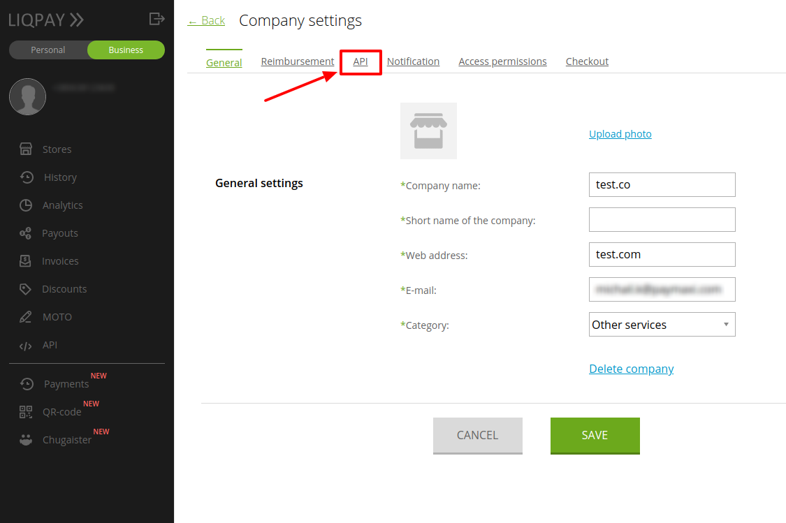
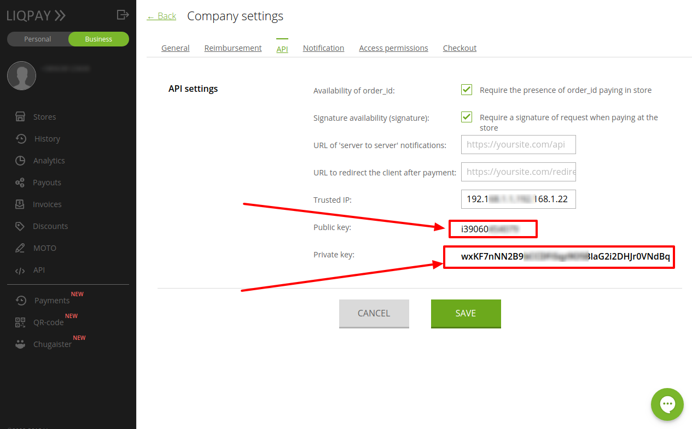

# Liqpay: Connecting merchant account

## Introduction

Here You can find  instructions for setting up <a href="https://www.liqpay.ua/" target="_blank" rel="noopener">**Liqpay** account</a>!

## Setup merchant account

### Step 1: Open merchant account settings
[https://www.liqpay.ua/en/admin/business](https://www.liqpay.ua/en/admin/business)

!!! info "Screenshot"
    

### Step 2: Go to "API" section

!!! info "Screenshot"
    

### Step 3: Set up parameters

-  Availability of `order_id`
-  Signature availability (signature)
-  Add all necessary IP adressess to the White list, including  [PayСore.io white-list IP addresses](/ips/#white-list-ip-addresses).
-  Save settings

!!! info "Screenshot"
    
  

!!! success
    You have configured account

## Connect merchant account

### Step 1: Copy credentials

-  Public key
-  Private key

!!! info "Screenshot"
    

### Step 2: Enter credentials

-  Public key
-  Private key

!!! tip
    Press **`Connect`** at LiqPay **`Provider Overview page`** in **`New connection`** section to open Connection form!

### Step 3: Choose provider's currencies

!!! info "Screenshot"
    

!!! success
    You have connected **LiqPay** merchant account!
