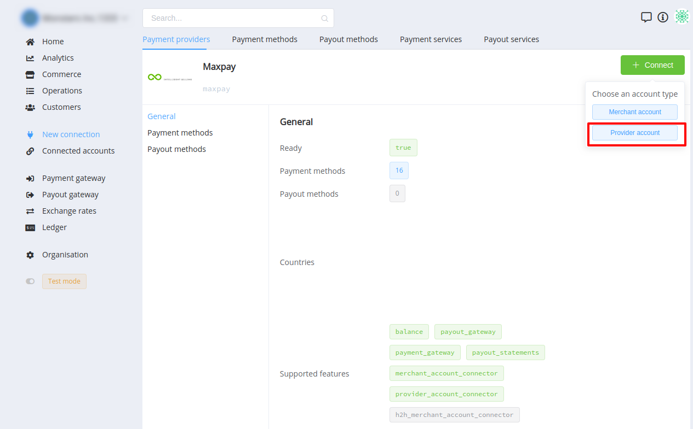
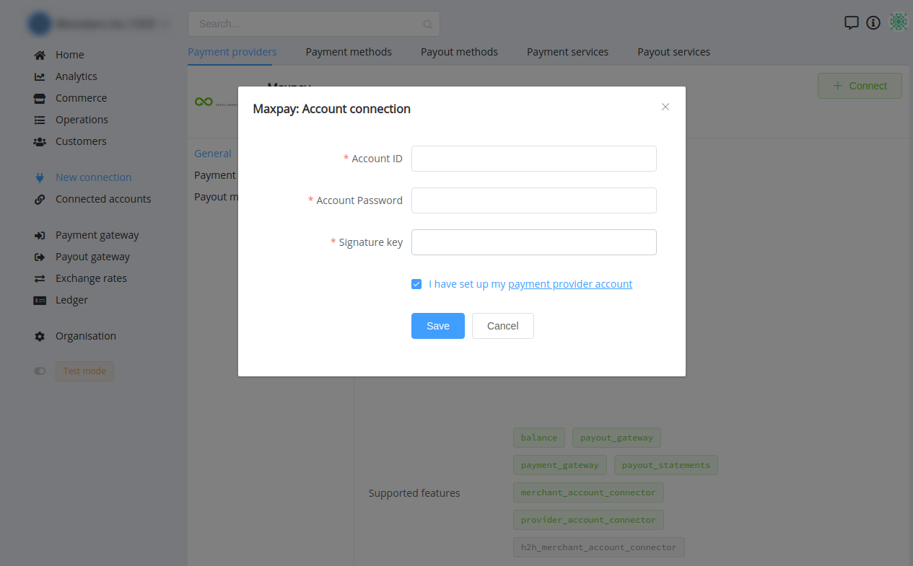
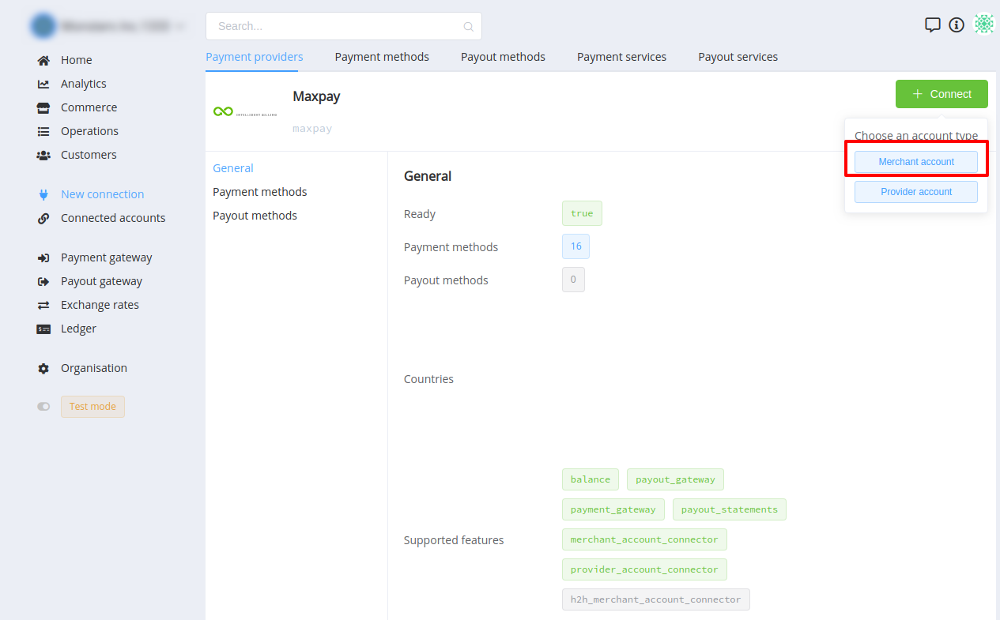
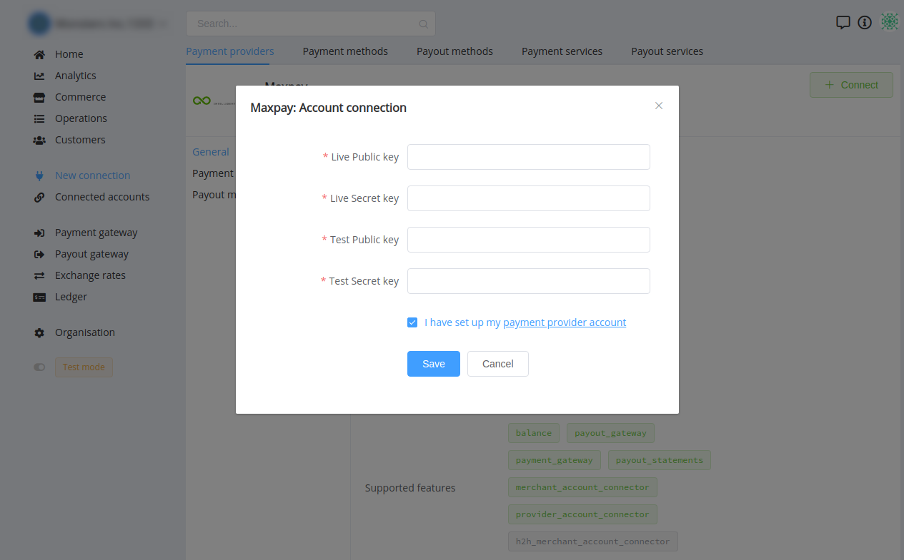

# MaxPay Connector

## Introduction

Here You can find  instructions for setting up **Paymega** accounts.

!!! info
     This provider supports **`Merchant`** and **`Provider`** account connection!

## Provider account

### Setup account

#### Step 1: Contact with MaxPay Support Manager

This Payment Provoider gives acoount credentials personaly to their merchants!
    
#### Step 2: Get required credentials

-   Account ID
-   Account Password
-   Signature key

!!! success
    You have configured account!
    
### Connect account

#### Step 1: Copy required credentials

#### Step 2: Enter credentials

-   Account ID
-   Account Password
-   Signature key

!!! tip
    Press **`Connect`** at MaxPay **`Provider Overview page`** in **`New connection`** section to open Connection form!
    Choose **`Provider`** account type.


!!! info "Screenshot"
    []()
    []()

!!! success
    You have connected **MaxPay** **Provider** Account!


## Merchant account


### Setup account

#### Step 1: Log in to [**MaxPay** Merchant Portal](https://my.maxpay.eu/)

#### Step 2: Create Payment Page

- Go to the **Payment Pages** section
- Press create button

!!! info "Screenshots"
    []()


#### Step 3: Upgrade  your page to LIVE

!!! tip
    Contact MaxPay support manager to upgrade your payment page!

#### Step 4: Get required credentials

- Go to created Page —> General
- Find and copy:
    -  **Test** public key
    -  **Test** secret key
    -  **Live** public key
    -  **Live** secret key

#### Step 5: Set up parameters

- Callback URL: ```https://psp-ext.paycore.io/maxpay/callback```

!!! info "Screenshots"
    []()

!!! success
    You have configured account!
    
### Connect account

#### Step 1: Copy required credentials


#### Step 2: Enter credentials

-  **Test** public key
-  **Test** secret key
-  **Live** public key
-  **Live** secret key

!!! tip
    Press **`Connect`** at MaxPay **`Provider Overview page`** in **`New connection`** section to open Connection form!
    Choose **`Merchant`** account type.


!!! info "Screenshot"
    []()
    []()


!!! success
    You have connected **MaxPay** **Merchant** Account!