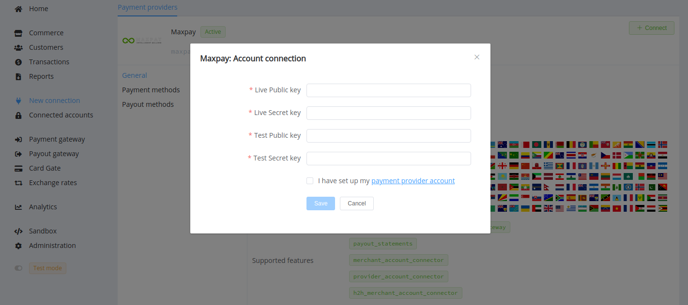
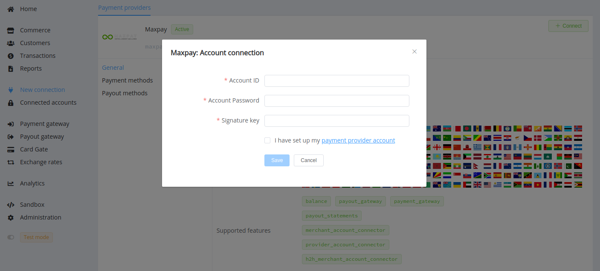
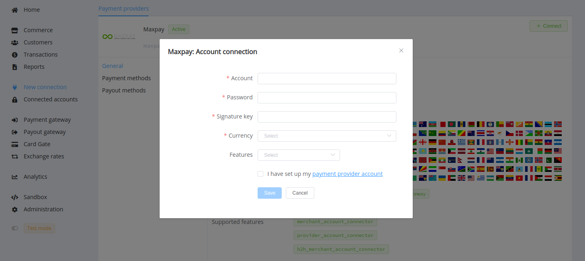

# MaxPay

!!! quote ""
    We are an international payment gateway designed to help your business.

**Website**: [MaxPay](https://maxpay.com/)

**Login**: [MaxPay](https://my.maxpay.com/#/signin)

Follow the guidance for setting up a connection with MaxPay payment service provider.

## Set Up Account

### Step 1: Contact MaxPay support manager

Send a request on the [website](https://maxpay.com/). Submit the required documents to verify your account and gain access.

### Step 2: Get credentials

Credentials that have to be issued:

* Account ID
* Account password
* Signature key

### Step 3. Create your payment page

If you are planning to use Merchant account connection at {{custom.company_name}}, firstly, you should create the related payment page. Log into the [MaxPay merchant portal](https://my.maxpay.com/#/signin), go to the *'Payment Pages'* section, and press the *'Create'* button. After that, send request to your MaxPay support manager about upgrading the created payment page from Test to Live type.

Go to the created *'Page'* --> *'General'*, find and copy:

* Test public key
* Test secret key
* Live public key
* Live secret key

Also, set `https://psp-ext.paycore.io/maxpay/callback` as Callback URL.

## Connect Merchant Account

### Step 1. Connect Merchant account at the {{custom.company_name}} Dashboard

Press **Connect** at [*MaxPay Provider Overview*]({{custom.dashboard_base_url}}connect-directory/payment-providers/maxpay/general) page in *'New connection'* and choose **Merchant account** option to open Connection form.

Enter your credentials:

* Test public key
* Test secret key
* Live public key
* Live secret key

!!! success
    You have connected **MaxPay** merchant account!

## Connect Provider account

### Step 1. Connect Provider account at the {{custom.company_name}} Dashboard

Press **Connect** at [*MaxPay Provider Overview*]({{custom.dashboard_base_url}}connect-directory/payment-providers/maxpay/general) page in *'New connection'* and choose **Provider account** option to open Connection form.

Enter your credentials:

* Account ID
* Account password
* Signature key

!!! success
    You have connected **MaxPay** provider account!

## Connect H2H merchant account

### Step 1. Connect H2H account at the {{custom.company_name}} Dashboard

Press **Connect** at [*MaxPay Provider Overview*]({{custom.dashboard_base_url}}connect-directory/payment-providers/maxpay/general) page in *'New connection'* and choose **H2H Merchant account** option to open Connection form.

Enter credentials:

* Account ID --> Account
* Account password --> Password
* Signature key

Choose Currency and Features. You can set these parameters according to available currencies and features for your MaxPay account, but it is also necessary to check details of the connection with your {{custom.company_name}} account manager.

!!! success
    You have connected **MaxPay** H2H merchant account!

!!! question "Still looking for help connecting your MaxPay account?"
    [Please contact our support team!](mailto:{{custom.support_email}})
