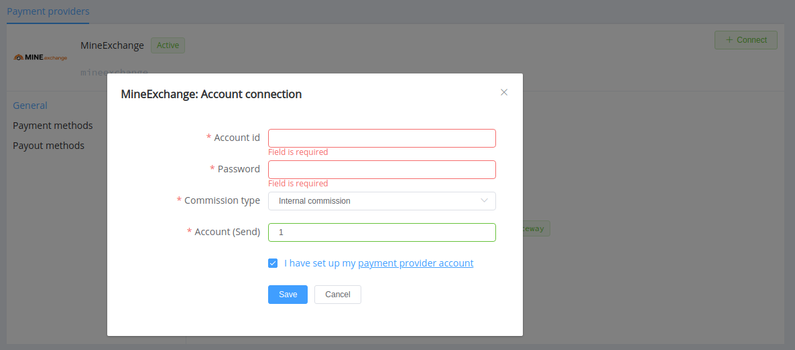

# Mine.Exchange (шахта.com)

!!! quote ""
    Automatic exchange 24/7

**Website**: [Mine.Exchange](https://mine.exchange/en/) | [шахта.com](https://xn--80aa7cln.com/en/)

**Login**: [Mine.Exchange](https://mine.exchange/en/login/) | [шахта.com](https://шахта.com/en/login/)

Follow the guidance for setting up a connection with Mine.Exchange payment service provider.

## Set Up Account

### Step 1: Contact Mine.Exchange support manager

Send a request on the [website](https://mine.exchange/en/). Submit the required documents to verify your account and gain access.

### Step 2: Get credentials

To connect Mine.Exchange, you need to know your **key to API authentication**. Also, it is worth clarifying with the manager which number you should use as the `account_send` (Mine.exchange internal account to send payouts).

## Connect Provider Account

### Step 1. Connect account at dashboard.{{custom.company_name}}

Press **Connect** at [*Mine.Exchange Provider Overview*]({{custom.dashboard_base_url}}connect-directory/payment-providers/mineexchange/general) page in *'New connection'* and choose **Provider account** option to open Connection form.

Choose Account ID for the connection: it can be any number value.

Enter the key to API authentication into the *Password* field and the `account_send` into *Account (Send)*.

Choose your commission (fee) type: Internal or External according to your Mine.Exchange account settings.

!!! success
    You have connected the **Mine.Exchange** provider account!

<!--

## Connect H2H Merchant Account

### Step 1. Connect H2H account at dashboard.{{custom.company_name}}

Press **Connect** at [*Mine.Exchange Provider Overview*]({{custom.dashboard_base_url}}connect-directory/payment-providers/mineexchange/general) page in *'New connection'* and choose **H2H Merchant account** option to open Connection form.

Enter credentials:

[//]: # (Choose Test Mode for test connection with Mine.Exchange.)

Choose Currency and Features: set these parameters according to available currencies and features for your Mine.Exchange account.

!!! success
    You have connected **Mine.Exchange** H2H merchant account!

-->

!!! question "Still looking for help connecting your Mine.Exchange account?"
    [Please contact our support team!](mailto:{{custom.support_email}})
