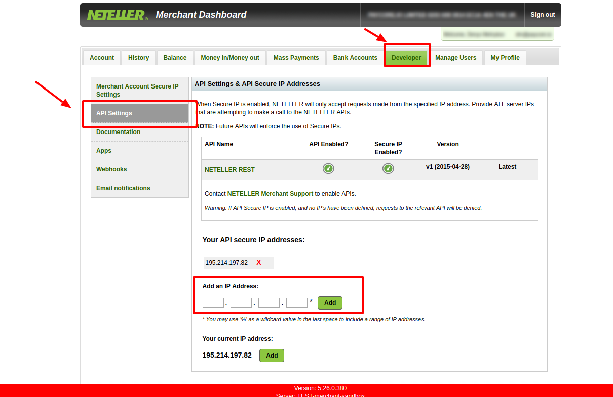
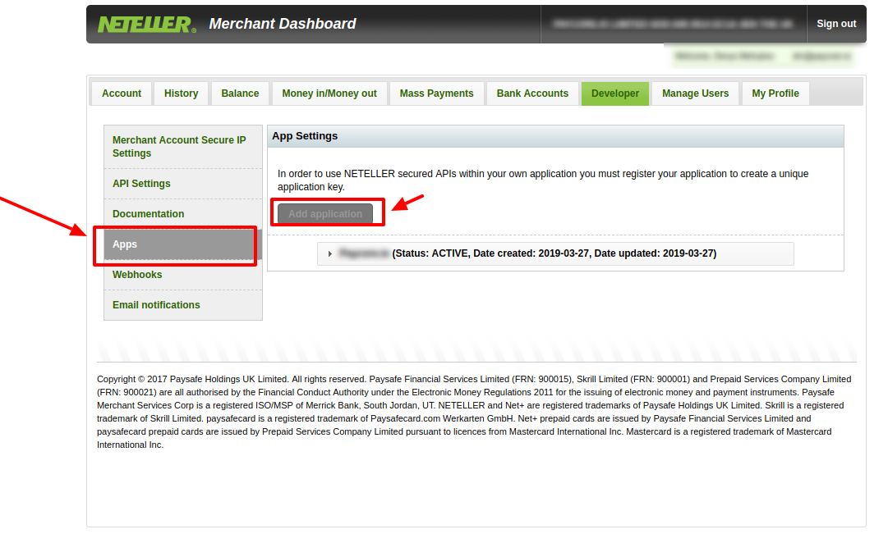
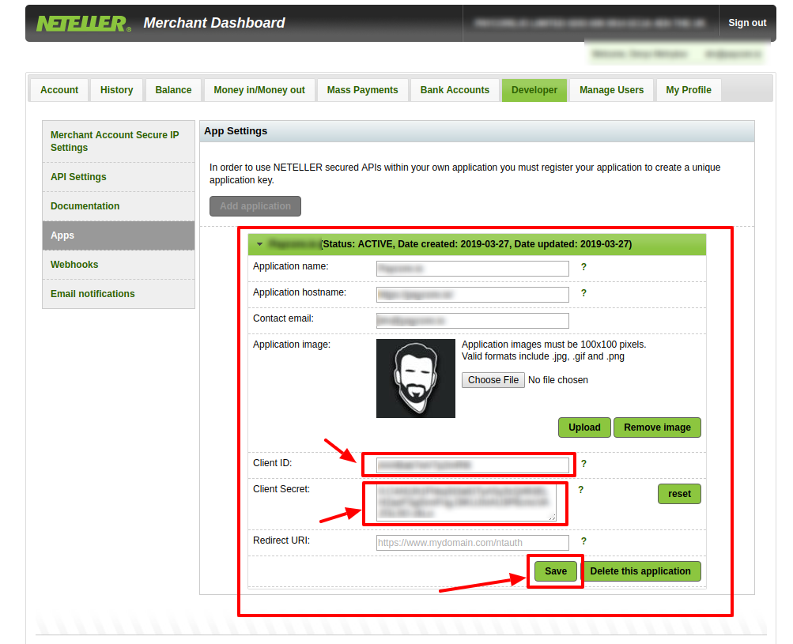
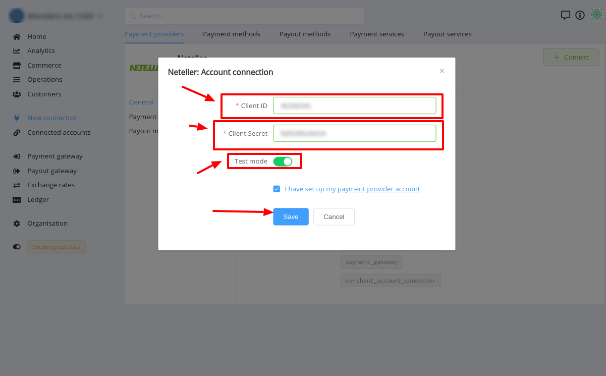

# Neteller Connector

## Introduction

Here You can find  instructions for setting up **Neteller**  account.

## Setup account

#### Step 1 Set up API preferences

1. Go to the **`Developer`** settings
2. Open **`API`** section
3. Add all necessary IP adressess to the White list, including  [PayСore.io white-list IP addresses](/ips/#white-list-ip-addresses)

#### Step 2: Add APP
1. Go to the **`Apps`** section
2. Add application:
    - Press Add button
    - Set your domain as Application hostname 

#### Step 3: Get required credentials

1. Go to the App preferences
2. Find :
    -  Client ID
    -  Client Secret

!!! success
    You have configured account!

## Connect account

#### Step 1: Copy required credentials

#### Step 2: Enter credentials

-  Client ID
-  Client Secret

!!! tip
    Press **`Connect`** at Neteller **`Provider Overview page`** in **`New connection`** section to open Connection form!

#### Step 3: Set up additional parameters 

-  Test mode

!!! note
    This parameter is set according to your Merchant account type!

!!! success
    You have connected **Neteller**!