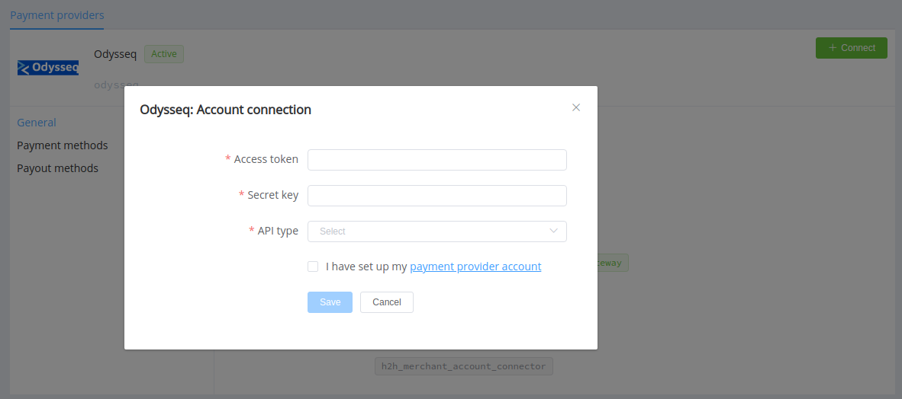

# Odysseq

**Website**: [odysseq.com](https://odysseq.com/)

**Login**: [Sign in](https://odysseq.com/user/sign-in/login)

Follow the guidance for setting up a connection with Odysseq payment service provider.

## Set Up Account

### Step 1: Apply for integration

Send a request on the [website](https://odysseq.com/) or via Telegram. Submit the required documents to verify your account and gain access.

### Step 2: Get credentials

Credentials that have to be issued:

* Access token
* Signature key

Specify your API type connection with your Odysseq support manager.

## Connect Provider Account

### Step 1. Connect account at the {{custom.company_name}} Dashboard

Press **Connect** at [*Odysseq Provider Overview*]({{custom.dashboard_base_url}}connect-directory/payment-providers/odysseq/general) page in *'New connection'* and choose **Provider account** option to open Connection form.

Enter credentials:

* Access token
* Signature key --> Secret key

Choose your API type from the dropdown list.

!!! success
    You have connected **Odysseq** account!

!!! question "Still looking for help connecting your Odysseq account?"
    <!--email_off-->[Please contact our support team!](mailto:{{custom.support_email}})<!--/email_off-->
