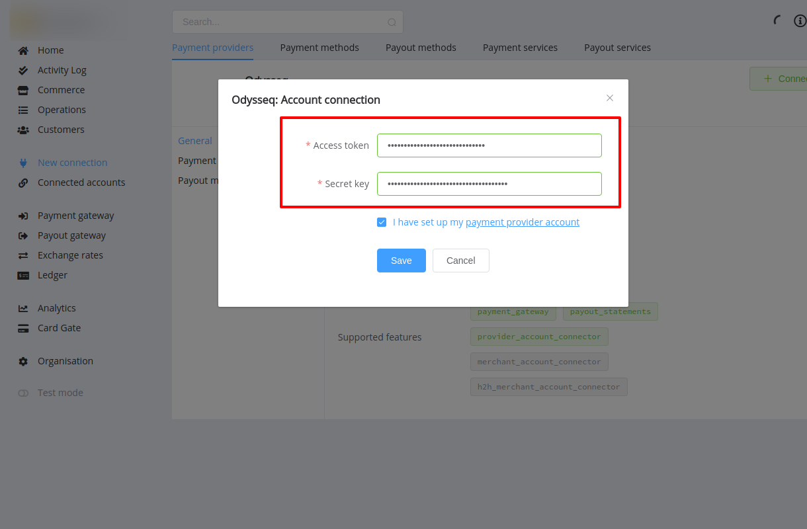

# Odysseq Connector

## Introduction

Here You can find  instructions for setting up **Odysseq**  account.

## Setup account

#### Step 1 Contact with Odysseq Support Manager

#### Step 2: Get required credentials

- Access token
- Signature key

!!! success
    You have configured account!

## Connect account

#### Step 1: Copy required credentials

#### Step 2: Enter credentials

- Access token
- Signature key

!!! tip
    Press **`Connect`** at Odysseq **`Provider Overview page`** in **`New connection`** section to open Connection form!

!!! note
    These parameters are set according to your Merchant account type and it's available currencies!

!!! success
    You have connected **Odysseq**!