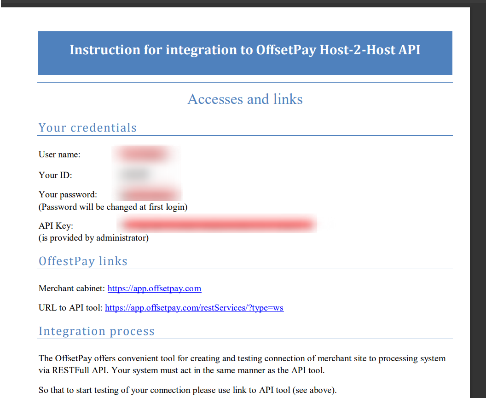
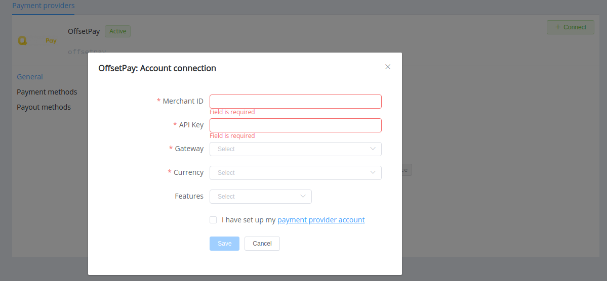

# OffsetPay Connector

**Login**: [OffsetPay](https://app.offsetpay.com/do/login)

Follow the guidance for setting up a connection with OffsetPay payment service provider.

## Set Up Account

### Step 1: Contact OffsetPay support manager

Send a request, submit the required documents to verify your account and gain access.

### Step 2: Get credentials

Your account administrator sends your credentials with the instruction for integration to OffsetPay API.

Credentials that have to be issued to establish a connection in {{custom.company_name}} dashboard:

* Your ID
* API Key

### Step 3. Get list of available gateways

Also, you need to authorize with the OffsetPay API tool and get a list of available gateways for your account:

Method: **GET**
Endpoint: `/gateways/listGateways`

## Connect H2H Merchant Account

### Step 1. Connect H2H account at the {{custom.company_name}} Dashboard

Press **Connect** at [*OffsetPay Provider Overview*]({{custom.dashboard_base_url}}connect-directory/payment-providers/offsetpay/general) page in *'New connection'* and choose **H2H Merchant account** option to open Connection form.

Enter credentials:

* *Your ID* --> Merchant ID
* API Key

Select one of the Gateway name included in the [list of available gateways](#step-3-get-list-of-available-gateways).

[//]: # (Choose Test Mode for test connection with OffsetPay.)

Choose Currency and Features. You can set these parameters according to available currencies and features for your OffsetPay account, but it is necessary to check details of the connection with your {{custom.company_name}} account manager.

!!! success
    You have connected **OffsetPay** H2H merchant account!

!!! question "Still looking for help connecting your OffsetPay account?"
    [Please contact our support team!](mailto:{{custom.support_email}})
