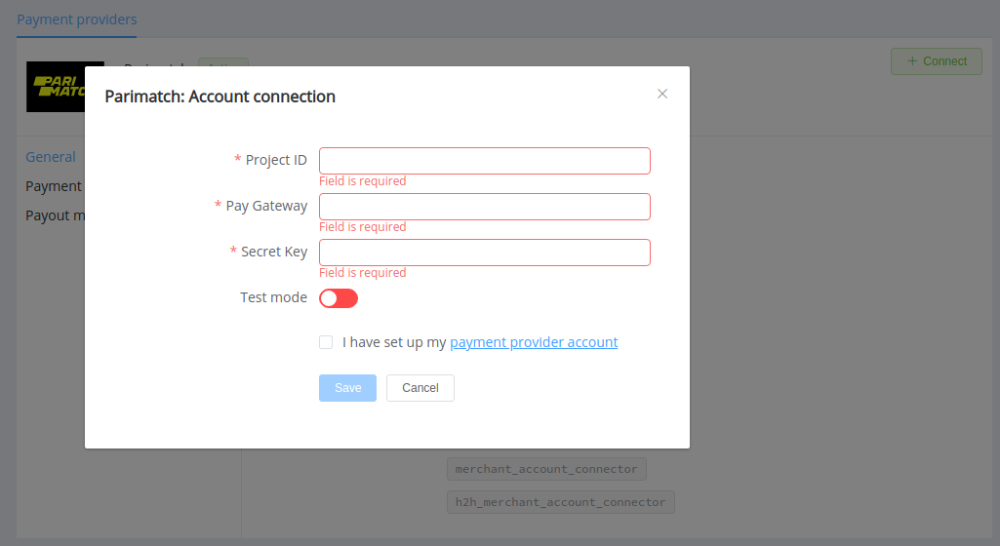

# Parimatch

**Website**: [parimatch.com](https://parimatch.com/en/)

**Login**: [parimatch.com](https://parimatch.com/en/?login=1)

Follow the guidance for setting up a connection with Parimatch payment service provider.

## Set up account

### Step 1 Contact Parimatch support team

Join or register your account to obtain a unique Project ID.

### Step 2: Get credentials

Credentials that have to be issued:

* Secret key
* Pay gateway URL

!!! important
    Be sure to check with the manager if you require to provide a white list of IPs, and if so, specify IP addresses from the [Corefy list](/integration/ips/).

## Connect Provider Account

### Step 1. Connect account at the {{custom.company_name}} Dashboard

Press **Connect** at [*Parimatch Provider Overview*]({{custom.dashboard_base_url}}connect-directory/payment-providers/NAME/general) page in *'New connection'* and choose **Provider account** option to open Connection form.

Enter credentials:

* Project ID
* Pay gateway URL
* Secret key

Also, select Test or Live mode according to the type of account to connect with Parimatch.

!!! success
    You have connected **Parimatch** account!

!!! question "Still looking for help connecting your Parimatch account?"
    <!--email_off-->[Please contact our support team!](mailto:{{custom.support_email}})<!--/email_off-->
