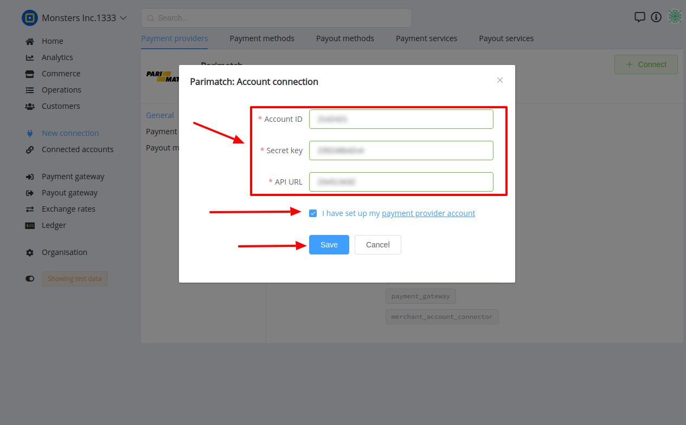

# Parimatch Connector

## Introduction

Here You can find  instructions for setting up **Parimatch**  account.

## Setup account

#### Step 1 Contact with Parimatch Support Manager


#### Step 2: Get required credentials

- [x] Account ID
- [x] Secret key
- [x] API URL

!!! success
    You have configured account!


## Connect account

#### Step 1: Copy required credentials


#### Step 2: Enter credentials


- [x] Account ID
- [x] Secret key
- [x] API URL

!!! tip
    Press **```Connect```** at Parimatch **```Provider Overview page```** in **```New connection```** section to open Connection form!


!!! note
    These parameters are set according to your Merchant account type and it's available currencies!

!!! tip
    **Don't forget to Save changes to confirm connection!**

!!! info "Screenshot"
    [](images/parimatch-step_connect.png)


!!! success
    You have connected **Parimatch**!