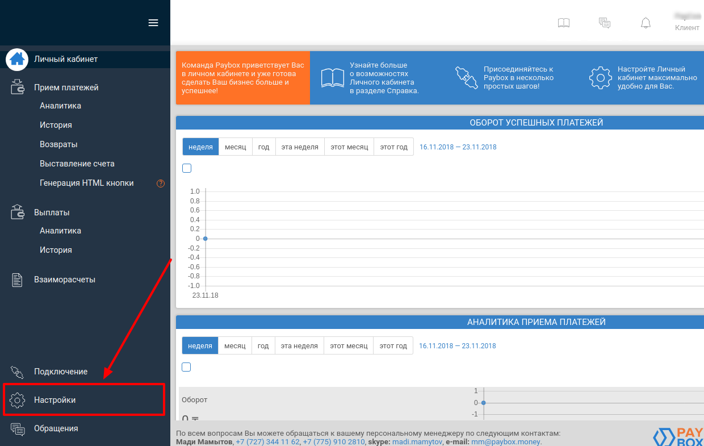
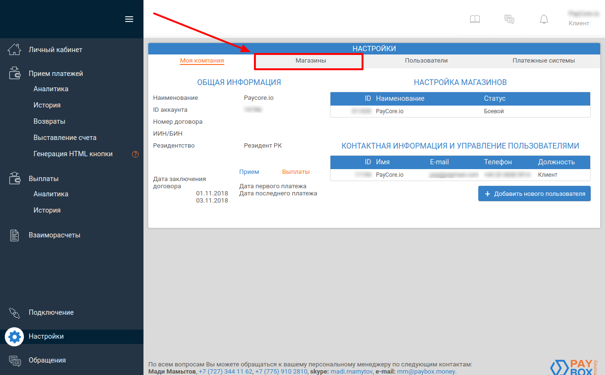
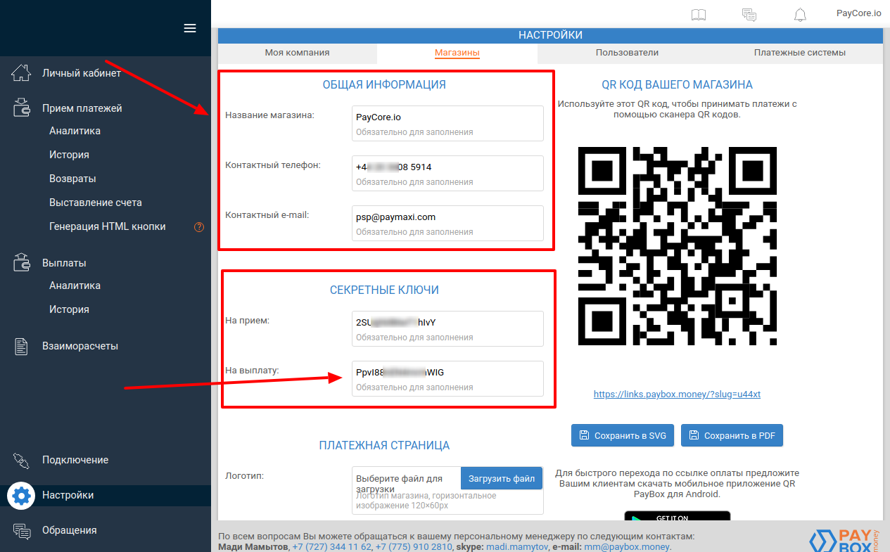
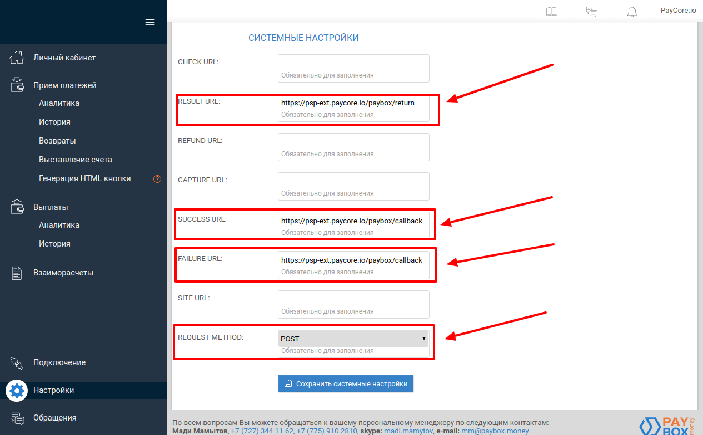
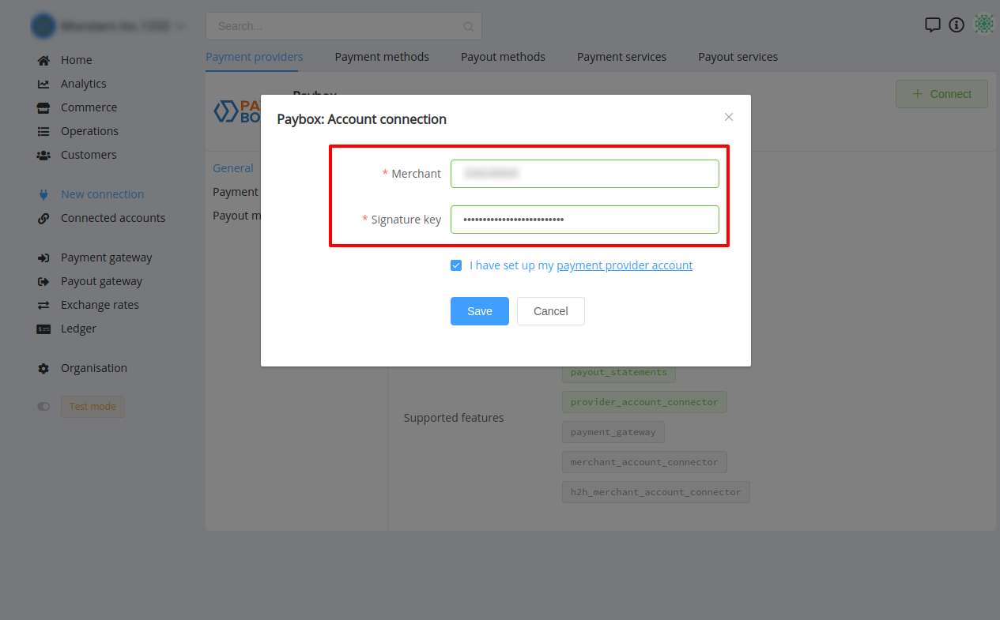

# Paybox Connector

## Introduction

Here You can find  instructions for setting up  [**Paybox** account](https://my.paybox.money/)!

## Setup account

#### Step 1: Connect to PayPox 

-  Submit a questionnaire
-  Verify your documents

#### Step 2: Open Settings



#### Step 3: Go to Merchant section (My markets)




#### Step 4: Configure your merchant

- Set up parameters:
    -  General merchant info
    -  Secret keys
        - For Payout

    

    -  URLs
        - RESULT URL    ```https://psp-ext.paycore.io/paybox/callback```
        - SUCCESS ```https://psp-ext.paycore.io/paybox/return```
        - FAILURE URL ```https://psp-ext.paycore.io/paybox/return```
        
        
    -  REQUEST METHOD ```POST```
    
    

!!! success
    You have configured your account!
    
## Connect account

#### Step 1: Copy required credentials

-  Merchant ID
-  Secret key (_for payout_)

#### Step 2: Enter credentials

-  Merchant ID
-  Secret key (_for payout_)


!!! tip
    Press **`Connect`** at Paybox **`Provider Overview page`** in **`New connection`** section to open Connection form!





!!! success
    You have connected **Paybox**!