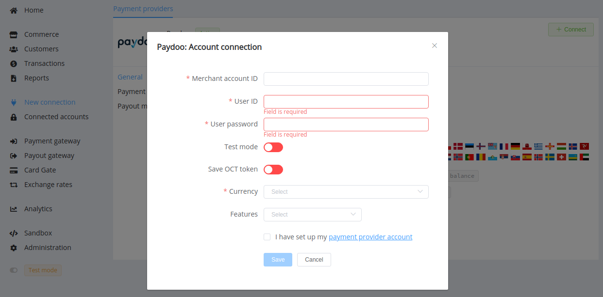

# PayDoo

!!! quote ""
    Omni-Channel Payments built for you

**Website**: [PayDoo](https://www.paydoo.com/)

**Login**: [PayDoo](https://www.paydoo.com/login)

Follow the guidance for setting up a connection with PayDoo payment service provider.

## Set Up Account

### Step 1: Contact PayDoo support manager

Send a request on the [website](https://www.paydoo.com/sign-up) or call the hotline. Submit the required documents to verify your account and gain access.

### Step 2: Get credentials

Credentials that have to be issued:

* User ID and password to get access to the platform
* Merchant account ID

## Connect H2H Merchant Account

### Step 1. Connect H2H account at the {{custom.company_name}} Dashboard

Press **Connect** at [*PayDoo Provider Overview*]({{custom.dashboard_base_url}}connect-directory/payment-providers/paydoo/general) page in *'New connection'* and choose **H2H Merchant account** option to open Connection form.

Enter credentials:

* Merchant account ID
* User ID
* User password

Select Test or Live mode according to the type of account to connect with PayDoo.

Toggle the 'Save OCT Token' option if you plan to use Original Credit Transaction flow for payouts. Also, toggle 'Save Instant token' for instant payments use.

Choose API type connected with your account.

Choose Currencies and Features. You can set these parameters according to available currencies and features for your PayDoo account, but it's necessary to check details of the connection with your {{custom.company_name}} account manager.

!!! success
    You have connected **PayDoo** H2H merchant account!

!!! question "Still looking for help connecting your PayDoo account?"
    <!--email_off-->[Please contact our support team!](mailto:{{custom.support_email}})<!--/email_off-->
