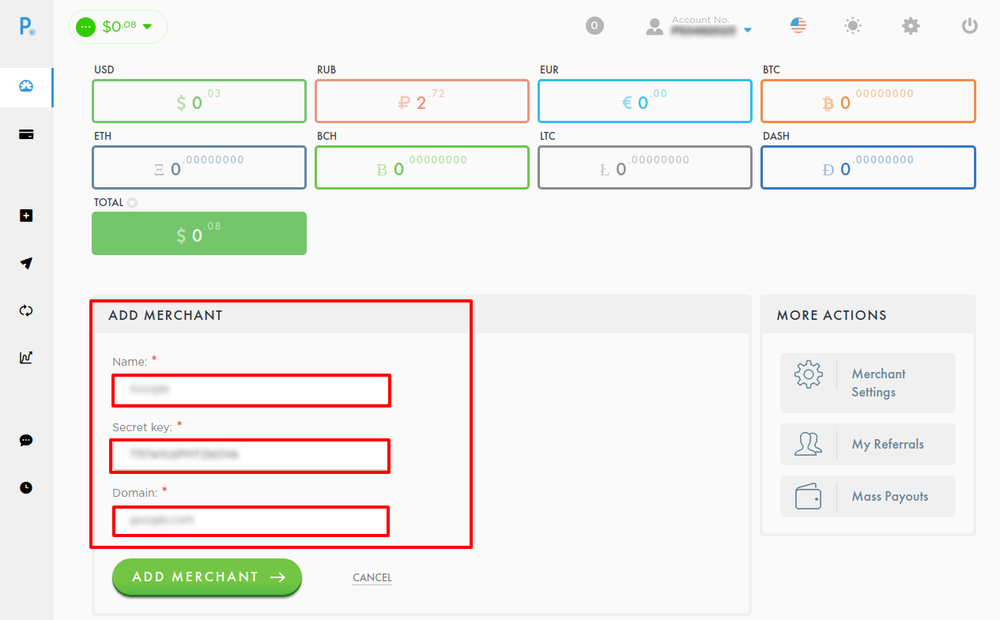
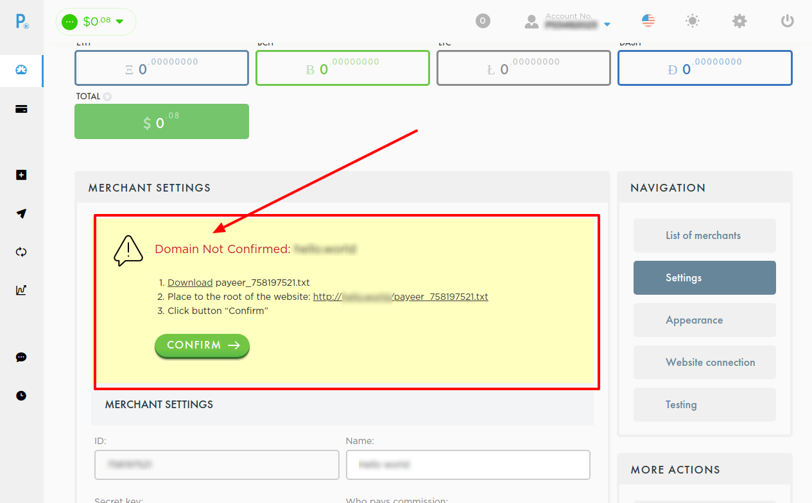
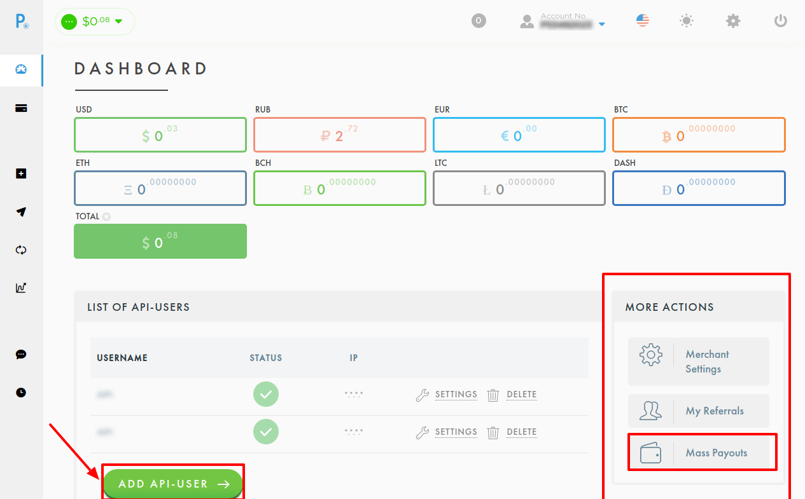
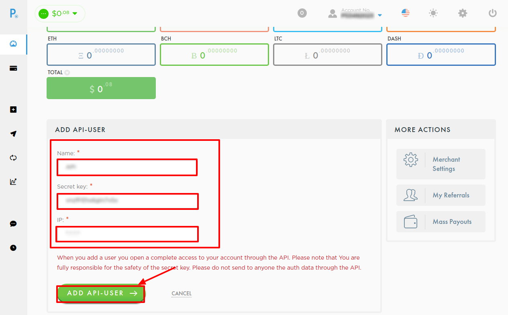

# Payeer Connector

## Introduction

Here You can find  instructions for setting up [ **Payeer**  account](https://payeer.com/en/account/).

## Setup account

### Step 1: Create Merchant

1. Go to the Merchant Settings
2. Press **Add merchant**
3. Set required parameters:
    - **Merchant Name**
    - **Secret key**
        
        !!! info
            Copy this parameter, whereas **this will be unavailable** henceforth!
    
    - **Domain name**: set your merchant  domain name

    
    
    

### Step 2: Configure Merchant

1. Go to the created Merchant

    As default system redirects user to the Merchant configuration page automaticaly. 
        As default system redirects user to the Merchant configuration page automaticaly. 
    As default system redirects user to the Merchant configuration page automaticaly. 

2. Verify domain
    
    !!! info "Domain verification"
        

3. Set configuration properties: 

    - **`Encryption key`**
        
        !!! tip
            It shoud consists of 32 symbols. You may generate it using any service You want.

        !!! info
            Copy this key before confirming changes, whereas **this will be unavailable** henceforth!

    - **`Success URL`**, **`Fail URL`**, **`Status URL`** : Set your URLs
        
        !!! info
            PayCore.io will overwrite this properties in request. 

    - other properties are set at your choice

        

### Step 3: Get Merchant credentials

-  Account No.

    

-  Merchant ID

    !!! tip
        It is located at Merchant configuration page!

-  Merchant Secret key
-  Encryption key

### Step 4: Create API User

1. Go to the Mass Payouts section
2. Press **Add API User** button
3. Set required parameters:
    - Name
    - Secret key
       
        !!! info
            Copy this parameter, whereas **this will be unavailable** henceforth!

    - IP: Add all necessary IP adressess to the White list, including  [PayСore.io white-list IP addresses](/integration/ips/)
    
        !!! tip
            IP list should contains IP adresses separated with **`;`**.

            **_For example_**: _54.36.117.30; 51.38.147.254; 54.38.139.222_

!!! note
    Note, that API User configuration can be modified at API User configuration page!

    
    
    

    
### Step 5: Get API User credentials

-  API User ID

    !!! tip
        It is located at API User configuration page!

-  API User Secret key

!!! success
    You have configured account!

## Connect account

#### Step 1: Copy required credentials

-  Account No.
-  Merchant ID
-  Merchant Secret key
-  Encryption key
-  API User ID
-  API User Secret key

#### Step 2: Enter credentials

!!! tip
    Press **`Connect`** at Payeer **`Provider Overview page`** in **`New connection`** section to open Connection form!

!!! success
    You have connected **Payeer**!